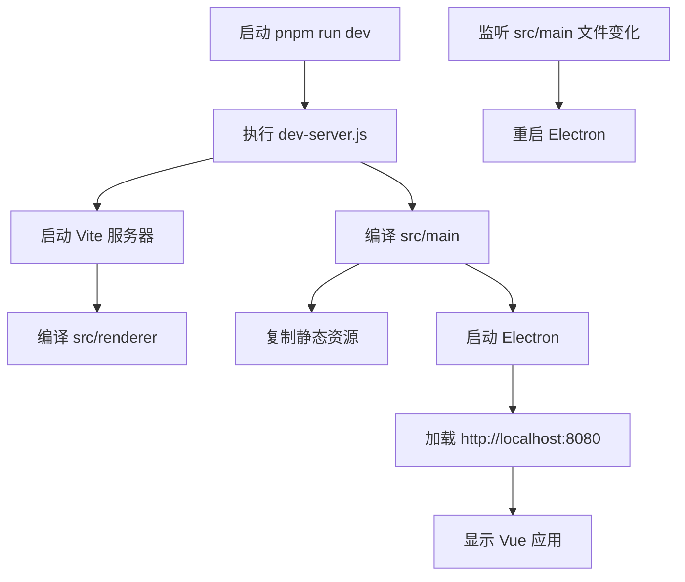
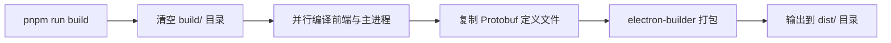

# 快速开始

<cite>
**本文档中引用的文件**  
- [README.md](file://README.md#L1-L316)
- [package.json](file://package.json#L1-L43)
- [vite.config.js](file://vite.config.js#L1-L28)
- [electron-builder.json](file://electron-builder.json#L1-L45)
- [scripts/dev-server.js](file://scripts/dev-server.js#L1-L137)
- [scripts/build.js](file://scripts/build.js#L1-L49)
- [src/main/main.ts](file://src/main/main.ts#L1-L449)
- [src/main/services/multicast.service.ts](file://src/main/services/multicast.service.ts#L1-L180)
- [src/main/services/protobuf-parser.service.ts](file://src/main/services/protobuf-parser.service.ts#L1-L458)
- [src/renderer/main.ts](file://src/renderer/main.ts#L1-L11)
- [src/renderer/views/pages/MulticastPage.vue](file://src/renderer/views/pages/MulticastPage.vue)
</cite>

## 目录
1. [简介](#简介)
2. [前置条件](#前置条件)
3. [项目结构概览](#项目结构概览)
4. [安装与运行步骤](#安装与运行步骤)
5. [开发服务器详解](#开发服务器详解)
6. [生产构建流程](#生产构建流程)
7. [主进程与渲染进程调试](#主进程与渲染进程调试)
8. [常见问题与解决方案](#常见问题与解决方案)

## 简介

**设备模拟操作端** 是一个基于 Electron、Vue 3 和 TypeScript 构建的桌面应用程序，主要用于模拟无人机通信协议，支持组播监听和 Protobuf 数据解析。本指南旨在帮助新手开发者在 10 分钟内完成本地环境搭建并成功运行该项目。

项目采用现代化技术栈，包括 Vite 作为前端构建工具，Electron 实现跨平台桌面应用，TypeScript 提供类型安全，以及 Protobuf 实现高效的数据序列化与解析。通过清晰的模块划分和自动化脚本，开发者可以快速进入开发状态。

**Section sources**
- [README.md](file://README.md#L1-L50)

## 前置条件

在开始之前，请确保您的系统满足以下最低要求：

- **Node.js**: 版本 18 或更高（推荐使用 LTS 版本）
- **包管理工具**: pnpm（推荐）或 npm（版本 9+）
- **TypeScript**: 已全局安装或项目内支持
- **Electron**: 项目依赖 Electron 38.0.0
- **Python**: 版本 3.10+（用于编译原生模块如 `better-sqlite3`）
- **构建工具**:
  - **Windows**: Visual Studio Build Tools
  - **macOS**: Xcode Command Line Tools
  - **Linux**: build-essential 包

您可以通过以下命令验证环境是否正确安装：

```bash
node --version
pnpm --version
python --version
```

**Section sources**
- [README.md](file://README.md#L52-L65)

## 项目结构概览

项目采用分层架构，主要分为三个部分：主进程（Electron）、渲染进程（Vue 3）和共享资源（Protobuf 定义）。

```
afs-opEnd/
├── scripts/               # 构建与开发脚本
│   ├── dev-server.js      # 开发服务器启动脚本
│   └── build.js           # 生产构建脚本
├── src/
│   ├── main/              # Electron 主进程
│   │   ├── database/      # SQLite 数据库管理
│   │   ├── services/      # 核心服务（组播、Protobuf 解析）
│   │   ├── main.ts        # 主进程入口
│   │   └── preload.ts     # 预加载脚本
│   ├── protobuf/          # Protobuf 协议定义文件
│   └── renderer/          # Vue 3 渲染进程
│       ├── main.ts        # Vue 应用入口
│       └── views/         # 页面组件
├── package.json           # 项目依赖与脚本定义
├── vite.config.js         # Vite 前端配置
└── electron-builder.json  # Electron 打包配置
```

```mermaid
graph TB
subgraph "主进程 (Electron)"
Main[main.ts] --> DB[(数据库)]
Main --> Multicast[组播服务]
Main --> Protobuf[Protobuf解析]
end
subgraph "渲染进程 (Vue 3)"
Renderer[main.ts] --> App[App.vue]
App --> MulticastPage[MulticastPage.vue]
end
Main < --> |IPC通信| Renderer
Multicast --> |数据包| Renderer
```

**Diagram sources**
- [src/main/main.ts](file://src/main/main.ts#L1-L449)
- [src/renderer/main.ts](file://src/renderer/main.ts#L1-L11)

**Section sources**
- [README.md](file://README.md#L250-L300)

## 安装与运行步骤

### 1. 克隆仓库

```bash
git clone <repository-url>
cd afs-opEnd
```

### 2. 安装依赖（使用 pnpm）

```bash
pnpm install
```

> **注意**：项目 `package.json` 中定义了 `postinstall` 脚本，会自动执行 `electron-rebuild` 以重新编译原生模块（如 `better-sqlite3`），确保跨平台兼容性。

### 3. 启动开发服务器

```bash
pnpm run dev
```

该命令会执行 `scripts/dev-server.js`，其工作流程如下：

1. 启动 Vite 开发服务器（端口 8080）
2. 编译主进程 TypeScript 代码
3. 启动 Electron 应用并连接到开发服务器
4. 监听主进程文件变化，自动重启 Electron

### 4. 构建生产版本

```bash
pnpm run build
```

该命令会执行 `scripts/build.js`，完成以下任务：

1. 使用 Vite 构建前端资源
2. 使用 TypeScript 编译主进程代码
3. 复制 Protobuf 定义文件到构建目录
4. 调用 `electron-builder` 打包为可执行文件

**Section sources**
- [package.json](file://package.json#L7-L12)
- [scripts/dev-server.js](file://scripts/dev-server.js#L1-L137)
- [scripts/build.js](file://scripts/build.js#L1-L49)

## 开发服务器详解

`vite.config.js` 配置了 Vite 开发服务器的核心参数：

```javascript
const config = defineConfig((mode) => {
  return {
    root: Path.join(__dirname, "src", "renderer"), // 项目根目录
    server: {
      port: 8080, // 开发服务器端口
    },
    build: {
      outDir: Path.join(__dirname, "build", "renderer"), // 构建输出目录
    },
    plugins: [vuePlugin()], // 使用 Vue 插件
  };
});
```

此配置确保 Vite 仅处理 `src/renderer` 目录下的前端代码，并将构建结果输出到 `build/renderer`，与 Electron 主进程分离。



**Diagram sources**
- [vite.config.js](file://vite.config.js#L1-L28)
- [scripts/dev-server.js](file://scripts/dev-server.js#L1-L137)

**Section sources**
- [vite.config.js](file://vite.config.js#L1-L28)

## 生产构建流程

`electron-builder.json` 定义了 Electron 应用的打包规则：

```json
{
  "appId": "com.electron.app",
  "directories": { "output": "dist" },
  "files": [
    { "from": "build/main", "to": "main" },
    { "from": "build/renderer", "to": "renderer" },
    { "from": "src/protobuf", "to": "main/src/protobuf" }
  ]
}
```

构建脚本 `scripts/build.js` 的执行流程：

1. 清空 `build` 目录
2. 并行执行 `Vite.build()` 和 `tsc` 编译
3. 编译完成后，复制 `src/protobuf` 到 `build/main/src/protobuf`
4. 最后由 `electron-builder` 根据配置打包



**Diagram sources**
- [electron-builder.json](file://electron-builder.json#L1-L45)
- [scripts/build.js](file://scripts/build.js#L1-L49)

**Section sources**
- [electron-builder.json](file://electron-builder.json#L1-L45)
- [scripts/build.js](file://scripts/build.js#L1-L49)

## 主进程与渲染进程调试

### 主进程调试

主进程代码位于 `src/main/`，其启动入口为 `src/main/main.ts`。该文件负责：

- 初始化数据库（应用迁移和种子数据）
- 创建浏览器窗口
- 启动组播监听服务
- 设置 IPC 通信通道

```typescript
app.whenReady().then(async () => {
  await dbService.applyMigrations();
  createWindow();
  await multicastService.start(); // 启动组播服务
});
```

### 渲染进程调试

渲染进程基于 Vue 3，入口文件为 `src/renderer/main.ts`：

```typescript
import { createApp } from "vue";
import App from "./App.vue";
createApp(App).mount("#app");
```

前端通过 IPC 与主进程通信，例如在 `MulticastPage.vue` 中：

```javascript
// 请求组播状态
const status = await ipcRenderer.invoke('multicast:getStatus');
```

### 调试方法

1. **打开开发者工具**：
   - 快捷键：`Ctrl+Shift+I`（Windows/Linux）或 `Cmd+Option+I`（macOS）
   - 菜单栏：开发 → 打开开发者工具

2. **查看主进程日志**：
   - 在终端中运行 `pnpm run dev`，所有 `console.log` 输出将显示在命令行。

3. **强制刷新**：
   - `Ctrl+Shift+R` 忽略缓存重新加载。

**Section sources**
- [src/main/main.ts](file://src/main/main.ts#L1-L449)
- [src/renderer/main.ts](file://src/renderer/main.ts#L1-L11)

## 常见问题与解决方案

### 1. 依赖安装失败（`better-sqlite3` 编译错误）

**问题**：`electron-rebuild` 编译原生模块失败。

**解决方案**：
- 确保已安装 Python 3.10+ 和对应平台的构建工具
- 尝试手动执行：`npx electron-rebuild`
- 检查 Node.js 与 Electron 的 ABI 版本是否匹配

### 2. 端口被占用（Vite 8080 端口冲突）

**问题**：`Error: listen EADDRINUSE: address already in use 127.0.0.1:8080`

**解决方案**：
- 修改 `vite.config.js` 中的 `server.port` 为其他值（如 8081）
- 或终止占用端口的进程：`lsof -i :8080`（macOS/Linux）或 `netstat -ano | findstr :8080`（Windows）

### 3. Electron 启动失败（黑屏或白屏）

**问题**：Electron 窗口打开但无内容。

**解决方案**：
- 检查 Vite 服务器是否正常启动
- 确认 `build/main/main.js` 是否成功生成
- 查看终端日志是否有 TypeScript 编译错误

### 4. 组播监听无数据

**问题**：组播服务启动但未收到数据包。

**解决方案**：
- 检查 `config.env` 文件中的 `MULTICAST_ADDRESS` 和 `MULTICAST_PORT` 是否正确
- 使用 `test-multicast.js` 脚本测试组播发送
- 确保网络环境支持组播（部分 WiFi 网络可能禁用）

### 5. Protobuf 解析失败

**问题**：控制台显示 `Protobuf解析失败`。

**解决方案**：
- 确认 `src/protobuf/` 目录下存在 `.proto` 文件
- 检查文件名是否匹配（如 `PlatformStatus.proto`）
- 查看 `loadProtobufDefinitions()` 的日志输出路径是否正确

**Section sources**
- [README.md](file://README.md#L200-L249)
- [src/main/services/multicast.service.ts](file://src/main/services/multicast.service.ts#L1-L180)
- [src/main/services/protobuf-parser.service.ts](file://src/main/services/protobuf-parser.service.ts#L1-L458)