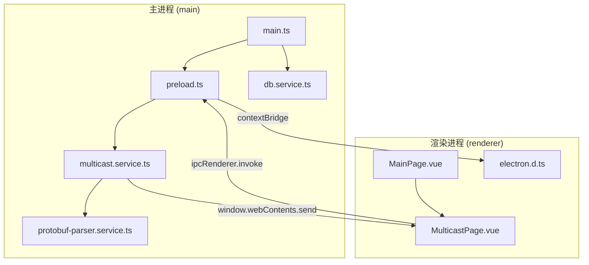
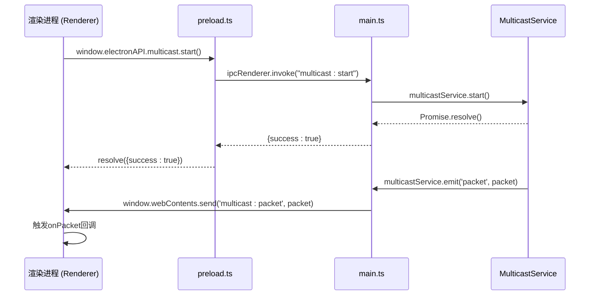
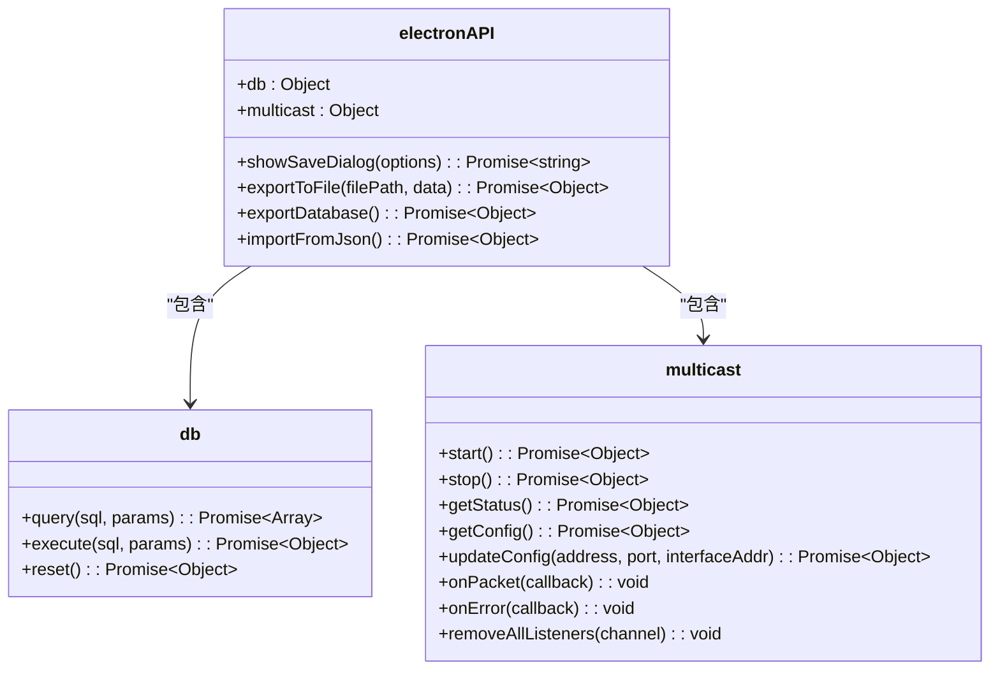
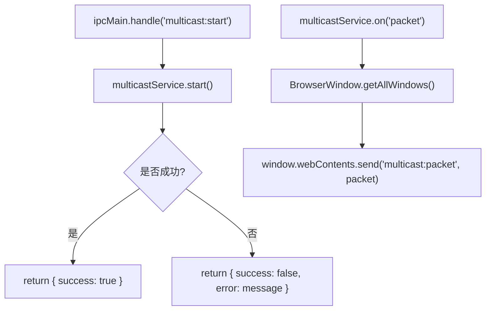
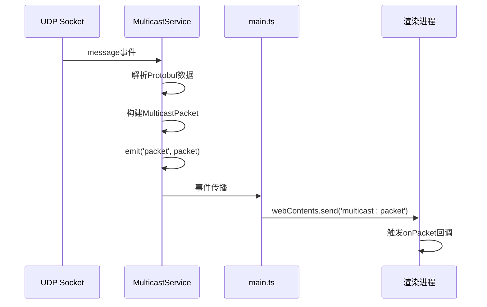
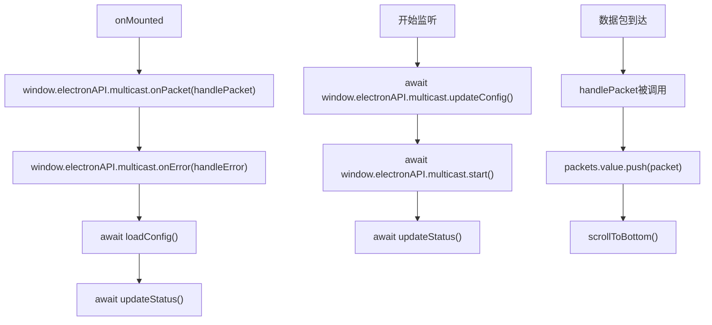
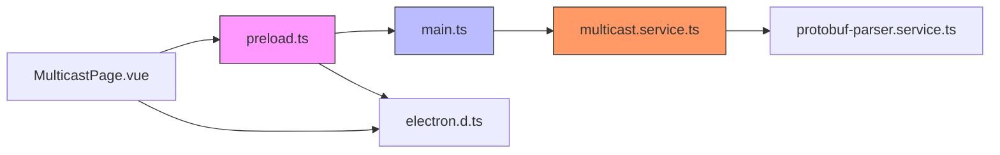

# IPC通信机制

<cite>
**本文档引用的文件**   
- [preload.ts](file://src/main/preload.ts#L0-L57)
- [main.ts](file://src/main/main.ts#L0-L448)
- [multicast.service.ts](file://src/main/services/multicast.service.ts#L0-L179)
- [electron.d.ts](file://src/renderer/typings/electron.d.ts#L0-L50)
- [MulticastPage.vue](file://src/renderer/views/pages/MulticastPage.vue#L0-L410)
</cite>

## 目录
1. [引言](#引言)
2. [项目结构](#项目结构)
3. [核心组件](#核心组件)
4. [架构概述](#架构概述)
5. [详细组件分析](#详细组件分析)
6. [依赖分析](#依赖分析)
7. [性能考虑](#性能考虑)
8. [故障排除指南](#故障排除指南)
9. [结论](#结论)

## 引言
本项目是一个基于Electron的桌面应用程序，实现了主进程与渲染进程之间的安全进程间通信（IPC）。系统通过`contextBridge`机制暴露受控的Node.js功能，使用异步`ipcRenderer.invoke`和事件监听模式实现双向通信。核心功能包括数据库操作、组播数据监听、文件导入导出等。本文档将深入分析其IPC机制的设计与实现。

## 项目结构
项目采用分层架构，主要分为`main`（主进程）、`renderer`（渲染进程）和`protobuf`（协议定义）三个目录。主进程负责系统级操作和硬件通信，渲染进程负责用户界面展示，两者通过预加载脚本（preload.ts）建立安全通信通道。



**图示来源**
- [main.ts](file://src/main/main.ts#L0-L53)
- [preload.ts](file://src/main/preload.ts#L0-L27)
- [multicast.service.ts](file://src/main/services/multicast.service.ts#L0-L179)
- [MulticastPage.vue](file://src/renderer/views/pages/MulticastPage.vue#L0-L410)

**本节来源**
- [main.ts](file://src/main/main.ts#L0-L53)
- [preload.ts](file://src/main/preload.ts#L0-L27)

## 核心组件
系统的核心组件包括：
- **preload.ts**：安全桥梁，通过`contextBridge`暴露受控API
- **main.ts**：主进程入口，注册IPC事件处理器
- **multicast.service.ts**：组播服务，继承EventEmitter处理UDP数据包
- **electron.d.ts**：类型定义，确保渲染进程调用的安全性
- **MulticastPage.vue**：用户界面，消费IPC暴露的功能

这些组件共同构成了一个安全、类型化、事件驱动的IPC通信体系。

**本节来源**
- [preload.ts](file://src/main/preload.ts#L0-L57)
- [main.ts](file://src/main/main.ts#L0-L448)
- [multicast.service.ts](file://src/main/services/multicast.service.ts#L0-L179)
- [electron.d.ts](file://src/renderer/typings/electron.d.ts#L0-L50)

## 架构概述
系统采用Electron的标准架构模式，主进程与渲染进程通过预加载脚本进行安全通信。主进程拥有完整的Node.js权限，负责文件系统、数据库、网络等敏感操作；渲染进程运行在沙箱环境中，通过`window.electronAPI`调用主进程功能。



**图示来源**
- [preload.ts](file://src/main/preload.ts#L29-L57)
- [main.ts](file://src/main/main.ts#L55-L103)
- [multicast.service.ts](file://src/main/services/multicast.service.ts#L0-L179)

## 详细组件分析

### preload.ts 安全暴露机制分析
`preload.ts`文件使用`contextBridge.exposeInMainWorld`将受控的API暴露给渲染进程，防止直接访问危险的Node.js API。



**图示来源**
- [preload.ts](file://src/main/preload.ts#L0-L57)

**本节来源**
- [preload.ts](file://src/main/preload.ts#L0-L57)

#### 安全性设计
- **上下文隔离**：在`main.ts`中设置`contextIsolation: true`，防止原型链污染
- **API最小化**：只暴露必要的功能，不直接暴露`require`、`process`等危险对象
- **数据序列化验证**：`ensureSerializable`函数确保传输数据可被JSON序列化

```typescript
function ensureSerializable(data: any): any {
  try {
    JSON.parse(JSON.stringify(data));
    return data;
  } catch (e) {
    console.error("Non-serializable data:", data);
    throw new Error("Data contains non-serializable values");
  }
}
```

### main.ts IPC事件处理器分析
`main.ts`文件通过`ipcMain.handle`注册异步事件处理器，处理来自渲染进程的请求。



**图示来源**
- [main.ts](file://src/main/main.ts#L55-L103)

**本节来源**
- [main.ts](file://src/main/main.ts#L55-L103)

#### 异步方法处理
所有`ipcMain.handle`处理器都返回Promise，支持异步操作：

```typescript
ipcMain.handle("multicast:start", async () => {
  try {
    await multicastService.start();
    return { success: true };
  } catch (error: any) {
    return { success: false, error: error.message };
  }
});
```

#### 事件转发机制
主进程监听`MulticastService`的事件，并通过`webContents.send`转发给所有渲染窗口：

```typescript
multicastService.on('packet', (packet: MulticastPacket) => {
  const windows = BrowserWindow.getAllWindows();
  windows.forEach(window => {
    window.webContents.send('multicast:packet', packet);
  });
});
```

### MulticastService 数据推送场景分析
`MulticastService`是一个基于`EventEmitter`的UDP组播监听服务，负责接收和解析网络数据包。



**图示来源**
- [multicast.service.ts](file://src/main/services/multicast.service.ts#L0-L179)
- [main.ts](file://src/main/main.ts#L55-L103)

**本节来源**
- [multicast.service.ts](file://src/main/services/multicast.service.ts#L0-L179)

#### 数据流路径
1. UDP套接字接收到数据包
2. `message`事件触发，调用`protobufParserService.parsePacket`尝试解析
3. 构建`MulticastPacket`对象，包含原始数据和解析结果
4. 服务`emit('packet', packet)`触发事件
5. `main.ts`监听该事件，通过`webContents.send`转发给渲染进程
6. 渲染进程通过`window.electronAPI.multicast.onPacket`接收数据

### 类型安全的IPC接口定义
通过`electron.d.ts`文件在全局`Window`接口中定义`electronAPI`的类型，确保类型安全。

```mermaid
classDiagram
class Window {
+electronAPI : ElectronAPI
}
class ElectronAPI {
+database : DatabaseAPI
+export : ExportAPI
+import : ImportAPI
+multicast : MulticastAPI
}
class DatabaseAPI {
+query(sql : string, params? : any[]) : Promise~any[]~
+execute(sql : string, params? : any[]) : Promise~{success : boolean, lastId? : number, changes? : number}~
+reset() : Promise~{success : boolean}~
}
class MulticastAPI {
+start() : Promise~{success : boolean}~
+stop() : Promise~{success : boolean}~
+getStatus() : Promise~MulticastStatus~
+getConfig() : Promise~{address : string, port : number, interfaceAddress : string}~
+updateConfig(address : string, port : number, interfaceAddr : string) : Promise~{success : boolean}~
+onPacket(callback : (packet : MulticastPacket) => void) : void
+onError(callback : (error : string) => void) : void
+removeAllListeners(channel : string) : void
}
class MulticastPacket {
+timestamp : number
+source : string
+data : Buffer
+dataString : string
+size : number
+parsedPacket? : ParsedPacket
}
class MulticastStatus {
+isListening : boolean
+address : string
+port : number
}
Window --> ElectronAPI
ElectronAPI --> DatabaseAPI
ElectronAPI --> MulticastAPI
MulticastAPI --> MulticastPacket
MulticastAPI --> MulticastStatus
```

**图示来源**
- [electron.d.ts](file://src/renderer/typings/electron.d.ts#L0-L50)

**本节来源**
- [electron.d.ts](file://src/renderer/typings/electron.d.ts#L0-L50)

### 渲染进程中的IPC调用实现
在`MulticastPage.vue`中，通过`window.electronAPI`调用主进程功能，并设置事件监听器。



**图示来源**
- [MulticastPage.vue](file://src/renderer/views/pages/MulticastPage.vue#L283-L410)

**本节来源**
- [MulticastPage.vue](file://src/renderer/views/pages/MulticastPage.vue#L283-L410)

#### 错误边界处理
代码中实现了完善的错误处理机制：

```typescript
// 异步调用的错误处理
const startListening = async () => {
  starting.value = true;
  try {
    const result = await window.electronAPI.multicast.start();
    if (result.success) {
      ElMessage.success('组播监听已启动');
    } else {
      ElMessage.error(`启动失败: ${result.error}`);
    }
  } catch (error) {
    ElMessage.error(`启动监听失败: ${error}`);
  } finally {
    starting.value = false;
  }
};
```

#### 内存泄漏防范
在组件卸载时移除事件监听器，防止内存泄漏：

```typescript
onUnmounted(() => {
  window.electronAPI.multicast.removeAllListeners('multicast:packet');
  window.electronAPI.multicast.removeAllListeners('multicast:error');
});
```

## 依赖分析
系统各组件之间的依赖关系清晰，遵循单一职责原则。



**图示来源**
- [preload.ts](file://src/main/preload.ts#L0-L57)
- [main.ts](file://src/main/main.ts#L0-L448)
- [multicast.service.ts](file://src/main/services/multicast.service.ts#L0-L179)
- [electron.d.ts](file://src/renderer/typings/electron.d.ts#L0-L50)
- [MulticastPage.vue](file://src/renderer/views/pages/MulticastPage.vue#L0-L410)

**本节来源**
- [preload.ts](file://src/main/preload.ts#L0-L57)
- [main.ts](file://src/main/main.ts#L0-L448)

## 性能考虑
- **异步通信**：所有IPC调用均为异步，避免阻塞UI线程
- **批量处理**：数据包接收后直接推送到前端，无需额外处理
- **内存管理**：通过`removeAllListeners`防止事件监听器累积
- **序列化优化**：`ensureSerializable`函数提前验证数据，避免传输失败

## 故障排除指南
### 常见问题
1. **无法接收组播数据**
   - 检查网络接口配置
   - 验证组播地址和端口
   - 确认防火墙设置

2. **Protobuf解析失败**
   - 检查`.proto`文件是否正确加载
   - 验证数据包格式是否符合定义
   - 查看控制台错误日志

3. **IPC调用超时**
   - 检查主进程是否响应
   - 验证`contextBridge`配置
   - 确认渲染进程是否正确加载

### 调试技巧
- 使用`console.log`在`main.ts`和`preload.ts`中添加日志
- 在`MulticastService`的`message`事件中打印原始数据包
- 利用Electron开发者工具检查`window.electronAPI`是否存在

**本节来源**
- [main.ts](file://src/main/main.ts#L55-L103)
- [multicast.service.ts](file://src/main/services/multicast.service.ts#L0-L179)

## 结论
该IPC通信机制设计精良，通过`contextBridge`实现了安全的功能暴露，利用异步`ipcRenderer.invoke`和事件监听模式构建了高效的数据流。类型定义确保了开发时的安全性，错误处理机制完善，内存管理得当。整体设计在安全性与功能性之间取得了良好平衡，为Electron应用的IPC通信提供了优秀范例。