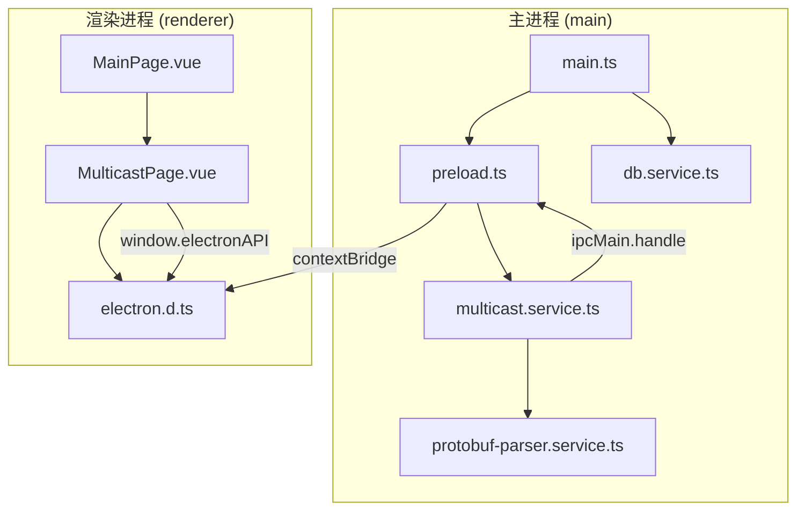
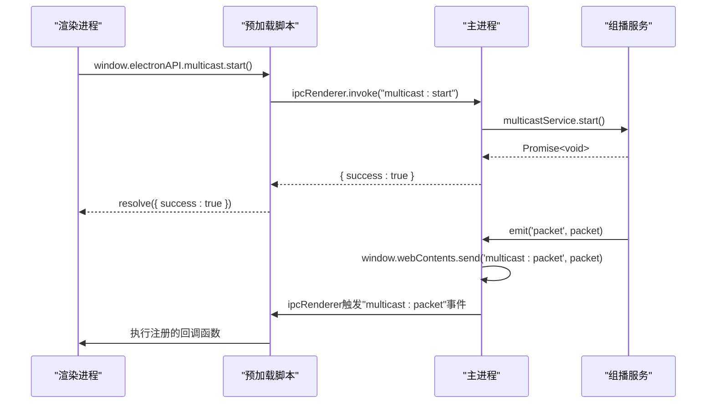
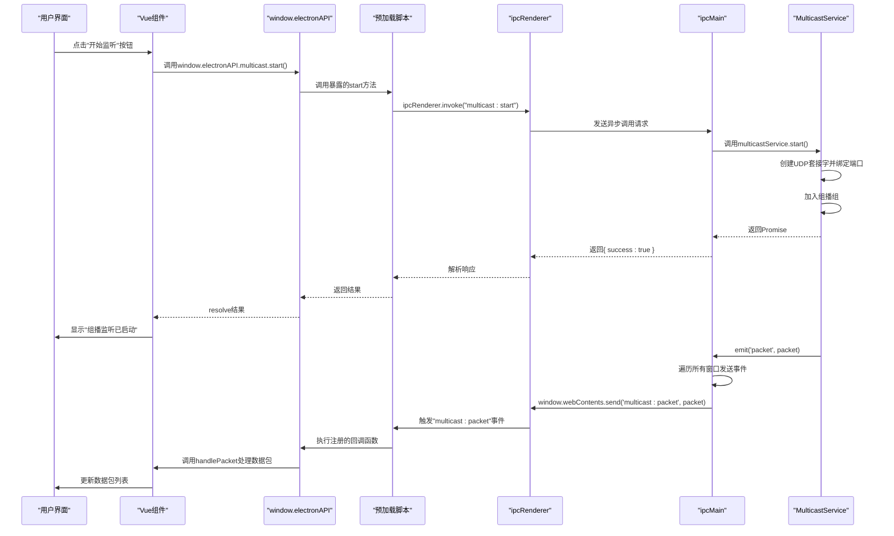

# IPC与预加载脚本

<cite>
**本文档中引用的文件**   
- [preload.ts](file://src/main/preload.ts)
- [main.ts](file://src/main/main.ts)
- [MulticastPage.vue](file://src/renderer/views/pages/MulticastPage.vue)
- [electron.d.ts](file://src/renderer/typings/electron.d.ts)
- [multicast.service.ts](file://src/main/services/multicast.service.ts)
</cite>

## 目录
1. [项目结构分析](#项目结构分析)
2. [核心组件](#核心组件)
3. [安全上下文隔离机制](#安全上下文隔离机制)
4. [预加载脚本与API暴露](#预加载脚本与api暴露)
5. [主进程IPC处理逻辑](#主进程ipc处理逻辑)
6. [渲染进程IPC调用流程](#渲染进程ipc调用流程)
7. [完整通信链路分析](#完整通信链路分析)
8. [数据序列化与安全性](#数据序列化与安全性)

## 项目结构分析

项目采用典型的Electron多进程架构，分为主进程（main）和渲染进程（renderer）两个主要模块。主进程负责系统级操作和原生功能调用，渲染进程负责用户界面展示。



**图示来源**
- [main.ts](file://src/main/main.ts)
- [preload.ts](file://src/main/preload.ts)
- [multicast.service.ts](file://src/main/services/multicast.service.ts)
- [MulticastPage.vue](file://src/renderer/views/pages/MulticastPage.vue)

## 核心组件

项目核心组件包括：
- **主进程入口**：`main.ts`，负责创建窗口、加载预加载脚本和初始化服务
- **预加载脚本**：`preload.ts`，在安全上下文隔离环境下建立主渲染进程通信桥梁
- **组播服务**：`multicast.service.ts`，基于UDP协议实现组播数据监听
- **渲染页面**：`MulticastPage.vue`，提供用户界面与交互功能
- **类型定义**：`electron.d.ts`，为渲染进程提供TypeScript类型支持

**组件来源**
- [main.ts](file://src/main/main.ts)
- [preload.ts](file://src/main/preload.ts)
- [multicast.service.ts](file://src/main/services/multicast.service.ts)
- [MulticastPage.vue](file://src/renderer/views/pages/MulticastPage.vue)
- [electron.d.ts](file://src/renderer/typings/electron.d.ts)

## 安全上下文隔离机制

Electron应用通过配置`webPreferences`实现安全上下文隔离，防止渲染进程直接访问Node.js危险API。

```typescript
// src/main/main.ts
function createWindow() {
  const mainWindow = new BrowserWindow({
    webPreferences: {
      devTools: true,
      preload: join(__dirname, "preload.js"),
      nodeIntegration: false,
      contextIsolation: true,
    },
  });
}
```

**关键安全配置：**
- **nodeIntegration: false**：禁用渲染进程的Node.js集成，防止直接访问`require`等危险API
- **contextIsolation: true**：启用上下文隔离，确保预加载脚本和页面脚本在不同JavaScript上下文中运行
- **preload**：指定预加载脚本路径，在隔离环境下建立安全通信通道

这种配置强制开发者通过`contextBridge`显式暴露受控API，避免了XSS攻击可能导致的任意代码执行风险。

**安全配置来源**
- [main.ts](file://src/main/main.ts#L163-L219)

## 预加载脚本与API暴露

`preload.ts`文件使用`contextBridge.exposeInMainWorld`在全局`window`对象上暴露受控的API接口，建立主渲染进程安全通信桥梁。

```typescript
// src/main/preload.ts
import { contextBridge, ipcRenderer } from "electron";

contextBridge.exposeInMainWorld("electronAPI", {
  db: {
    query: (sql, params) => ipcRenderer.invoke("database:query", sql, params),
    execute: (sql, params) => ipcRenderer.invoke("database:execute", sql, params),
    reset: () => ipcRenderer.invoke("database:reset"),
  },
  multicast: {
    start: () => ipcRenderer.invoke("multicast:start"),
    stop: () => ipcRenderer.invoke("multicast:stop"),
    getStatus: () => ipcRenderer.invoke("multicast:getStatus"),
    getConfig: () => ipcRenderer.invoke("multicast:getConfig"),
    updateConfig: (address, port, interfaceAddr) => 
      ipcRenderer.invoke("multicast:updateConfig", address, port, interfaceAddr),
    onPacket: (callback) => {
      ipcRenderer.on("multicast:packet", (_, packet) => callback(packet));
    },
    onError: (callback) => {
      ipcRenderer.on("multicast:error", (_, error) => callback(error));
    },
    removeAllListeners: (channel) => {
      ipcRenderer.removeAllListeners(channel);
    },
  },
});
```

**暴露的API分类：**
- **数据库操作**：`db.query`、`db.execute`、`db.reset`
- **组播控制**：`multicast.start`、`multicast.stop`、`multicast.getStatus`
- **组播配置**：`multicast.getConfig`、`multicast.updateConfig`
- **事件监听**：`multicast.onPacket`、`multicast.onError`、`multicast.removeAllListeners`

**API暴露来源**
- [preload.ts](file://src/main/preload.ts#L0-L58)

## 主进程IPC处理逻辑

主进程通过`ipcMain.handle`监听来自渲染进程的异步请求，并调用相应服务进行处理。

```typescript
// src/main/main.ts
ipcMain.handle("multicast:start", async () => {
  try {
    await multicastService.start();
    return { success: true };
  } catch (error: any) {
    return { success: false, error: error.message };
  }
});

ipcMain.handle("multicast:stop", async () => {
  try {
    await multicastService.stop();
    return { success: true };
  } catch (error: any) {
    return { success: false, error: error.message };
  }
});

ipcMain.handle("multicast:getStatus", () => {
  return multicastService.getStatus();
});

ipcMain.handle("multicast:getConfig", () => {
  return {
    address: process.env.MULTICAST_ADDRESS || '224.0.0.1',
    port: parseInt(process.env.MULTICAST_PORT || '8888'),
    interfaceAddress: process.env.INTERFACE_ADDRESS || '0.0.0.0'
  };
});

// 监听组播数据包并转发给渲染进程
multicastService.on('packet', (packet: MulticastPacket) => {
  const windows = BrowserWindow.getAllWindows();
  windows.forEach(window => {
    window.webContents.send('multicast:packet', packet);
  });
});
```

**消息处理模式：**
- **异步请求-响应**：使用`ipcMain.handle`和`ipcRenderer.invoke`实现Promise-based异步通信
- **事件订阅-发布**：使用`ipcMain`发送事件，`ipcRenderer.on`监听事件
- **双向通信**：主进程主动向渲染进程推送数据包事件



**主进程处理来源**
- [main.ts](file://src/main/main.ts#L55-L103)

## 渲染进程IPC调用流程

渲染进程通过`window.electronAPI`调用暴露的API，实现与主进程的通信。

```typescript
// src/renderer/views/pages/MulticastPage.vue
const startListening = async () => {
  starting.value = true;
  try {
    const result = await window.electronAPI.multicast.updateConfig(
      config.address,
      config.port,
      config.interfaceAddress
    );
    
    if (result.success) {
      const startResult = await window.electronAPI.multicast.start();
      if (startResult.success) {
        ElMessage.success('组播监听已启动');
        await updateStatus();
      } else {
        ElMessage.error(`启动失败: ${startResult.error}`);
      }
    } else {
      ElMessage.error(`配置更新失败: ${result.error}`);
    }
  } catch (error) {
    ElMessage.error(`启动监听失败: ${error}`);
  } finally {
    starting.value = false;
  }
};

// 设置事件监听
window.electronAPI.multicast.onPacket(handlePacket);
window.electronAPI.multicast.onError(handleError);
```

**调用流程特点：**
- **异步调用**：所有API调用都返回Promise，使用`async/await`语法处理
- **错误处理**：通过try-catch捕获异常，提供用户友好的错误提示
- **状态同步**：调用API后立即更新UI状态，保持界面一致性
- **事件注册**：在组件挂载时注册事件监听，在卸载时清理监听器

```mermaid
flowchart TD
A[用户点击"开始监听"] --> B[调用startListening函数]
B --> C[更新配置updateConfig]
C --> D{配置更新成功?}
D --> |是| E[调用start启动监听]
D --> |否| F[显示错误信息]
E --> G{启动成功?}
G --> |是| H[更新状态并显示成功]
G --> |否| I[显示启动失败]
H --> J[注册数据包监听]
I --> K[清理状态]
J --> L[接收数据包并更新UI]
```

**渲染进程调用来源**
- [MulticastPage.vue](file://src/renderer/views/pages/MulticastPage.vue#L0-L410)

## 完整通信链路分析

从UI触发到主进程执行并返回结果的完整通信链路如下：



**通信链路关键点：**
1. **UI触发**：用户在`MulticastPage.vue`点击"开始监听"按钮
2. **API调用**：调用`window.electronAPI.multicast.start()`
3. **预加载桥接**：`preload.ts`中的`contextBridge`将调用转发给`ipcRenderer.invoke`
4. **主进程处理**：`main.ts`中的`ipcMain.handle`监听并调用`multicastService.start()`
5. **服务执行**：`multicast.service.ts`创建UDP套接字并开始监听组播数据
6. **结果返回**：处理结果通过Promise链返回到渲染进程
7. **事件推送**：当收到组播数据包时，主进程通过`webContents.send`主动推送事件
8. **UI更新**：渲染进程接收到事件后更新界面显示

**完整链路来源**
- [MulticastPage.vue](file://src/renderer/views/pages/MulticastPage.vue)
- [preload.ts](file://src/main/preload.ts)
- [main.ts](file://src/main/main.ts)
- [multicast.service.ts](file://src/main/services/multicast.service.ts)

## 数据序列化与安全性

为了确保跨进程通信的数据安全，项目实现了数据序列化验证机制。

```typescript
// src/main/preload.ts
function ensureSerializable(data: any): any {
  try {
    JSON.parse(JSON.stringify(data));
    return data;
  } catch (e) {
    console.error("Non-serializable data:", data);
    throw new Error("Data contains non-serializable values");
  }
}

// 在exportToFile中使用
exportToFile: async (filePath: string, data: any) => {
  return await ipcRenderer.invoke("export-file", {
    filePath,
    data: ensureSerializable(data),
  });
}
```

**安全性保障措施：**
- **数据验证**：`ensureSerializable`函数验证数据是否可序列化
- **内容安全策略**：主进程设置CSP头`script-src 'self'`，防止XSS攻击
- **最小权限原则**：只暴露必要的API，限制渲染进程的能力
- **输入验证**：主进程对所有输入参数进行验证和错误处理
- **环境隔离**：开发和生产环境使用不同的配置和加载方式

这些安全措施共同构建了一个可靠的Electron应用架构，既保证了功能完整性，又确保了应用安全性。

**数据安全来源**
- [preload.ts](file://src/main/preload.ts#L50-L58)
- [main.ts](file://src/main/main.ts#L190-L205)