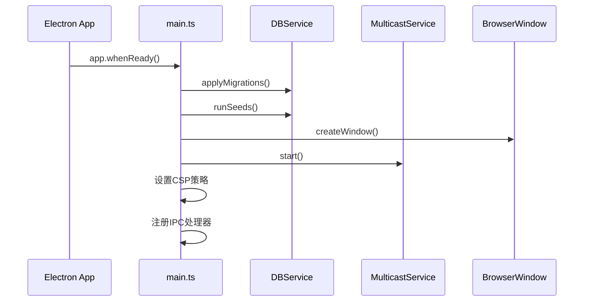
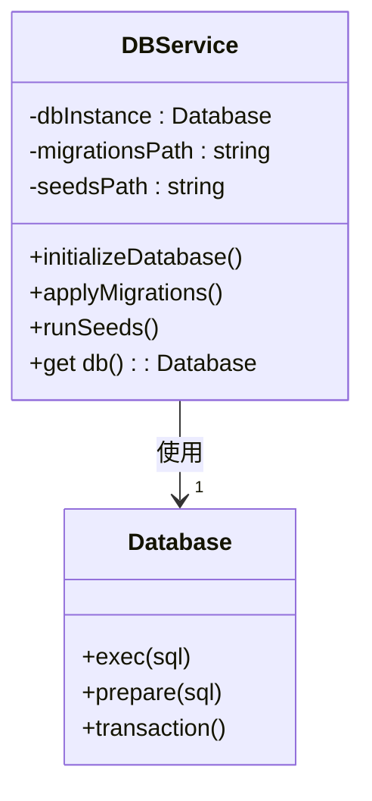
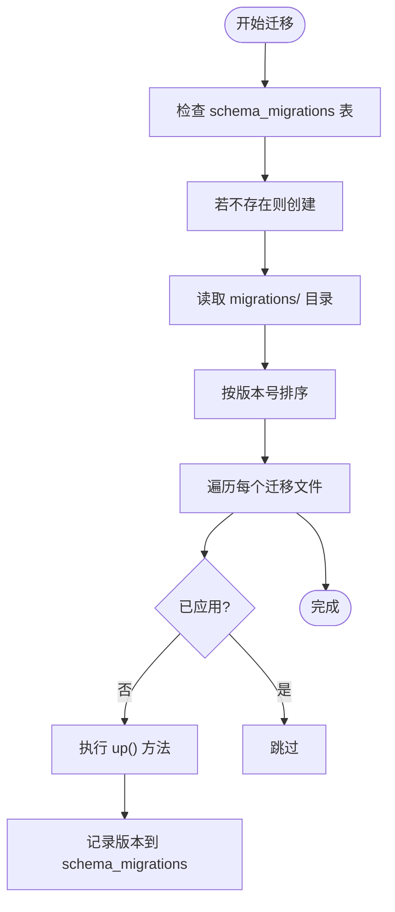
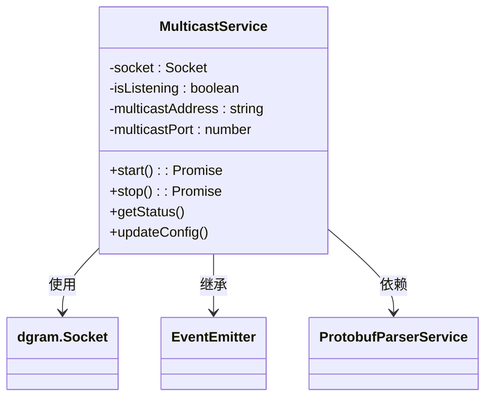
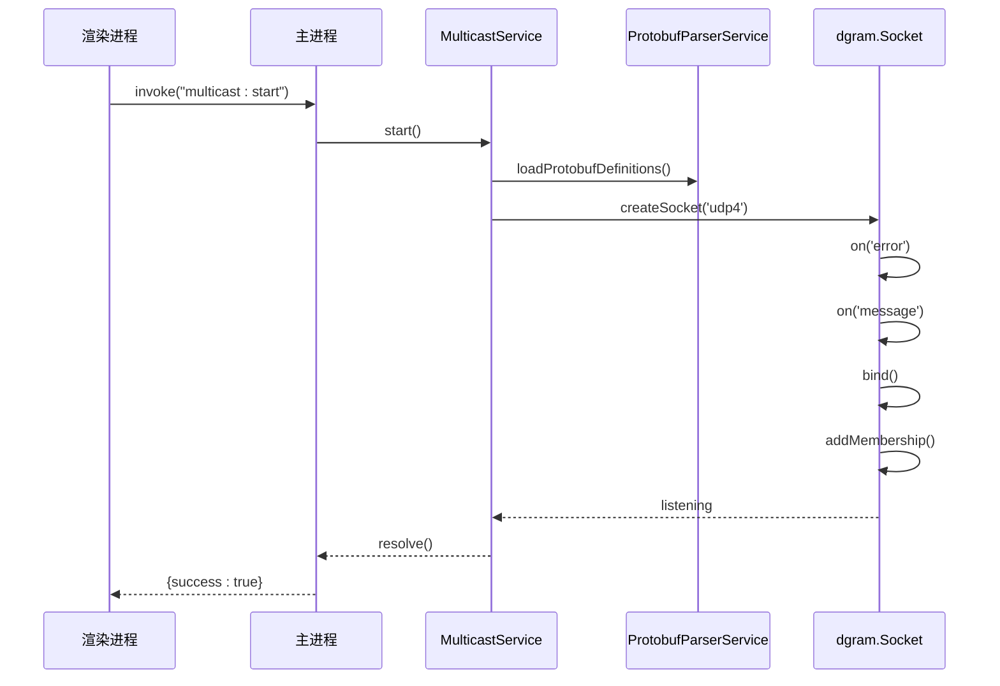
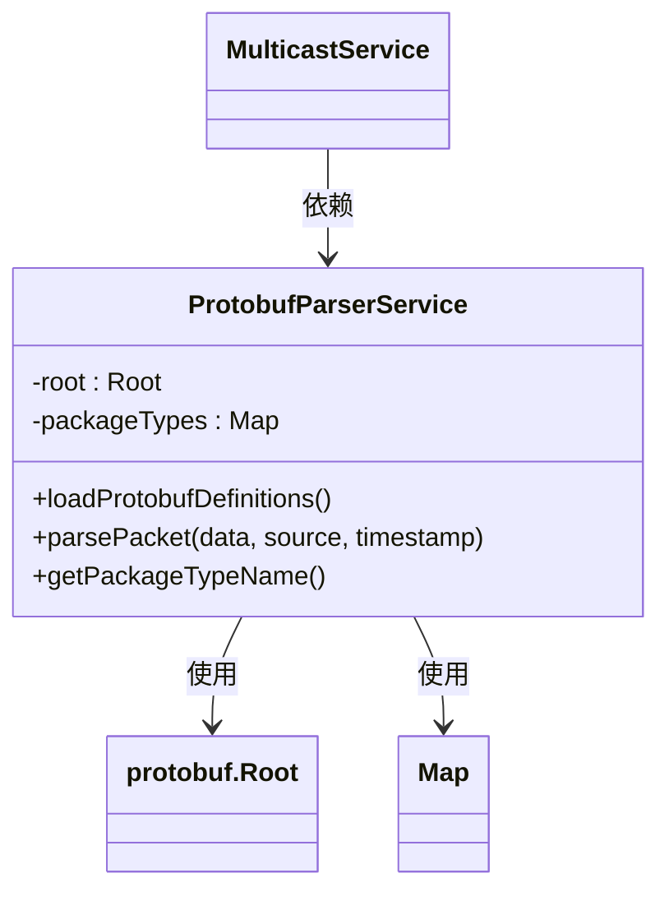
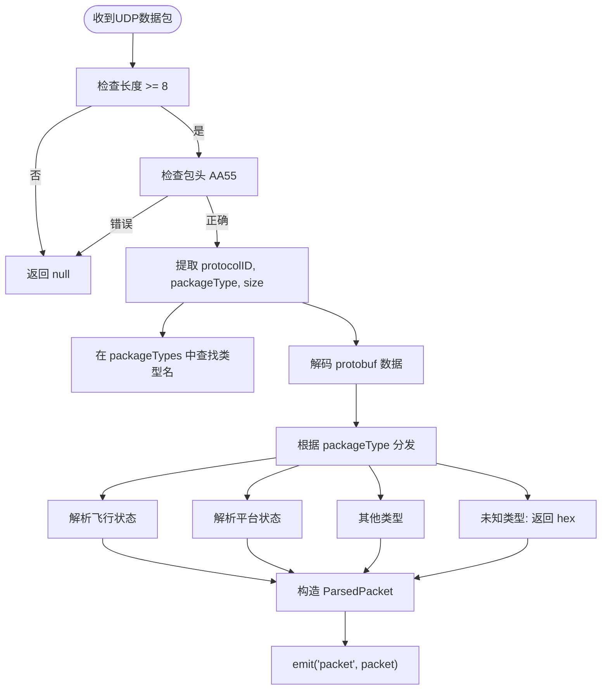
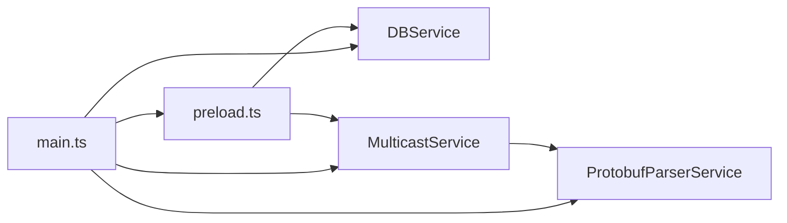
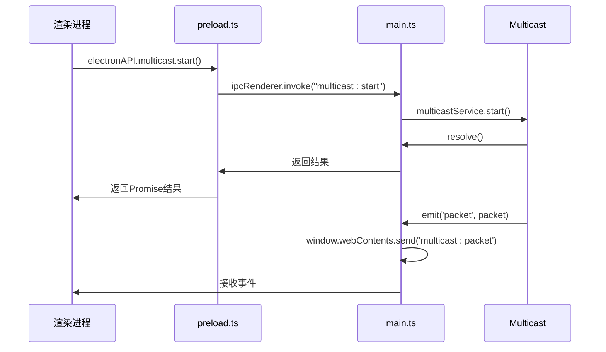
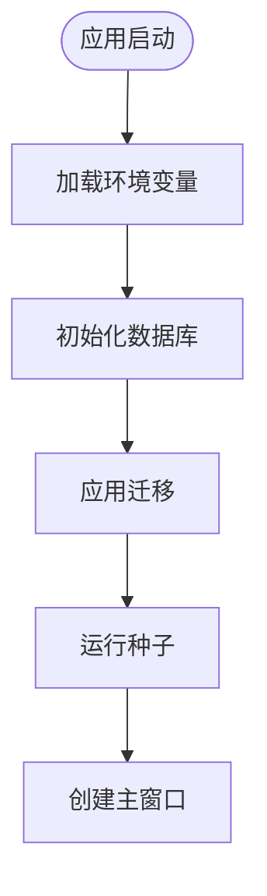

# 主进程架构

<cite>
**本文档引用文件**   
- [main.ts](file://src/main/main.ts#L1-L449)
- [db.service.ts](file://src/main/database/db.service.ts#L1-L96)
- [multicast.service.ts](file://src/main/services/multicast.service.ts#L1-L180)
- [protobuf-parser.service.ts](file://src/main/services/protobuf-parser.service.ts#L1-L458)
- [001-initial-schema.js](file://src/main/database/migrations/001-initial-schema.js#L1-L26)
- [002-update-table-users.js](file://src/main/database/migrations/002-update-table-users.js#L1-L24)
- [001-sample-data.js](file://src/main/database/seeds/001-sample-data.js#L1-L27)
- [preload.ts](file://src/main/preload.ts#L1-L59)
</cite>

## 目录
1. [项目结构](#项目结构)
2. [核心组件](#核心组件)
3. [主进程架构概述](#主进程架构概述)
4. [详细组件分析](#详细组件分析)
5. [服务依赖与生命周期管理](#服务依赖与生命周期管理)
6. [数据流与通信机制](#数据流与通信机制)
7. [错误处理与安全配置](#错误处理与安全配置)
8. [数据库管理机制](#数据库管理机制)

## 项目结构

项目采用分层架构设计，将主进程、渲染进程、协议定义和数据库管理分离，确保职责清晰。

```mermaid
graph TB
subgraph "主进程 (main)"
A[src/main/main.ts] --> B[src/main/database/db.service.ts]
A --> C[src/main/services/multicast.service.ts]
A --> D[src/main/services/protobuf-parser.service.ts]
B --> E[src/main/database/migrations]
B --> F[src/main/database/seeds]
C --> D
end
subgraph "渲染进程 (renderer)"
G[src/renderer/main.ts]
H[src/renderer/App.vue]
I[src/renderer/services]
end
subgraph "共享资源"
J[src/protobuf]
K[config.env]
end
A --> |通过preload.ts| G
D --> |加载| J
A --> |读取| K
B --> |初始化| "SQLite3数据库"
```

**图示来源**
- [main.ts](file://src/main/main.ts#L1-L449)
- [db.service.ts](file://src/main/database/db.service.ts#L1-L96)
- [multicast.service.ts](file://src/main/services/multicast.service.ts#L1-L180)

**本节来源**
- [main.ts](file://src/main/main.ts#L1-L449)
- [project_structure](file://#L1-L20)

## 核心组件

主进程包含三个核心服务组件：`DBService` 负责数据持久化，`MulticastService` 处理UDP组播通信，`ProtobufParserService` 解析二进制协议数据。这些服务通过单例模式全局访问，并在 `main.ts` 入口文件中初始化。

**本节来源**
- [main.ts](file://src/main/main.ts#L1-L449)
- [db.service.ts](file://src/main/database/db.service.ts#L1-L96)
- [multicast.service.ts](file://src/main/services/multicast.service.ts#L1-L180)
- [protobuf-parser.service.ts](file://src/main/services/protobuf-parser.service.ts#L1-L458)

## 主进程架构概述

主进程作为Electron应用的控制中心，负责窗口管理、服务初始化和进程间通信。其启动流程如下：

1. 加载环境配置文件 `config.env`
2. 初始化数据库服务并执行迁移和种子
3. 创建主窗口
4. 启动组播监听服务
5. 设置内容安全策略
6. 建立IPC通信通道



**图示来源**
- [main.ts](file://src/main/main.ts#L1-L449)

**本节来源**
- [main.ts](file://src/main/main.ts#L1-L449)

## 详细组件分析

### DBService 数据库服务分析

`DBService` 是一个单例类，封装了SQLite3数据库的初始化、迁移和种子数据填充功能。



**图示来源**
- [db.service.ts](file://src/main/database/db.service.ts#L5-L94)

**本节来源**
- [db.service.ts](file://src/main/database/db.service.ts#L1-L96)

#### 数据库迁移机制

系统通过迁移文件管理数据库模式变更。每次启动时，服务会检查并应用未执行的迁移。



**图示来源**
- [db.service.ts](file://src/main/database/db.service.ts#L50-L75)
- [001-initial-schema.js](file://src/main/database/migrations/001-initial-schema.js#L1-L26)
- [002-update-table-users.js](file://src/main/database/migrations/002-update-table-users.js#L1-L24)

**本节来源**
- [db.service.ts](file://src/main/database/db.service.ts#L1-L96)
- [001-initial-schema.js](file://src/main/database/migrations/001-initial-schema.js#L1-L26)
- [002-update-table-users.js](file://src/main/database/migrations/002-update-table-users.js#L1-L24)

#### 初始模式迁移

`001-initial-schema.js` 创建了两个基础表：

```javascript
// 创建公司表
CREATE TABLE companies (
  id INTEGER PRIMARY KEY AUTOINCREMENT,
  name TEXT NOT NULL,
  type TEXT NOT NULL,
  capacity INTEGER,
  owner TEXT
);

// 创建用户表
CREATE TABLE users (
  id INTEGER PRIMARY KEY AUTOINCREMENT,
  company_id INTEGER REFERENCES companies(id) ON DELETE CASCADE,
  name TEXT NOT NULL,
  email TEXT UNIQUE
);
```

**本节来源**
- [001-initial-schema.js](file://src/main/database/migrations/001-initial-schema.js#L1-L26)

#### 用户表更新迁移

`002-update-table-users.js` 为用户表添加年龄字段：

```javascript
ALTER TABLE users 
ADD COLUMN age INTEGER NOT NULL DEFAULT 18;
```

**本节来源**
- [002-update-table-users.js](file://src/main/database/migrations/002-update-table-users.js#L1-L24)

#### 种子数据填充

`001-sample-data.js` 在数据库中插入初始数据：

```javascript
const companies = [
  { name: "Company A", type: "Cargo", capacity: 1000, owner: "Owner A" },
  { name: "Company B", type: "Tanker", capacity: 2000, owner: "Owner B" },
];

const users = [
  { companyId: 1, name: "John Doe", email: "john@example.com", age: 30 },
  { companyId: 2, name: "Jane Smith", email: "jane@example.com", age: 25 },
];
```

**本节来源**
- [001-sample-data.js](file://src/main/database/seeds/001-sample-data.js#L1-L27)

### MulticastService 组播服务分析

`MulticastService` 基于Node.js的dgram模块实现UDP组播监听，继承自EventEmitter以支持事件驱动通信。



**图示来源**
- [multicast.service.ts](file://src/main/services/multicast.service.ts#L20-L177)

**本节来源**
- [multicast.service.ts](file://src/main/services/multicast.service.ts#L1-L180)

#### 组播服务启动流程



**图示来源**
- [main.ts](file://src/main/main.ts#L55-L65)
- [multicast.service.ts](file://src/main/services/multicast.service.ts#L30-L85)

**本节来源**
- [multicast.service.ts](file://src/main/services/multicast.service.ts#L1-L180)

### ProtobufParserService 协议解析服务分析

该服务负责加载.proto文件并解析二进制数据包。



**图示来源**
- [protobuf-parser.service.ts](file://src/main/services/protobuf-parser.service.ts#L15-L455)

**本节来源**
- [protobuf-parser.service.ts](file://src/main/services/protobuf-parser.service.ts#L1-L458)

#### 协议解析流程



**图示来源**
- [protobuf-parser.service.ts](file://src/main/services/protobuf-parser.service.ts#L100-L200)

**本节来源**
- [protobuf-parser.service.ts](file://src/main/services/protobuf-parser.service.ts#L1-L458)

## 服务依赖与生命周期管理

各服务之间存在明确的依赖关系，通过单例模式确保全局唯一实例。



**图示来源**
- [main.ts](file://src/main/main.ts#L1-L449)
- [preload.ts](file://src/main/preload.ts#L1-L59)

**本节来源**
- [main.ts](file://src/main/main.ts#L1-L449)
- [db.service.ts](file://src/main/database/db.service.ts#L1-L96)
- [multicast.service.ts](file://src/main/services/multicast.service.ts#L1-L180)
- [protobuf-parser.service.ts](file://src/main/services/protobuf-parser.service.ts#L1-L458)

### 单例模式实现

所有服务均通过导出实例的方式实现单例：

```typescript
// db.service.ts
export const dbService = new DBService();

// multicast.service.ts  
export const multicastService = new MulticastService();

// protobuf-parser.service.ts
export const protobufParserService = new ProtobufParserService();
```

**本节来源**
- [db.service.ts](file://src/main/database/db.service.ts#L94-L94)
- [multicast.service.ts](file://src/main/services/multicast.service.ts#L179-L179)
- [protobuf-parser.service.ts](file://src/main/services/protobuf-parser.service.ts#L457-L457)

## 数据流与通信机制

主进程与渲染进程通过IPC进行双向通信，使用contextBridge确保安全性。



**图示来源**
- [main.ts](file://src/main/main.ts#L85-L95)
- [preload.ts](file://src/main/preload.ts#L29-L57)

**本节来源**
- [main.ts](file://src/main/main.ts#L1-L449)
- [preload.ts](file://src/main/preload.ts#L1-L59)

## 错误处理与安全配置

系统实现了多层次的错误处理和安全防护机制。

### 错误处理策略

- **服务启动错误**：在 `app.whenReady()` 中捕获并退出应用
- **IPC调用错误**：使用try-catch包装并返回结构化错误信息
- **数据库操作错误**：在事务中处理，返回错误码和消息
- **文件操作错误**：重试机制处理EBUSY错误

```typescript
// 示例：数据库重置的错误处理
try {
    // ... 操作
} catch (err: any) {
    if (err.code === 'EBUSY' && retries > 0) {
        await new Promise(resolve => setTimeout(resolve, 200));
        continue;
    }
    throw err;
}
```

**本节来源**
- [main.ts](file://src/main/main.ts#L105-L150)

### 安全配置

主进程实施了严格的安全措施：

```typescript
webPreferences: {
    devTools: true,
    preload: join(__dirname, "preload.js"),
    nodeIntegration: false,  // 防止RCE攻击
    contextIsolation: true,  // 隔离上下文
}
```

同时设置了内容安全策略：

```typescript
session.defaultSession.webRequest.onHeadersReceived((details, callback) => {
    callback({
        responseHeaders: {
            ...details.responseHeaders,
            "Content-Security-Policy": ["script-src 'self'"],
        },
    });
});
```

**本节来源**
- [main.ts](file://src/main/main.ts#L180-L185)
- [main.ts](file://src/main/main.ts#L160-L168)

## 数据库管理机制

系统实现了完整的数据库生命周期管理，包括初始化、迁移、种子和备份恢复。

### 数据库初始化流程



**本节来源**
- [main.ts](file://src/main/main.ts#L10-L20)

### 数据导入导出功能

系统提供了完整的数据管理API：

- **导出**：数据库、SQL查询、JSON文件
- **导入**：JSON文件、SQLite数据库、SQL脚本

```typescript
// 导出数据库
ipcMain.handle("export-database", async () => {
    // 复制数据库文件
    await fs.promises.copyFile(srcDb, filePath);
});
```

**本节来源**
- [main.ts](file://src/main/main.ts#L250-L350)