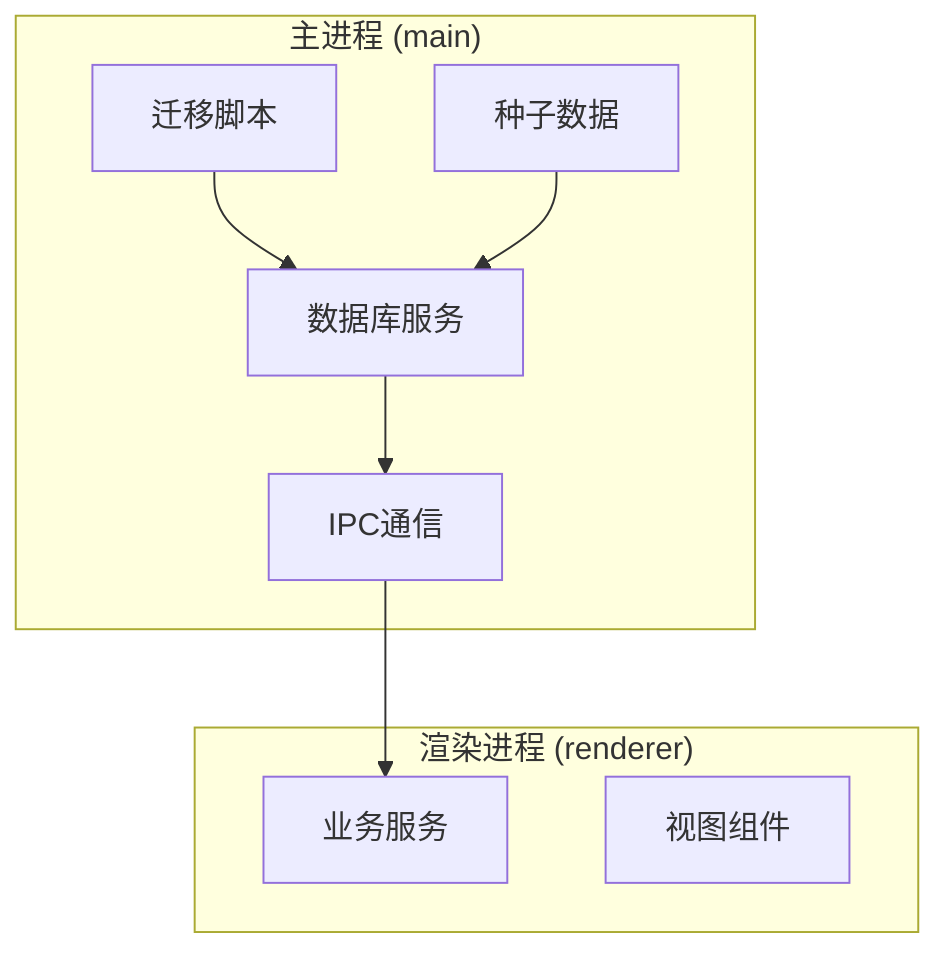
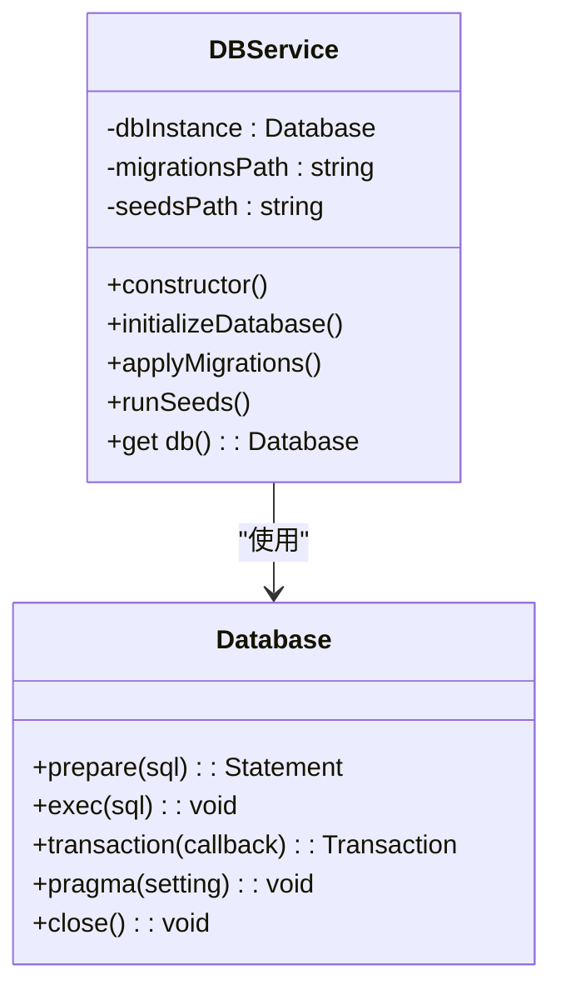
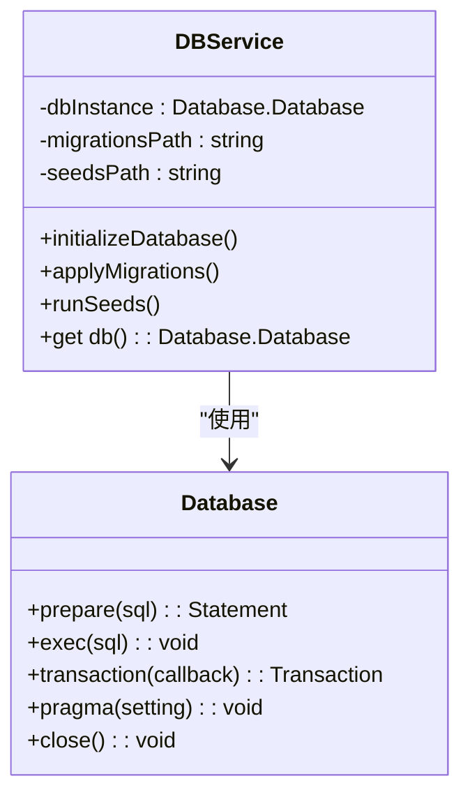
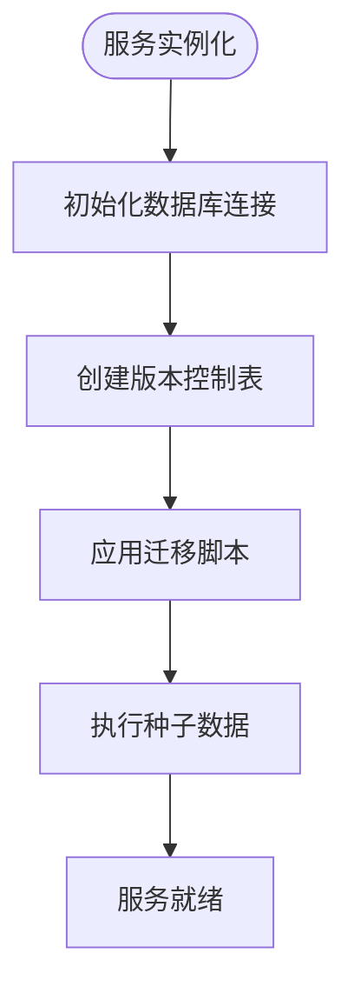
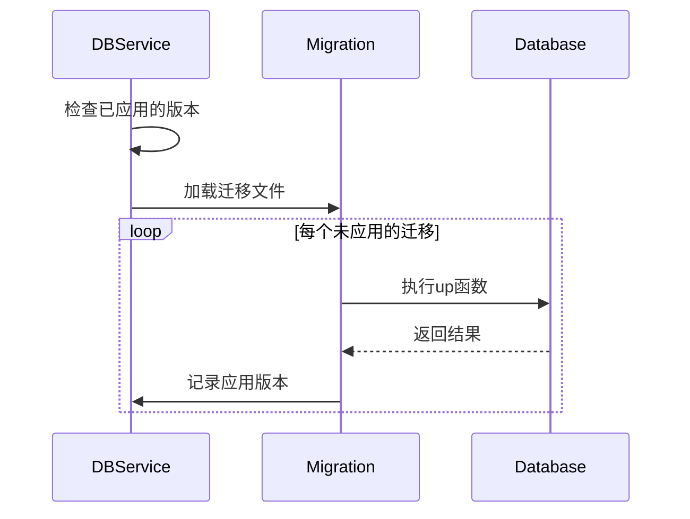
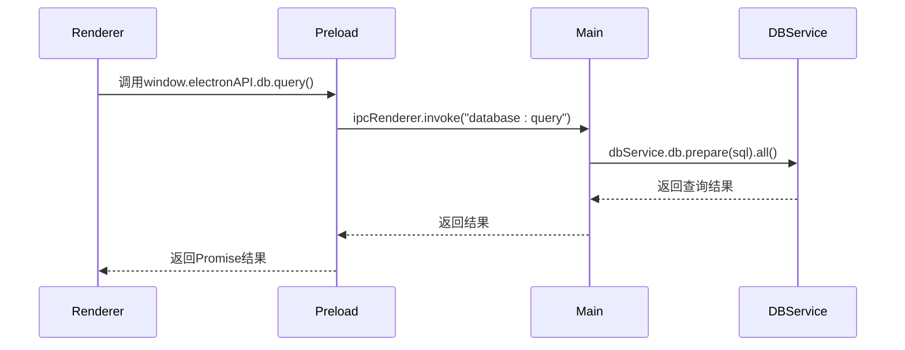
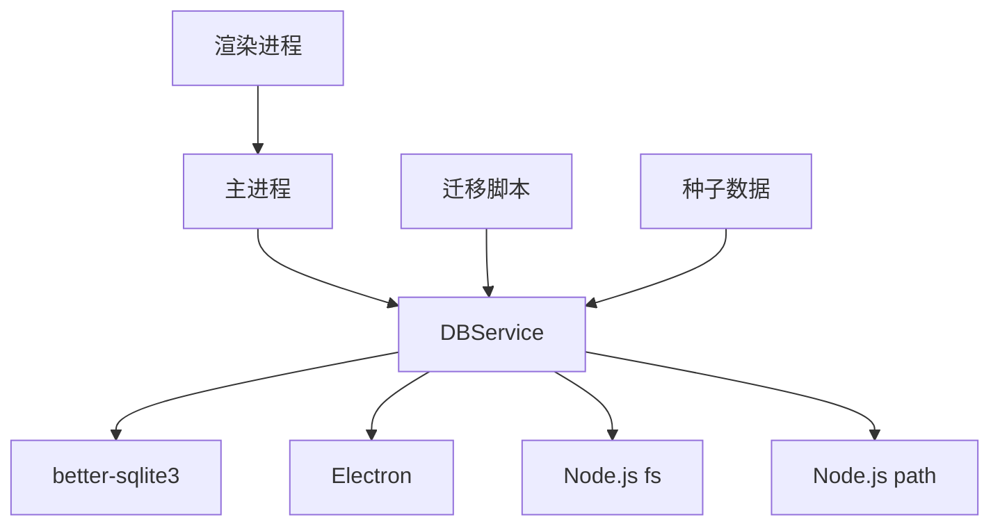
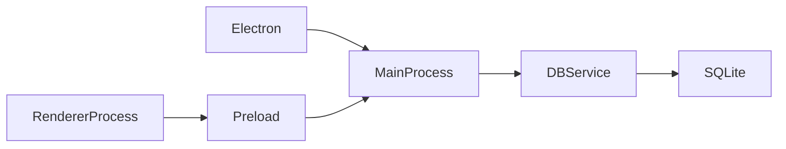
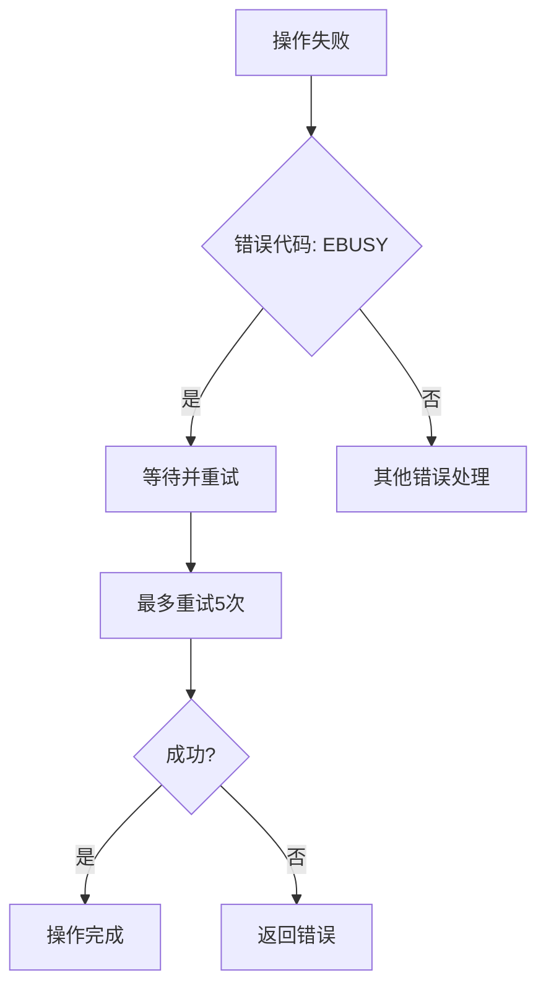

# 数据库服务

<cite>
**本文档引用的文件**   
- [db.service.ts](file://src/main/database/db.service.ts)
- [001-initial-schema.js](file://src/main/database/migrations/001-initial-schema.js)
- [002-update-table-users.js](file://src/main/database/migrations/002-update-table-users.js)
- [001-sample-data.js](file://src/main/database/seeds/001-sample-data.js)
- [main.ts](file://src/main/main.ts)
- [preload.ts](file://src/main/preload.ts)
- [companies.ts](file://src/renderer/services/companies.ts)
- [users.ts](file://src/renderer/services/users.ts)
</cite>

## 目录
1. [项目结构](#项目结构)
2. [核心组件](#核心组件)
3. [架构概述](#架构概述)
4. [详细组件分析](#详细组件分析)
5. [依赖分析](#依赖分析)
6. [性能考虑](#性能考虑)
7. [故障排除指南](#故障排除指南)

## 项目结构

项目采用分层架构设计，主要分为三个核心目录：`main`（主进程）、`renderer`（渲染进程）和`protobuf`（协议定义）。数据库服务位于主进程的`database`模块中，通过Electron的IPC机制与渲染进程通信。



**图示来源**
- [db.service.ts](file://src/main/database/db.service.ts)
- [main.ts](file://src/main/main.ts)
- [preload.ts](file://src/main/preload.ts)

**本节来源**
- [db.service.ts](file://src/main/database/db.service.ts)
- [main.ts](file://src/main/main.ts)

## 核心组件

`DBService`是整个应用的核心数据访问组件，采用单例模式实现，确保全局唯一性和线程安全访问。该服务封装了`better-sqlite3`数据库驱动，提供了数据库初始化、迁移、种子数据加载和查询执行等核心功能。

**本节来源**
- [db.service.ts](file://src/main/database/db.service.ts)

## 架构概述

`DBService`的架构设计遵循了现代数据库应用的最佳实践，包括自动初始化、版本控制的迁移机制和数据种子加载。



**图示来源**
- [db.service.ts](file://src/main/database/db.service.ts)

## 详细组件分析

### DBService 类分析

`DBService`类是数据库服务的核心实现，采用单例模式确保全局唯一性。

#### 类图


**图示来源**
- [db.service.ts](file://src/main/database/db.service.ts)

#### 初始化流程


**图示来源**
- [db.service.ts](file://src/main/database/db.service.ts)

**本节来源**
- [db.service.ts](file://src/main/database/db.service.ts)

### 数据库迁移机制

数据库迁移机制确保了数据库模式的版本控制和演进。

#### 迁移流程


**图示来源**
- [db.service.ts](file://src/main/database/db.service.ts)
- [001-initial-schema.js](file://src/main/database/migrations/001-initial-schema.js)

#### 核心表结构
根据`001-initial-schema.js`中的SQL定义，核心表结构设计如下：

```mermaid
erDiagram
COMPANIES {
integer id PK
text name NOT NULL
text type NOT NULL
integer capacity
text owner
}
USERS {
integer id PK
integer company_id FK
text name NOT NULL
text email UNIQUE
integer age
}
COMPANIES ||--o{ USERS : "拥有"
```

**图示来源**
- [001-initial-schema.js](file://src/main/database/migrations/001-initial-schema.js)
- [002-update-table-users.js](file://src/main/database/migrations/002-update-table-users.js)

**本节来源**
- [001-initial-schema.js](file://src/main/database/migrations/001-initial-schema.js)
- [002-update-table-users.js](file://src/main/database/migrations/002-update-table-users.js)

### 通信机制分析

#### 主进程与渲染进程通信


**图示来源**
- [main.ts](file://src/main/main.ts)
- [preload.ts](file://src/main/preload.ts)
- [db.service.ts](file://src/main/database/db.service.ts)

**本节来源**
- [main.ts](file://src/main/main.ts)
- [preload.ts](file://src/main/preload.ts)

## 依赖分析

### 组件依赖关系


**图示来源**
- [db.service.ts](file://src/main/database/db.service.ts)
- [package.json](file://package.json)

### 运行时依赖


**图示来源**
- [db.service.ts](file://src/main/database/db.service.ts)
- [main.ts](file://src/main/main.ts)
- [preload.ts](file://src/main/preload.ts)

**本节来源**
- [db.service.ts](file://src/main/database/db.service.ts)
- [main.ts](file://src/main/main.ts)

## 性能考虑

### 连接管理
- **连接池**: `better-sqlite3`是同步驱动，通过单例模式实现连接复用
- **WAL模式**: 启用WAL（Write-Ahead Logging）模式提高并发性能
- **外键约束**: 启用外键约束确保数据完整性

### 查询优化
- **预编译语句**: 使用`prepare()`方法预编译SQL语句，提升重复查询性能
- **事务处理**: 对批量操作使用事务，确保数据一致性和性能
- **索引使用**: 在`users`表的`email`字段上创建唯一索引

### 缓存策略
- **内存缓存**: `better-sqlite3`自动缓存预编译语句
- **文件缓存**: SQLite数据库文件本身作为持久化缓存

**本节来源**
- [db.service.ts](file://src/main/database/db.service.ts)

## 故障排除指南

### 常见问题及解决方案

#### 数据库文件锁定


**本节来源**
- [main.ts](file://src/main/main.ts)

#### 迁移失败处理
- **问题**: 迁移脚本执行失败
- **解决方案**: 
  1. 检查SQL语法
  2. 确保数据库连接正常
  3. 验证版本控制表的完整性
  4. 使用`down`函数回滚变更

#### 种子数据加载失败
- **问题**: 种子数据无法插入
- **解决方案**:
  1. 检查表结构是否匹配
  2. 验证外键约束
  3. 确认数据格式正确
  4. 检查事务是否正确提交

### 错误处理策略
- **异常捕获**: 在`execute`操作中使用try-catch捕获数据库异常
- **错误传播**: 将错误信息封装后返回给调用方
- **日志记录**: 在关键操作中记录错误日志

**本节来源**
- [db.service.ts](file://src/main/database/db.service.ts)
- [main.ts](file://src/main/main.ts)