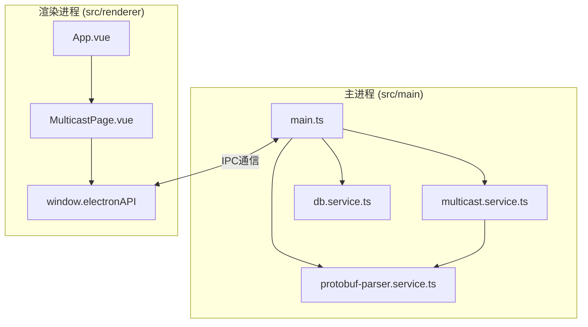
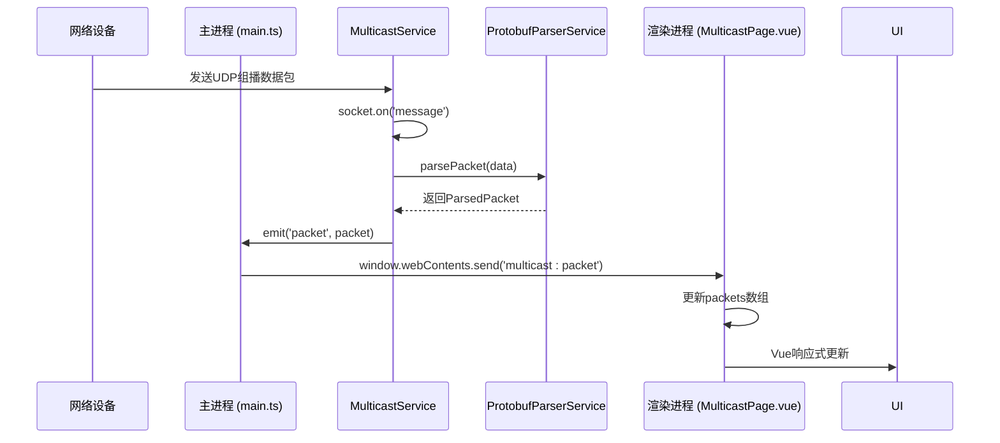
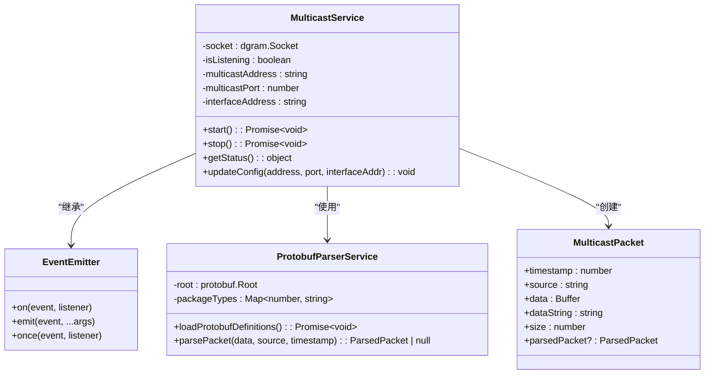
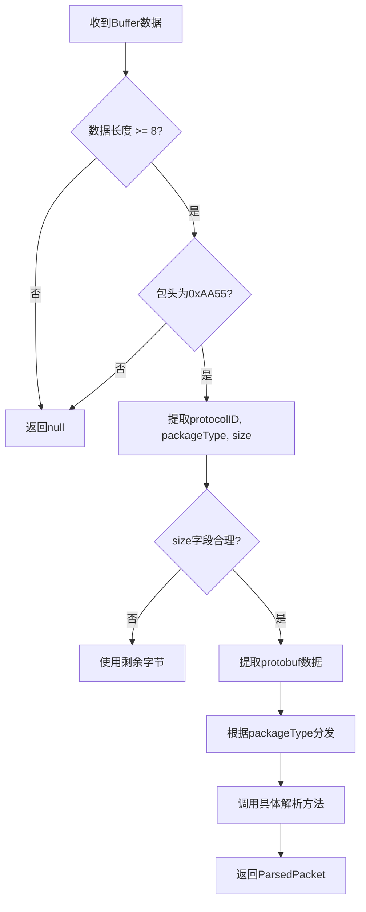
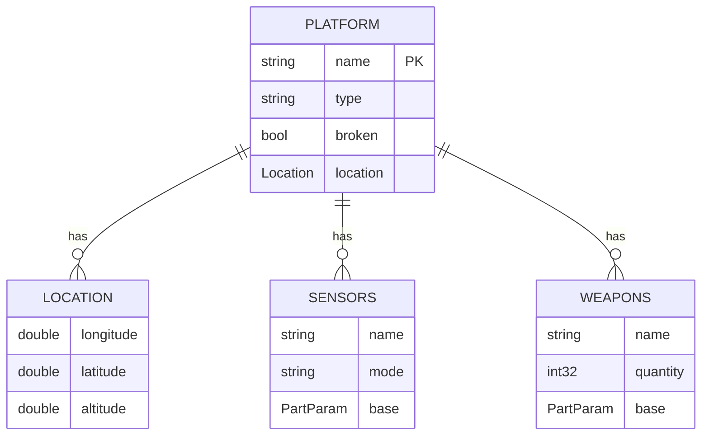
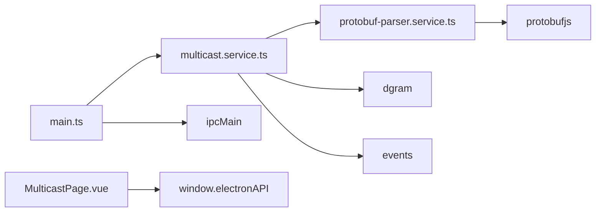

# 组播服务

<cite>
**本文档引用的文件**   
- [multicast.service.ts](file://src/main/services/multicast.service.ts)
- [main.ts](file://src/main/main.ts)
- [protobuf-parser.service.ts](file://src/main/services/protobuf-parser.service.ts)
- [platformStatus.proto](file://src/protobuf/platformStatus.proto)
- [MULTICAST_README.md](file://MULTICAST_README.md)
- [MulticastPage.vue](file://src/renderer/views/pages/MulticastPage.vue)
</cite>

## 目录
1. [简介](#简介)
2. [项目结构](#项目结构)
3. [核心组件](#核心组件)
4. [架构概览](#架构概览)
5. [详细组件分析](#详细组件分析)
6. [依赖分析](#依赖分析)
7. [性能考虑](#性能考虑)
8. [故障排除指南](#故障排除指南)
9. [结论](#结论)

## 简介
本项目是一个基于 Electron 的桌面应用，旨在实现对组播网络数据包的监听、解析与可视化展示。其核心功能是通过 UDP 组播协议接收来自无人机或其他设备的数据流，利用 Protobuf 协议进行高效解析，并将结构化数据实时推送至前端界面。该系统广泛应用于设备模拟、飞行状态监控和平台数据可视化等场景。

## 项目结构
项目采用典型的 Electron 分层架构，分为主进程（`src/main`）和渲染进程（`src/renderer`）。主进程负责核心业务逻辑，如数据库操作、组播监听和 Protobuf 解析；渲染进程则使用 Vue 3 框架构建用户界面，提供直观的数据展示和交互功能。

**图示来源**
- [main.ts](file://src/main/main.ts)
- [multicast.service.ts](file://src/main/services/multicast.service.ts)
- [MulticastPage.vue](file://src/renderer/views/pages/MulticastPage.vue)

## 核心组件
系统的核心是 `MulticastService` 类，它封装了 UDP 组播监听的全部逻辑。该服务继承自 `EventEmitter`，实现了观察者模式，允许其他模块订阅其事件。它与 `ProtobufParserService` 紧密协作，将接收到的原始二进制数据流转换为可读的结构化信息，并通过 Electron 的 IPC 机制将数据安全地传递给渲染进程。

**组件来源**
- [multicast.service.ts](file://src/main/services/multicast.service.ts)
- [protobuf-parser.service.ts](file://src/main/services/protobuf-parser.service.ts)

## 架构概览
整个系统的数据流和控制流清晰明确。主进程的 `MulticastService` 负责监听网络，一旦收到数据包，便触发 `packet` 事件。`main.ts` 中的事件监听器捕获该事件，并通过 `window.webContents.send` 将数据包转发给所有打开的渲染窗口。渲染进程的 `MulticastPage.vue` 通过 `window.electronAPI` 注册的 IPC 处理程序接收数据，更新 Vue 的响应式数据，最终在 UI 上实时渲染。

**图示来源**
- [multicast.service.ts](file://src/main/services/multicast.service.ts#L70-L110)
- [main.ts](file://src/main/main.ts#L86-L90)
- [MulticastPage.vue](file://src/renderer/views/pages/MulticastPage.vue#L180-L190)

## 详细组件分析

### MulticastService 类分析
`MulticastService` 是一个事件驱动的服务，其设计精巧，职责分明。

#### 类图

**图示来源**
- [multicast.service.ts](file://src/main/services/multicast.service.ts)
- [protobuf-parser.service.ts](file://src/main/services/protobuf-parser.service.ts)

#### 关键方法与状态管理
- **`start()` 方法**: 这是服务的启动入口。它首先检查是否已在监听，避免重复启动。接着尝试加载 Protobuf 定义文件，这是解析数据的前提。然后创建 UDP 套接字，绑定到配置的地址和端口，并加入组播组。整个过程被封装在 `Promise` 中，确保异步操作的有序执行。
- **`stop()` 方法**: 用于优雅地停止服务。它会关闭套接字，释放端口资源，并更新内部状态。
- **`getStatus()` 方法**: 提供一个简单的状态查询接口，返回当前的监听状态、组播地址和端口，供 UI 层轮询或查询。
- **状态管理**: 通过 `isListening` 布尔值和 `socket` 对象的引用，精确地管理服务的生命周期，确保在任何状态下调用 `start` 或 `stop` 都是安全的。

**组件来源**
- [multicast.service.ts](file://src/main/services/multicast.service.ts#L120-L177)

### ProtobufParserService 服务分析
该服务是数据解析的核心，负责将二进制流转换为有意义的对象。

#### 数据解析流程

**图示来源**
- [protobuf-parser.service.ts](file://src/main/services/protobuf-parser.service.ts#L100-L200)

#### 平台状态数据结构
当 `packageType` 为 `0x29` 时，数据被解析为 `PlatformStatus`。其结构定义在 `platformStatus.proto` 文件中，包含平台基础信息、位置、航迹点、传感器、武器等复杂嵌套对象。

**图示来源**
- [platformStatus.proto](file://src/protobuf/platformStatus.proto)

## 依赖分析
系统内部依赖关系清晰，耦合度低。`MulticastService` 依赖 `ProtobufParserService` 进行数据解析，两者都通过单例模式导出，便于全局访问。主进程通过 `ipcMain.handle` 暴露 API，渲染进程通过 `window.electronAPI` 调用，实现了主渲染进程的安全通信。

**图示来源**
- [multicast.service.ts](file://src/main/services/multicast.service.ts)
- [main.ts](file://src/main/main.ts)
- [MulticastPage.vue](file://src/renderer/views/pages/MulticastPage.vue)

## 性能考虑
- **异步非阻塞**: 使用 Node.js 的 `dgram` 模块，确保网络 I/O 不会阻塞主线程。
- **内存管理**: 接收到的数据包被封装为 `MulticastPacket` 对象，通过 Vue 的响应式系统管理。在 `MulticastPage.vue` 中提供了“清空数据”功能，可手动释放内存。
- **错误处理**: 在 `start` 和 `parsePacket` 方法中都有完善的 `try-catch` 机制，防止因单个数据包错误导致服务崩溃。

## 故障排除指南
根据 `MULTICAST_README.md` 的指导，常见问题及解决方案如下：

- **无法启动监听**: 检查端口是否被占用（EADDRINUSE 错误），确认应用有足够权限，或检查防火墙设置。
- **接收不到数据**: 确认发送方的组播地址和端口与配置一致，检查网络环境是否支持组播。
- **数据解析失败**: 查看主进程控制台日志，确认 `Protobuf` 定义文件是否成功加载，检查数据包的包头（0xAA55）和长度是否正确。
- **数据乱码**: 确认发送方使用 UTF-8 编码，或检查数据是否为二进制格式。

**组件来源**
- [MULTICAST_README.md](file://MULTICAST_README.md)

## 结论
`MulticastService` 类的设计体现了高内聚、低耦合的原则。它通过继承 `EventEmitter` 实现了灵活的事件通信，利用 `dgram` 模块高效处理网络数据，并通过与 `ProtobufParserService` 的协作，完成了从原始字节到结构化数据的转换。结合 Electron 的 IPC 机制，该服务成功地将后端能力安全地暴露给前端，构建了一个功能完整、易于维护的组播监听系统。其清晰的架构和详尽的日志为系统的调试和扩展提供了坚实的基础。