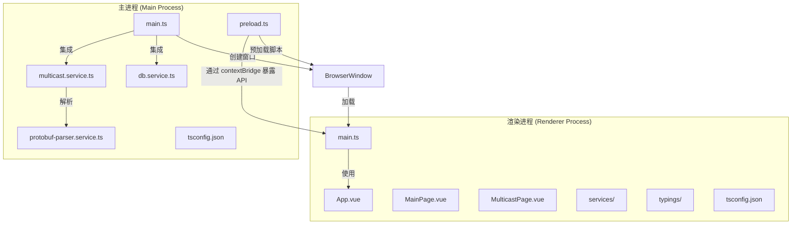
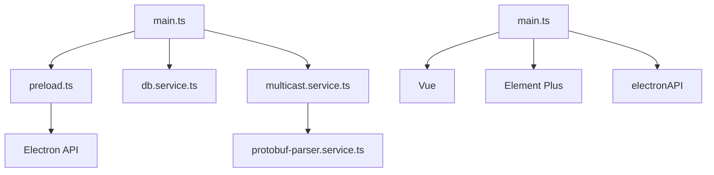

# 架构设计

<cite>
**本文档引用的文件**   
- [main.ts](file://src/main/main.ts)
- [preload.ts](file://src/main/preload.ts)
- [db.service.ts](file://src/main/database/db.service.ts)
- [multicast.service.ts](file://src/main/services/multicast.service.ts)
- [tsconfig.json](file://src/main/tsconfig.json)
- [tsconfig.json](file://src/renderer/tsconfig.json)
- [main.ts](file://src/renderer/main.ts)
- [electron.d.ts](file://src/renderer/typings/electron.d.ts)
</cite>

## 目录
1. [项目结构](#项目结构)
2. [核心组件](#核心组件)
3. [架构概览](#架构概览)
4. [详细组件分析](#详细组件分析)
5. [依赖分析](#依赖分析)
6. [性能考虑](#性能考虑)
7. [故障排除指南](#故障排除指南)
8. [结论](#结论)

## 项目结构

该项目采用分层架构，将 Electron 主进程与渲染进程分离，确保安全性和可维护性。主进程负责系统级操作和核心服务管理，渲染进程负责用户界面展示。



**图示来源**
- [main.ts](file://src/main/main.ts)
- [preload.ts](file://src/main/preload.ts)
- [db.service.ts](file://src/main/database/db.service.ts)
- [multicast.service.ts](file://src/main/services/multicast.service.ts)
- [main.ts](file://src/renderer/main.ts)

**本节来源**
- [main.ts](file://src/main/main.ts)
- [preload.ts](file://src/main/preload.ts)
- [main.ts](file://src/renderer/main.ts)

## 核心组件

本项目的核心组件包括 Electron 主进程入口 `main.ts`、预加载脚本 `preload.ts`、数据库服务 `db.service.ts` 和组播服务 `multicast.service.ts`。这些组件共同构成了应用的基础架构。

**本节来源**
- [main.ts](file://src/main/main.ts)
- [preload.ts](file://src/main/preload.ts)
- [db.service.ts](file://src/main/database/db.service.ts)
- [multicast.service.ts](file://src/main/services/multicast.service.ts)

## 架构概览

该应用采用 Electron 的主进程-渲染进程分离架构，通过 IPC（进程间通信）机制实现安全的数据交换。主进程负责初始化窗口、管理核心服务，渲染进程负责 UI 展示。


**图示来源**
- [main.ts](file://src/main/main.ts)
- [preload.ts](file://src/main/preload.ts)
- [main.ts](file://src/renderer/main.ts)

**本节来源**
- [main.ts](file://src/main/main.ts)
- [preload.ts](file://src/main/preload.ts)

## 详细组件分析

### 主进程初始化分析

`main.ts` 是 Electron 应用的主进程入口文件，负责整个应用的初始化和核心服务集成。

```typescript
app.whenReady().then(async () => {
  try {
    await dbService.applyMigrations();
    await dbService.runSeeds();
    createWindow();
    await multicastService.start();
    // ... 其他初始化逻辑
  } catch (error) {
    console.error("Initialization failed:", error);
    app.quit();
  }
});
```

`createWindow` 函数创建了主窗口，并配置了安全的 Web 首选项：

```typescript
function createWindow() {
  const mainWindow = new BrowserWindow({
    width: 1400,
    height: 1000,
    webPreferences: {
      devTools: true,
      preload: join(__dirname, "preload.js"),
      nodeIntegration: false,
      contextIsolation: true,
    },
  });
  // ... 窗口加载逻辑
}
```

在开发模式下，窗口加载 Vite 开发服务器；在生产模式下，加载打包后的资源文件。

**本节来源**
- [main.ts](file://src/main/main.ts#L0-L50)

### 预加载脚本安全机制分析

`preload.ts` 文件通过 `contextBridge` 安全地将 Node.js API 暴露给渲染进程，防止远程代码执行风险。

```typescript
import { contextBridge, ipcRenderer } from "electron";

contextBridge.exposeInMainWorld("electronAPI", {
  db: {
    query: (sql, params) => ipcRenderer.invoke("database:query", sql, params),
    execute: (sql, params) => ipcRenderer.invoke("database:execute", sql, params),
    reset: () => ipcRenderer.invoke("database:reset"),
  },
  multicast: {
    start: () => ipcRenderer.invoke("multicast:start"),
    stop: () => ipcRenderer.invoke("multicast:stop"),
    getStatus: () => ipcRenderer.invoke("multicast:getStatus"),
    getConfig: () => ipcRenderer.invoke("multicast:getConfig"),
    updateConfig: (address: string, port: number, interfaceAddr: string) => 
      ipcRenderer.invoke("multicast:updateConfig", address, port, interfaceAddr),
    onPacket: (callback: (packet: any) => void) => {
      ipcRenderer.on("multicast:packet", (_, packet) => callback(packet));
    },
    onError: (callback: (error: string) => void) => {
      ipcRenderer.on("multicast:error", (_, error) => callback(error));
    },
    removeAllListeners: (channel: string) => {
      ipcRenderer.removeAllListeners(channel);
    },
  },
});
```

`contextBridge.exposeInMainWorld` 方法创建了一个安全的桥梁，只暴露指定的 API，同时保持 `nodeIntegration: false` 和 `contextIsolation: true` 的安全配置。

**本节来源**
- [preload.ts](file://src/main/preload.ts#L0-L58)

### 核心服务集成分析

#### 数据库服务

`db.service.ts` 实现了基于 `better-sqlite3` 的数据库服务，支持迁移和种子数据管理。

```typescript
class DBService {
  private dbInstance: Database.Database;
  
  public initializeDatabase() {
    this.dbInstance = new Database(this.getDatabasePath());
    this.dbInstance.pragma("journal_mode = WAL");
    this.dbInstance.pragma("foreign_keys = ON");
  }

  public async applyMigrations() {
    await this.processFiles(
      this.migrationsPath,
      "schema_migrations",
      async (filePath) => {
        const migration = require(filePath);
        const transaction = this.dbInstance.transaction(() => {
          migration.up(this.dbInstance);
        });
        transaction();
      }
    );
  }
}
```

#### 组播服务

`multicast.service.ts` 实现了 UDP 组播监听功能，支持 Protobuf 数据解析。

```typescript
export class MulticastService extends EventEmitter {
  private socket: dgram.Socket | null = null;
  private isListening = false;

  public start(): Promise<void> {
    return new Promise((resolve, reject) => {
      this.socket = dgram.createSocket('udp4');
      this.socket.on('message', (msg, rinfo) => {
        const packet: MulticastPacket = {
          timestamp: Date.now(),
          source: `${rinfo.address}:${rinfo.port}`,
          data: msg,
          dataString: msg.toString('utf8'),
          size: msg.length
        };
        this.emit('packet', packet);
      });
      // ... 其他逻辑
    });
  }
}
```

**图示来源**
- [db.service.ts](file://src/main/database/db.service.ts#L0-L95)
- [multicast.service.ts](file://src/main/services/multicast.service.ts#L0-L179)

**本节来源**
- [db.service.ts](file://src/main/database/db.service.ts#L0-L95)
- [multicast.service.ts](file://src/main/services/multicast.service.ts#L0-L179)

### TypeScript 配置差异分析

#### 主进程 tsconfig.json

```json
{
  "compilerOptions": {
    "target": "ES2015",
    "module": "commonjs",
    "strict": true,
    "esModuleInterop": true,
    "skipLibCheck": true,
    "forceConsistentCasingInFileNames": true,
    "outDir": "../../build/main",
    "allowJs": true,
    "noImplicitAny": false
  },
  "exclude": ["static"]
}
```

#### 渲染进程 tsconfig.json

```json
{
  "compilerOptions": {
    "target": "esnext",
    "useDefineForClassFields": true,
    "module": "esnext",
    "moduleResolution": "node",
    "strict": false,
    "jsx": "preserve",
    "resolveJsonModule": true,
    "isolatedModules": true,
    "esModuleInterop": true,
    "lib": ["esnext", "dom"],
    "skipLibCheck": true,
    "allowJs": true,
    "composite": true,
    "types": ["vite/client", "node"]
  }
}
```

主要差异：
- **目标版本**：主进程为 ES2015，渲染进程为 esnext
- **模块系统**：主进程使用 commonjs，渲染进程使用 esnext
- **严格模式**：主进程启用严格模式，渲染进程未启用
- **类型定义**：渲染进程包含 Vite 和 Node 的类型定义

**本节来源**
- [tsconfig.json](file://src/main/tsconfig.json#L0-L14)
- [tsconfig.json](file://src/renderer/tsconfig.json#L0-L18)

## 依赖分析



**图示来源**
- [main.ts](file://src/main/main.ts)
- [preload.ts](file://src/main/preload.ts)
- [db.service.ts](file://src/main/database/db.service.ts)
- [multicast.service.ts](file://src/main/services/multicast.service.ts)
- [main.ts](file://src/renderer/main.ts)

**本节来源**
- [main.ts](file://src/main/main.ts)
- [preload.ts](file://src/main/preload.ts)
- [db.service.ts](file://src/main/database/db.service.ts)
- [multicast.service.ts](file://src/main/services/multicast.service.ts)
- [main.ts](file://src/renderer/main.ts)

## 性能考虑

该架构在性能方面具有以下优势：
- **分离关注点**：主进程专注于系统操作，渲染进程专注于 UI 渲染
- **按需加载**：开发模式下通过 Vite 实现热重载，生产模式下加载优化后的资源
- **数据库优化**：使用 WAL 模式和外键约束提升 SQLite 性能
- **事件驱动**：组播服务采用事件驱动模型，减少轮询开销

## 故障排除指南

### 常见问题

1. **组播服务启动失败**
   - 检查网络接口配置
   - 验证组播地址和端口是否正确
   - 确认防火墙设置

2. **数据库重置失败**
   - 检查文件权限
   - 确保数据库连接已关闭
   - 验证用户数据目录可写

3. **渲染进程无法调用主进程 API**
   - 确认 `contextBridge` 配置正确
   - 检查 `preload.js` 路径是否正确
   - 验证 `contextIsolation` 设置

**本节来源**
- [main.ts](file://src/main/main.ts)
- [preload.ts](file://src/main/preload.ts)
- [db.service.ts](file://src/main/database/db.service.ts)

## 结论

该架构采用 Electron 主进程-渲染进程分离模式，具有以下优势：

1. **安全性**：通过 `contextBridge` 安全暴露 API，防止远程代码执行
2. **可维护性**：清晰的职责分离，便于团队协作开发
3. **性能**：事件驱动的组播服务和优化的数据库操作
4. **可扩展性**：模块化的服务设计，便于功能扩展

这种架构模式确保了应用的安全性、性能和可维护性，是现代 Electron 应用的理想选择。