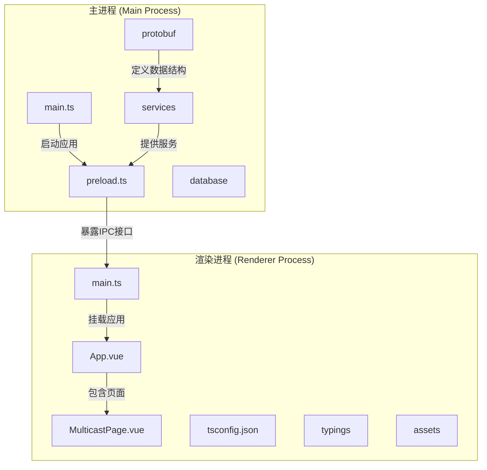
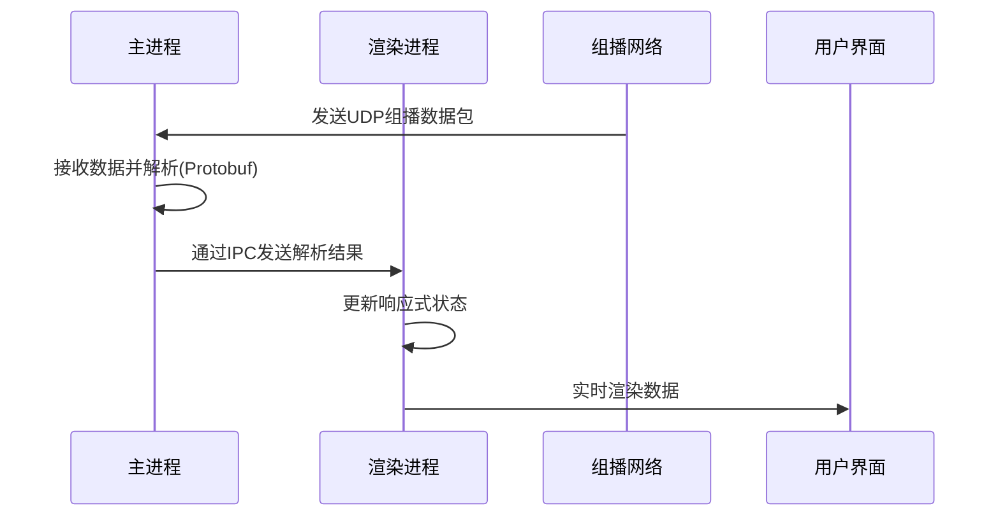
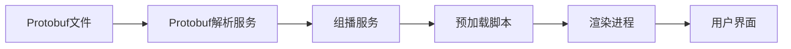

# 渲染进程架构

<cite>
**本文档引用的文件**   
- [main.ts](file://src/renderer/main.ts)
- [App.vue](file://src/renderer/App.vue)
- [MulticastPage.vue](file://src/renderer/views/pages/MulticastPage.vue)
- [preload.ts](file://src/main/preload.ts)
- [tsconfig.json](file://src/renderer/tsconfig.json)
- [auto-imports.d.ts](file://src/renderer/typings/auto-imports.d.ts)
- [multicast.service.ts](file://src/main/services/multicast.service.ts)
- [protobuf-parser.service.ts](file://src/main/services/protobuf-parser.service.ts)
</cite>

## 目录
1. [项目结构](#项目结构)
2. [核心组件](#核心组件)
3. [架构概览](#架构概览)
4. [详细组件分析](#详细组件分析)
5. [依赖分析](#依赖分析)
6. [性能考虑](#性能考虑)
7. [故障排除指南](#故障排除指南)
8. [结论](#结论)

## 项目结构

项目采用分层架构，分为主进程（`main`）和渲染进程（`renderer`）两个主要模块。主进程负责底层系统交互、数据库操作和组播通信，渲染进程则专注于用户界面展示和交互。



**Diagram sources**
- [src/main](file://src/main)
- [src/renderer](file://src/renderer)

**Section sources**
- [src/main](file://src/main)
- [src/renderer](file://src/renderer)

## 核心组件

本项目的核心组件包括渲染进程的入口文件 `main.ts`、根组件 `App.vue`、组播数据展示页面 `MulticastPage.vue`，以及主进程的预加载脚本 `preload.ts` 和服务层 `multicast.service.ts`。这些组件共同实现了从组播数据接收、解析到前端展示的完整流程。

**Section sources**
- [main.ts](file://src/renderer/main.ts)
- [App.vue](file://src/renderer/App.vue)
- [MulticastPage.vue](file://src/renderer/views/pages/MulticastPage.vue)
- [preload.ts](file://src/main/preload.ts)

## 架构概览

整个应用基于 Electron 框架构建，采用 Vue 3 + Vite + TypeScript 技术栈。主进程通过 `dgram` 模块监听组播数据，并利用 Protobuf 解析二进制数据包。解析后的数据通过 IPC 通信机制传递给渲染进程，最终在前端页面上进行可视化展示。



**Diagram sources**
- [multicast.service.ts](file://src/main/services/multicast.service.ts#L122-L179)
- [preload.ts](file://src/main/preload.ts#L29-L57)
- [MulticastPage.vue](file://src/renderer/views/pages/MulticastPage.vue)

## 详细组件分析

### 渲染进程入口分析

`main.ts` 是渲染进程的入口文件，负责创建和挂载 Vue 应用实例，并集成 Element Plus 组件库。

```typescript
import { createApp } from "vue";
import ElementPlus from "element-plus";
import "element-plus/dist/index.css";
import "./assets/css/index.css";
import App from "./App.vue";

const app = createApp(App);

app.use(ElementPlus);
app.mount("#app");
```

该文件首先导入 Vue 核心库和 Element Plus 组件库及其样式，然后创建 Vue 应用实例并挂载到 DOM 元素 `#app` 上。通过 `app.use(ElementPlus)` 完成组件库的全局注册。

**Section sources**
- [main.ts](file://src/renderer/main.ts#L1-L10)

### 根组件布局分析

`App.vue` 作为根组件，采用 `<script setup>` 语法糖简化代码，其模板仅包含一个 `<MainPage />` 组件，实现了极简的布局结构。

```vue
<template>
  <MainPage />
</template>

<script setup lang="ts">
import MainPage from "./views/pages/MainPage.vue";
</script>
```

这种设计模式将主要业务逻辑封装在 `MainPage.vue` 中，保持了根组件的简洁性，有利于项目维护和扩展。

**Section sources**
- [App.vue](file://src/renderer/App.vue#L1-L7)

### 组播页面组件分析

`MulticastPage.vue` 是核心业务组件，使用 Vue 3 的组合式 API（Composition API）管理复杂的状态和逻辑。

#### 响应式状态管理

组件使用 `ref` 和 `reactive` 创建响应式数据：

```typescript
const config = reactive({
  address: '239.255.43.21',
  port: 10086,
  interfaceAddress: '0.0.0.0'
});

const packets = ref<MulticastPacket[]>([]);
const isListening = ref(false);
const starting = ref(false);
const stopping = ref(false);
```

`config` 使用 `reactive` 包装配置对象，`packets` 和状态标志使用 `ref` 创建响应式引用。

#### 计算属性

使用 `computed` 创建派生数据：

```typescript
const parsedPacketsCount = computed(() => 
  packets.value.filter(p => p.parsedPacket).length
);

const platformStatusCount = computed(() => 
  packets.value.filter(p => p.parsedPacket?.packageType === 0x29).length
);
```

这些计算属性自动响应源数据变化，无需手动更新。

#### 生命周期与事件监听

在 `onMounted` 钩子中注册 IPC 事件监听器：

```typescript
onMounted(() => {
  window.electronAPI.multicast.onPacket((packet) => {
    packets.value.push(packet);
    if (autoScroll.value) {
      nextTick(() => {
        scrollToBottom();
      });
    }
  });

  window.electronAPI.multicast.onError((error) => {
    ElMessage.error(`组播错误: ${error}`);
  });
});
```

通过 `window.electronAPI` 调用预加载脚本暴露的 IPC 接口，实现与主进程的通信。

**Section sources**
- [MulticastPage.vue](file://src/renderer/views/pages/MulticastPage.vue#L1-L200)

### IPC通信接口分析

`preload.ts` 文件通过 `contextBridge.exposeInMainWorld` 安全地将主进程的 IPC 接口暴露给渲染进程：

```typescript
contextBridge.exposeInMainWorld("electronAPI", {
  multicast: {
    start: () => ipcRenderer.invoke("multicast:start"),
    stop: () => ipcRenderer.invoke("multicast:stop"),
    getStatus: () => ipcRenderer.invoke("multicast:getStatus"),
    getConfig: () => ipcRenderer.invoke("multicast:getConfig"),
    updateConfig: (address: string, port: number, interfaceAddr: string) => 
      ipcRenderer.invoke("multicast:updateConfig", address, port, interfaceAddr),
    onPacket: (callback: (packet: any) => void) => {
      ipcRenderer.on("multicast:packet", (_, packet) => callback(packet));
    },
    onError: (callback: (error: string) => void) => {
      ipcRenderer.on("multicast:error", (_, error) => callback(error));
    },
    removeAllListeners: (channel: string) => {
      ipcRenderer.removeAllListeners(channel);
    },
  },
});
```

这种方式既保证了渲染进程能够访问主进程功能，又避免了直接暴露 Node.js API 带来的安全风险。

**Section sources**
- [preload.ts](file://src/main/preload.ts#L29-L57)

### 服务层封装分析

前端服务层通过封装 IPC 调用，实现了与主进程的异步通信。主进程的 `multicast.service.ts` 提供了完整的组播功能：

```typescript
public start(): Promise<void> {
  return new Promise(async (resolve, reject) => {
    try {
      if (this.isListening) {
        resolve();
        return;
      }

      // 加载protobuf定义文件
      try {
        await protobufParserService.loadProtobufDefinitions();
      } catch (error) {
        console.warn('Protobuf定义文件加载失败，将使用原始数据显示:', error);
      }

      this.socket = dgram.createSocket('udp4');
      // ... 绑定端口、加入组播组等
    } catch (error) {
      reject(error);
    }
  });
}
```

`protobuf-parser.service.ts` 负责解析 Protobuf 数据包，支持多种消息类型：

```typescript
private initializePackageTypes() {
  this.packageTypes.set(0x29, 'PackType_PlatformStatus');
  // ... 其他类型
}
```

这种分层设计使得业务逻辑清晰分离，便于维护和测试。

**Section sources**
- [multicast.service.ts](file://src/main/services/multicast.service.ts)
- [protobuf-parser.service.ts](file://src/main/services/protobuf-parser.service.ts)

## 依赖分析

项目依赖关系清晰，各层之间耦合度低。渲染进程通过预加载脚本与主进程通信，主进程服务层处理具体业务逻辑，Protobuf 文件定义数据结构。



**Diagram sources**
- [protobuf](file://src/protobuf)
- [services](file://src/main/services)
- [preload.ts](file://src/main/preload.ts)
- [renderer](file://src/renderer)

## 性能考虑

### 响应式系统优化

使用 `ref` 和 `reactive` 合理管理状态，避免不必要的响应式开销。对于大型数据集，考虑使用虚拟滚动等技术优化渲染性能。

### 自动滚动优化

在 `MulticastPage.vue` 中，通过 `autoScroll` 开关控制是否自动滚动到底部，避免在大量数据涌入时频繁触发 DOM 操作：

```typescript
if (autoScroll.value) {
  nextTick(() => {
    scrollToBottom();
  });
}
```

### 类型声明优化

`auto-imports.d.ts` 文件由 `unplugin-auto-import` 自动生成，提供了自动导入的类型定义，提升了开发体验和类型安全：

```typescript
// Generated by unplugin-auto-import
export {}
declare global {
  // 自动导入的组件和API
}
```

`tsconfig.json` 配置针对浏览器环境进行了优化：

```json
{
  "compilerOptions": {
    "target": "esnext",
    "module": "esnext",
    "moduleResolution": "node",
    "lib": ["esnext", "dom"],
    "types": ["vite/client", "node"]
  }
}
```

这些配置确保了代码能够在现代浏览器中高效运行。

**Section sources**
- [auto-imports.d.ts](file://src/renderer/typings/auto-imports.d.ts)
- [tsconfig.json](file://src/renderer/tsconfig.json)

## 故障排除指南

### 常见问题

1. **无法接收组播数据**
   - 检查组播地址和端口配置是否正确
   - 确认网络接口支持组播
   - 检查防火墙设置

2. **Protobuf解析失败**
   - 确认 `protobuf` 目录存在且包含必要的 `.proto` 文件
   - 检查数据包格式是否符合预期（0xAA 0x55 头部）
   - 查看控制台日志获取详细错误信息

3. **IPC通信失败**
   - 确认 `preload.ts` 正确暴露了 API
   - 检查 `window.electronAPI` 是否存在
   - 查看 Electron 主进程日志

### 调试技巧

- 使用 `console.log` 在关键位置输出调试信息
- 利用 `debug-protobuf.js` 脚本单独测试 Protobuf 解析功能
- 通过 `test-protobuf-multicast.js` 模拟组播数据流进行测试

**Section sources**
- [debug-protobuf.js](file://debug-protobuf.js)
- [test-protobuf-multicast.js](file://test-protobuf-multicast.js)

## 结论

afs-opEnd 渲染进程采用了现代化的前端技术栈，通过 Vue 3 的组合式 API 实现了高效的状态管理，利用 Vite 提供了快速的开发体验。架构设计合理，分层清晰，主进程与渲染进程职责分明，通过安全的 IPC 机制进行通信。服务层封装良好，便于维护和扩展。整体架构既满足了实时组播数据展示的需求，又保证了代码的可读性和可维护性。