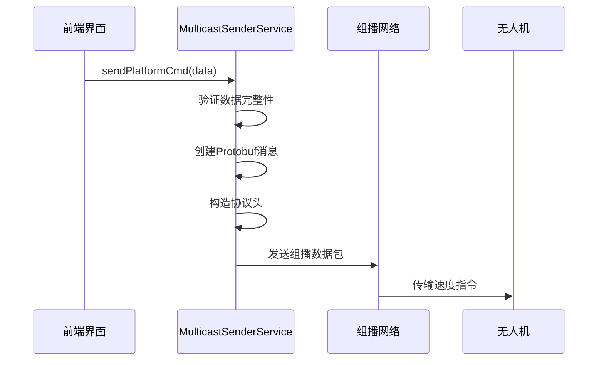
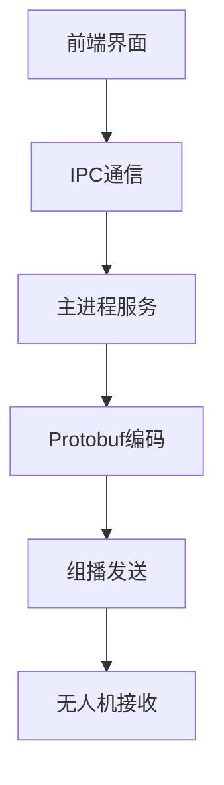

# 速度设置功能

<cite>
**本文档引用文件**  
- [PlatformCmd.proto](file://src/protobuf/PlatformCmd.proto#L1-L90)
- [multicast-sender.service.ts](file://src/main/services/multicast-sender.service.ts#L5-L57)
- [test-speed-setting.js](file://testScipt/test-speed-setting.js)
- [UavOperationPage.vue](file://src/renderer/views/pages/UavOperationPage.vue)
</cite>

## 目录
1. [功能概述](#功能概述)
2. [协议定义](#协议定义)
3. [API接口](#api接口)
4. [集成模式](#集成模式)
5. [使用示例](#使用示例)
6. [故障排除](#故障排除)

## 功能概述
速度设置功能允许用户通过平台控制命令为无人机设定飞行速度。该功能作为平台控制命令（PlatformCmd）的一部分，通过组播网络发送速度指令，实现对无人机飞行速度的远程控制。

该功能主要应用于无人机任务控制场景，支持在1-100 m/s范围内精确设置无人机的飞行速度。系统通过Protobuf协议进行数据序列化，确保命令传输的高效性和可靠性。

**Section sources**
- [test-speed-setting.js](file://testScipt/test-speed-setting.js)

## 协议定义
速度设置功能基于Protobuf协议定义，包含命令枚举和参数结构两个核心部分。

### 命令枚举
在`PlatformCommand`枚举中新增了速度设置命令：
```protobuf
Uav_Set_Speed = 9; // 设定无人机速度
```

### 参数结构
定义了`SetSpeedparam`消息结构用于传递速度参数：
```protobuf
message SetSpeedparam {
  optional double speed = 1; // 速度值，单位：m/s
}
```

速度参数的有效范围为1-100 m/s，系统在发送前会对输入值进行验证。

```mermaid
erDiagram
PlatformCmd ||--o{ SetSpeedparam : "包含"
class PlatformCmd {
int32 commandID
string platformName
PlatformCommand command
SetSpeedparam setSpeedParam
}
class SetSpeedparam {
double speed
}
```

**Diagram sources**
- [PlatformCmd.proto](file://src/protobuf/PlatformCmd.proto#L87-L90)

**Section sources**
- [PlatformCmd.proto](file://src/protobuf/PlatformCmd.proto#L27-L39)

## API接口
速度设置功能通过`MulticastSenderService`服务提供API接口。

### 接口定义
```typescript
interface PlatformCmdData {
  commandID: number;
  platformName: string;
  command: number;
  setSpeedParam?: {
    speed?: number;
  };
}
```

### 发送方法
```typescript
public async sendPlatformCmd(data: PlatformCmdData): Promise<void>
```

该方法负责将速度设置命令编码为Protobuf格式，并通过组播网络发送。系统会自动处理协议头构造、数据序列化和网络传输。



**Diagram sources**
- [multicast-sender.service.ts](file://src/main/services/multicast-sender.service.ts#L268-L604)

**Section sources**
- [multicast-sender.service.ts](file://src/main/services/multicast-sender.service.ts#L5-L57)

## 集成模式
速度设置功能已集成到无人机操作界面中，采用前后端分离的架构模式。

### 前端集成
在`UavOperationPage.vue`中添加了速度设置控件，用户可以通过图形界面输入目标速度值。前端通过Electron IPC与主进程通信，调用组播发送服务。

### 后端集成
主进程中的`MulticastSenderService`负责处理速度设置请求，包括：
- Protobuf定义文件加载
- 消息类型查找
- 数据编码和包头构造
- 组播数据发送

系统支持多种部署环境，具有路径自动查找和错误恢复机制。



**Diagram sources**
- [UavOperationPage.vue](file://src/renderer/views/pages/UavOperationPage.vue)

**Section sources**
- [UavOperationPage.vue](file://src/renderer/views/pages/UavOperationPage.vue)

## 使用示例
以下是速度设置功能的使用示例。

### 基本用法
```javascript
const commandData = {
  commandID: Date.now(),
  platformName: "UAV-001",
  command: 9, // Uav_Set_Speed
  setSpeedParam: {
    speed: 15 // 目标速度：15 m/s
  }
};
```

### 边界值测试
系统支持以下边界值测试：
- 最小速度：1 m/s
- 最大速度：100 m/s
- 默认速度：10 m/s

### 操作步骤
1. 在命令测试页面选择无人机平台
2. 点击"设置速度"按钮
3. 在对话框中输入目标速度 (1-100 m/s)
4. 点击确定发送速度设置命令

**Section sources**
- [test-speed-setting.js](file://testScipt/test-speed-setting.js)

## 故障排除
本节提供速度设置功能的常见问题及解决方案。

### 常见问题
1. **Protobuf定义文件未加载**
   - 现象：发送速度设置命令失败
   - 原因：无法找到protobuf定义文件
   - 解决方案：检查文件路径配置，确保`src/protobuf`目录存在

2. **命令发送失败**
   - 现象：组播数据包无法发送
   - 原因：UDP socket未初始化
   - 解决方案：确保调用`initialize()`方法初始化服务

3. **速度值无效**
   - 现象：无人机未按预期速度飞行
   - 原因：输入速度超出1-100 m/s范围
   - 解决方案：验证输入值在有效范围内

### 调试建议
- 启用详细日志输出，检查消息创建和编码过程
- 使用`test-speed-setting.js`测试脚本验证功能
- 检查组播地址和端口配置是否正确

**Section sources**
- [multicast-sender.service.ts](file://src/main/services/multicast-sender.service.ts#L268-L604)
- [test-speed-setting.js](file://testScipt/test-speed-setting.js)