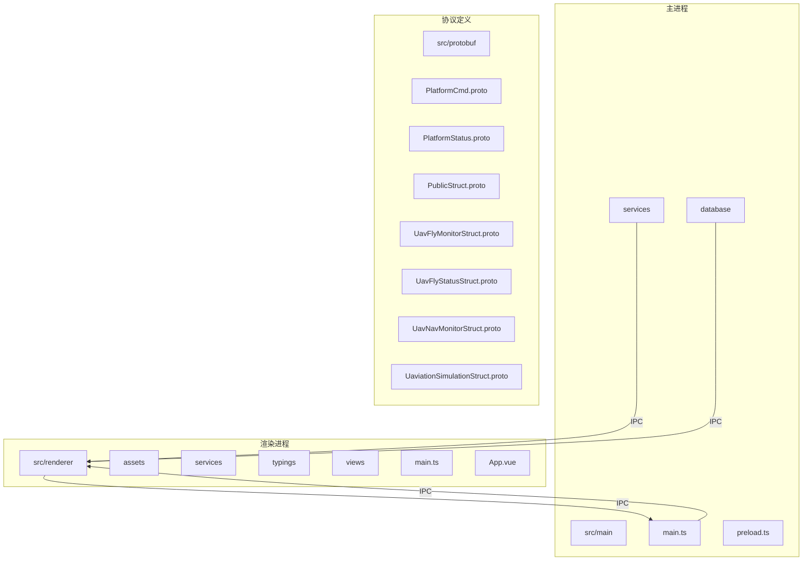
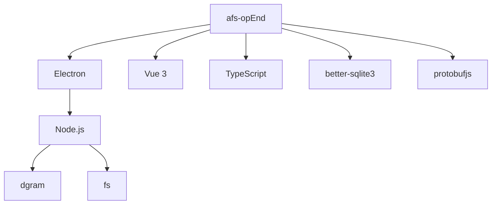

# 项目概述

<cite>
**本文档引用的文件**  
- [README.md](file://README.md)
- [MULTICAST_README.md](file://MULTICAST_README.md)
- [PLATFORM_CMD_README.md](file://PLATFORM_CMD_README.md)
- [PLATFORM_STATUS_README.md](file://PLATFORM_STATUS_README.md)
- [src/main/main.ts](file://src/main/main.ts)
- [src/main/services/multicast.service.ts](file://src/main/services/multicast.service.ts)
- [src/main/services/protobuf-parser.service.ts](file://src/main/services/protobuf-parser.service.ts)
- [src/main/database/db.service.ts](file://src/main/database/db.service.ts)
- [src/main/services/multicast-sender.service.ts](file://src/main/services/multicast-sender.service.ts)
- [src/renderer/main.ts](file://src/renderer/main.ts)
- [src/renderer/views/pages/MulticastPage.vue](file://src/renderer/views/pages/MulticastPage.vue)
- [src/renderer/views/pages/ArtilleryOperationPage.vue](file://src/renderer/views/pages/ArtilleryOperationPage.vue)
- [src/protobuf/PlatformStatus.proto](file://src/protobuf/PlatformStatus.proto)
- [src/protobuf/PlatformCmd.proto](file://src/protobuf/PlatformCmd.proto)
- [src/protobuf/UavFlyStatusStruct.proto](file://src/protobuf/UavFlyStatusStruct.proto)
- [src/protobuf/UavNavMonitorStruct.proto](file://src/protobuf/UavNavMonitorStruct.proto)
- [src/protobuf/PublicStruct.proto](file://src/protobuf/PublicStruct.proto)
- [src/main/preload.ts](file://src/main/preload.ts)
</cite>

## 更新摘要
**变更内容**  
- 更新了简介部分，增加了平台状态监控和火炮控制命令的新功能
- 扩展了核心组件分析，新增了组播发送服务和火炮操作页面
- 更新了架构概览，增加了双向通信机制
- 新增了平台状态协议和火炮控制命令的详细分析
- 更新了依赖分析，增加了新功能的依赖关系
- 更新了故障排除指南，增加了新功能的常见问题

## 目录
1. [简介](#简介)
2. [项目结构](#项目结构)
3. [核心组件](#核心组件)
4. [架构概览](#架构概览)
5. [详细组件分析](#详细组件分析)
6. [依赖分析](#依赖分析)
7. [性能考量](#性能考量)
8. [故障排除指南](#故障排除指南)
9. [结论](#结论)

## 简介
afs-opEnd 是一个基于 Electron 框架的无人机通信模拟与监控桌面应用，旨在为开发人员和测试人员提供一个强大的工具，用于监听、解析和可视化无人机通信数据。该应用支持 UDP 组播监听和 Protobuf 协议解析，能够实时显示接收到的数据包信息，并支持数据导出和清空功能。通过集成 better-sqlite3 和 protobufjs 等关键技术栈，afs-opEnd 实现了高效的数据持久化和协议解析能力。

最新版本增加了对平台状态监控和火炮控制命令的支持。平台状态功能允许系统接收和解析详细的平台信息，包括位置、状态、设备配置等，为无人机学习场景提供了更全面的态势感知能力。火炮控制命令功能则实现了从火炮操作页面发送控制指令的能力，支持用户输入武器名称和目标名称，增强了系统的交互性和实用性。

**Section sources**
- [README.md](file://README.md)
- [MULTICAST_README.md](file://MULTICAST_README.md)
- [PLATFORM_CMD_README.md](file://PLATFORM_CMD_README.md)
- [PLATFORM_STATUS_README.md](file://PLATFORM_STATUS_README.md)

## 项目结构
afs-opEnd 项目采用分层架构设计，主要分为三个部分：主进程（main）、渲染进程（renderer）和协议定义（protobuf）。主进程负责处理系统级操作，如数据库管理和组播监听；渲染进程则负责用户界面的展示和交互；协议定义部分包含了所有通信协议的 Protobuf 定义文件。

```mermaid
graph TB
subgraph "主进程"
main["src/main"]
database["database"]
services["services"]
main_ts["main.ts"]
preload_ts["preload.ts"]
end
subgraph "渲染进程"
renderer["src/renderer"]
assets["assets"]
services_r["services"]
typings["typings"]
views["views"]
main_r_ts["main.ts"]
App_vue["App.vue"]
end
subgraph "协议定义"
protobuf["src/protobuf"]
PlatformCmd_proto["PlatformCmd.proto"]
PlatformStatus_proto["PlatformStatus.proto"]
PublicStruct_proto["PublicStruct.proto"]
UavFlyMonitorStruct_proto["UavFlyMonitorStruct.proto"]
UavFlyStatusStruct_proto["UavFlyStatusStruct.proto"]
UavNavMonitorStruct_proto["UavNavMonitorStruct.proto"]
UaviationSimulationStruct_proto["UaviationSimulationStruct.proto"]
end
main --> database
main --> services
main --> main_ts
main --> preload_ts
renderer --> assets
renderer --> services_r
renderer --> typings
renderer --> views
renderer --> main_r_ts
renderer --> App_vue
protobuf --> PlatformCmd_proto
protobuf --> PlatformStatus_proto
protobuf --> PublicStruct_proto
protobuf --> UavFlyMonitorStruct_proto
protobuf --> UavFlyStatusStruct_proto
protobuf --> UavNavMonitorStruct_proto
protobuf --> UaviationSimulationStruct_proto
```



**Diagram sources**
- [src/main/main.ts](file://src/main/main.ts)
- [src/renderer/main.ts](file://src/renderer/main.ts)
- [src/protobuf/PlatformStatus.proto](file://src/protobuf/PlatformStatus.proto)

**Section sources**
- [src/main/main.ts](file://src/main/main.ts)
- [src/renderer/main.ts](file://src/renderer/main.ts)
- [src/protobuf/PlatformStatus.proto](file://src/protobuf/PlatformStatus.proto)

## 核心组件
afs-opEnd 的核心组件包括主进程、渲染进程、组播服务、Protobuf 解析服务、数据库服务、组播发送服务和火炮操作页面。主进程负责启动应用、管理数据库和监听组播数据包；渲染进程负责展示用户界面和处理用户交互；组播服务负责接收和解析组播数据包；Protobuf 解析服务负责解析 Protobuf 格式的数据；数据库服务负责数据的持久化存储；组播发送服务负责发送控制命令；火炮操作页面提供用户友好的火炮控制界面。

**Section sources**
- [src/main/main.ts](file://src/main/main.ts)
- [src/main/services/multicast.service.ts](file://src/main/services/multicast.service.ts)
- [src/main/services/protobuf-parser.service.ts](file://src/main/services/protobuf-parser.service.ts)
- [src/main/database/db.service.ts](file://src/main/database/db.service.ts)
- [src/main/services/multicast-sender.service.ts](file://src/main/services/multicast-sender.service.ts)
- [src/renderer/main.ts](file://src/renderer/main.ts)
- [src/renderer/views/pages/MulticastPage.vue](file://src/renderer/views/pages/MulticastPage.vue)
- [src/renderer/views/pages/ArtilleryOperationPage.vue](file://src/renderer/views/pages/ArtilleryOperationPage.vue)

## 架构概览
afs-opEnd 采用主进程与渲染进程分离的设计，主进程负责系统级操作，如数据库管理和组播监听，而渲染进程负责用户界面的展示和交互。主进程通过 IPC 机制与渲染进程通信，传递数据和状态信息。组播服务使用 Node.js 的 dgram 模块创建 UDP socket 监听组播数据包，并通过 IPC 机制将接收到的数据包传递给渲染进程。Protobuf 解析服务负责解析 Protobuf 格式的数据，并将解析结果传递给渲染进程。数据库服务使用 better-sqlite3 实现数据的持久化存储。

新增的组播发送服务允许渲染进程通过 IPC 机制向主进程发送控制命令，主进程将这些命令编码为 Protobuf 格式并通过 UDP 组播发送出去。这种双向通信机制使得系统既能接收和监控数据，又能主动发送控制指令，形成了完整的通信闭环。



**Diagram sources**
- [src/main/main.ts](file://src/main/main.ts)
- [src/main/services/multicast.service.ts](file://src/main/services/multicast.service.ts)
- [src/main/services/protobuf-parser.service.ts](file://src/main/services/protobuf-parser.service.ts)
- [src/main/database/db.service.ts](file://src/main/database/db.service.ts)
- [src/main/services/multicast-sender.service.ts](file://src/main/services/multicast-sender.service.ts)
- [src/renderer/main.ts](file://src/renderer/main.ts)
- [src/renderer/views/pages/MulticastPage.vue](file://src/renderer/views/pages/MulticastPage.vue)
- [src/renderer/views/pages/ArtilleryOperationPage.vue](file://src/renderer/views/pages/ArtilleryOperationPage.vue)

## 详细组件分析
### 主进程分析
主进程是 afs-opEnd 的核心，负责启动应用、管理数据库和监听组播数据包。主进程通过 `main.ts` 文件中的 `createWindow` 函数创建主窗口，并通过 `preload.ts` 文件中的 `contextBridge` 暴露 IPC 接口给渲染进程。主进程还通过 `db.service.ts` 文件中的 `DBService` 类管理数据库，通过 `multicast.service.ts` 文件中的 `MulticastService` 类监听组播数据包。

#### 主进程入口文件
```typescript
import { app, BrowserWindow, dialog, ipcMain, session, Menu } from "electron";
import { join } from "path";
import fs from "fs";
import * as dotenv from 'dotenv';
import { dbService } from "./database/db.service";
import { multicastService, MulticastPacket } from "./services/multicast.service";
import { multicastSenderService, PlatformCmdData } from "./services/multicast-sender.service";

// 加载环境配置
const envPath = join(app.getAppPath(), 'config.env');
dotenv.config({ path: envPath });

app.whenReady().then(async () => {
  try {
    await dbService.applyMigrations();
    await dbService.runSeeds();

    createWindow();

    // 启动组播监听服务
    try {
      await multicastService.start();
    } catch (error) {
      console.error("组播服务启动失败:", error);
    }

    // 初始化组播发送服务
    try {
      await multicastSenderService.initialize();
      console.log('✅ 组播发送服务初始化成功');
    } catch (error) {
      console.error("❌ 组播发送服务初始化失败:", error);
    }

    session.defaultSession.webRequest.onHeadersReceived((details, callback) => {
      callback({
        responseHeaders: {
          ...details.responseHeaders,
          "Content-Security-Policy": ["script-src 'self'"],
        },
      });
    });

    app.on("activate", () => {
      if (BrowserWindow.getAllWindows().length === 0) {
        createWindow();
      }
    });
  } catch (error) {
    console.error("Initialization failed:", error);
    app.quit();
  }
});

// 组播服务IPC处理
ipcMain.handle("multicast:start", async () => {
  try {
    await multicastService.start();
    return { success: true };
  } catch (error: any) {
    return { success: false, error: error.message };
  }
});

ipcMain.handle("multicast:stop", async () => {
  try {
    await multicastService.stop();
    return { success: true };
  } catch (error: any) {
    return { success: false, error: error.message };
  }
});

ipcMain.handle("multicast:getStatus", () => {
  return multicastService.getStatus();
});

ipcMain.handle("multicast:getConfig", () => {
  return {
    address: process.env.MULTICAST_ADDRESS || '239.255.43.21',
    port: parseInt(process.env.MULTICAST_PORT || '10086'),
    interfaceAddress: process.env.INTERFACE_ADDRESS || '0.0.0.0'
  };
});

ipcMain.handle("multicast:updateConfig", (_, address: string, port: number, interfaceAddr: string) => {
  try {
    multicastService.updateConfig(address, port, interfaceAddr);
    return { success: true };
  } catch (error: any) {
    return { success: false, error: error.message };
  }
});

// 组播发送服务IPC处理
ipcMain.handle("multicast:sendPlatformCmd", async (_, data: PlatformCmdData) => {
  try {
    // 检查服务是否已初始化，如果没有则尝试重新初始化
    if (!multicastSenderService.isInitialized()) {
      console.log('[Main] MulticastSender未初始化，尝试重新初始化...');
      try {
        await multicastSenderService.initialize();
        console.log('[Main] ✅ MulticastSender重新初始化成功');
      } catch (initError) {
        console.error('[Main] ❌ MulticastSender重新初始化失败:', initError);
        return { success: false, error: `初始化失败: ${initError instanceof Error ? initError.message : String(initError)}` };
      }
    }
    
    await multicastSenderService.sendPlatformCmd(data);
    return { success: true };
  } catch (error: any) {
    console.error('发送PlatformCmd失败:', error);
    return { success: false, error: error.message };
  }
});

// 监听组播数据包并转发给渲染进程
multicastService.on('packet', (packet: MulticastPacket) => {
  const windows = BrowserWindow.getAllWindows();
  windows.forEach(window => {
    window.webContents.send('multicast:packet', packet);
  });
});

multicastService.on('error', (error) => {
  const windows = BrowserWindow.getAllWindows();
  windows.forEach(window => {
    window.webContents.send('multicast:error', error.message);
  });
});

ipcMain.handle("database:query", (_, sql, params) => {
  const stmt = dbService.db.prepare(sql);
  return params ? stmt.all(params) : stmt.all();
});

ipcMain.handle("database:execute", (_, sql, params) => {
  try {
    const stmt = dbService.db.prepare(sql);
    const result = params ? stmt.run(params) : stmt.run();

    return {
      success: true,
      lastId: result.lastInsertRowid,
      changes: result.changes,
    };
  } catch (error: any) {
    return {
      success: false,
      error: error.message,
    };
  }
});

ipcMain.handle("database:reset", async () => {
  const dbFile = join(app.getPath("userData"), "app-database.sqlite");

  try {
    if (dbService.db) {
      dbService.db.close();
      await new Promise(resolve => setTimeout(resolve, 500));
    }

    let retries = 5;
    while (retries-- > 0) {
      try {
        if (fs.existsSync(dbFile)) {
          fs.unlinkSync(dbFile);
        }
        break;
      } catch (err: any) {
        if (err.code === 'EBUSY' && retries > 0) {
          await new Promise(resolve => setTimeout(resolve, 200));
          continue;
        }
        throw err;
      }
    }

    dbService.initializeDatabase();
    await dbService.applyMigrations();
    await dbService.runSeeds();
    
    return { success: true };
  } catch (error: any) {
    console.error("Reset database failed:", error);
    return { 
      success: false,
      error: error.message,
      code: error.code
    };
  }
});

function createWindow() {
  const mainWindow = new BrowserWindow({
    width: 1400,
    height: 1000,
    webPreferences: {
      devTools: true,
      preload: join(__dirname, "preload.js"),
      nodeIntegration: false,
      contextIsolation: true,
    },
  });

  // 创建菜单
  const template = [
    {
      label: '开发',
      submenu: [
        {
          label: '打开开发者工具',
          accelerator: 'CmdOrCtrl+Shift+I',
          click: () => {
            mainWindow.webContents.openDevTools();
          }
        },
        {
          label: '重新加载',
          accelerator: 'CmdOrCtrl+R',
          click: () => {
            mainWindow.reload();
          }
        },
        {
          label: '强制重新加载',
          accelerator: 'CmdOrCtrl+Shift+R',
          click: () => {
            mainWindow.webContents.reloadIgnoringCache();
          }
        }
      ]
    }
  ];

  const menu = Menu.buildFromTemplate(template);
  Menu.setApplicationMenu(menu);

  if (process.env.NODE_ENV === "development") {
    const rendererPort = process.argv[2];
    mainWindow.loadURL(`http://localhost:${rendererPort}`);
    
    // 在开发模式下自动打开开发者工具
    mainWindow.webContents.once('dom-ready', () => {
      mainWindow.webContents.openDevTools();
    });
  } else {
    mainWindow.loadFile(join(app.getAppPath(), "renderer", "index.html"));
  }
}

app.on("window-all-closed", function () {
  if (process.platform !== "darwin") app.quit();
});

ipcMain.handle("show-save-dialog", async (event, options) => {
  const { filePath } = await dialog.showSaveDialog({
    title: options.title || "Save File",
    defaultPath:
      options.defaultPath ||
      join(app.getPath("downloads"), options.defaultFileName || "export.json"),
    filters: options.filters || [
      { name: "JSON Files", extensions: ["json"] },
      { name: "All Files", extensions: ["*"] },
    ],
    properties: ["createDirectory"],
  });
  return filePath;
});

ipcMain.handle("export-file", async (event, { filePath, data }) => {
  try {
    const serializableData = JSON.parse(JSON.stringify(data));
    await fs.promises.writeFile(
      filePath,
      JSON.stringify(serializableData, null, 2),
      "utf8"
    );
    return { success: true, path: filePath };
  } catch (err: any) {
    console.error("Error writing file", err);
    return { success: false, error: err.message };
  }
});

ipcMain.handle("export-database", async () => {
  try {
    const srcDb = join(app.getPath("userData"), "app-database.sqlite");

    const { canceled, filePath } = await dialog.showSaveDialog({
      title: "Export Database",
      buttonLabel: "Export",
      defaultPath: join(app.getPath("documents"), "database_backup.sqlite"),
      filters: [
        { name: "SQLite Database", extensions: ["sqlite", "db"] },
        { name: "All Files", extensions: ["*"] },
      ],
      properties: [
        "createDirectory",
        "showOverwriteConfirmation",
        "dontAddToRecent",
      ],
    });

    if (canceled || !filePath) {
      return { success: false, error: "Export cancelled" };
    }

    if (dbService.db.open) {
      dbService.db.close();
    }

    await fs.promises.copyFile(srcDb, filePath);

    await dbService.initializeDatabase();

    const { size } = await fs.promises.stat(filePath);

    return { success: true, path: filePath, size };
  } catch (err: any) {
    console.error("Export DB failed:", err);
    return { success: false, error: err.message, code: err.code };
  }
});

ipcMain.handle("export-sql-query", async () => {
  try {
    const tables = ["companies", "users"];
    let sqlContent = "BEGIN TRANSACTION;\n\n";

    for (const table of tables) {
      const data = dbService.db.prepare(`SELECT * FROM ${table}`).all();
      if (data.length === 0) continue;

      const schema = dbService.db.prepare(`PRAGMA table_info(${table})`).all();
      const primaryKey = schema.find((col) => col.pk === 1)?.name || "id";
      const columns = Object.keys(data[0]);

      // Tạo mảng giá trị cho multi-row insert
      const valuesBatch = data.map((row) =>
        columns.map((col) => {
          const value = row[col];
          if (value === null) return "NULL";
          if (typeof value === "string")
            return `'${value.replace(/'/g, "''")}'`;
          if (value instanceof Date) return `'${value.toISOString()}'`;
          return value;
        })
      );

      // Tạo mệnh đề UPDATE từ schema
      const updateSet = columns
        .filter((col) => col !== primaryKey)
        .map((col) => `${col} = excluded.${col}`)
        .join(",\n    ");

      sqlContent += `-- UPSERT for ${table}
INSERT INTO ${table} (${columns.join(", ")})
VALUES\n  `;

      // Thêm các giá trị theo batch
      sqlContent += valuesBatch
        .map((values) => `(${values.join(", ")})`)
        .join(",\n  ");

      sqlContent += `\nON CONFLICT(${primaryKey}) DO UPDATE SET
    ${updateSet};\n\n`;
    }

    sqlContent += "COMMIT;";

    // Phần dialog và write file giữ nguyên
    const { filePath } = await dialog.showSaveDialog({
      title: "Export SQL Query",
      filters: [{ name: "SQL Files", extensions: ["sql"] }],
      defaultPath: `database_upsert_${new Date()
        .toISOString()
        .slice(0, 10)}.sql`,
    });

    if (!filePath) return { success: false, error: "Export cancelled" };

    await fs.promises.writeFile(filePath, sqlContent);
    return { success: true, path: filePath };
  } catch (error: any) {
    return {
      success: false,
      error: error.message,
      code: error.code,
    };
  }
});

ipcMain.handle("import:json", async () => {
  const { canceled, filePaths } = await dialog.showOpenDialog({
    title: "Import from JSON",
    filters: [{ name: "JSON Files", extensions: ["json"] }],
    properties: ["openFile"],
  });
  if (canceled || filePaths.length === 0)
    return { success: false, error: "No file selected" };

  try {
    const content = await fs.promises.readFile(filePaths[0], "utf8");
    const data = JSON.parse(content);
    const txn = dbService.db.transaction(() => {
      if (data.companies) {
        const upsertV = dbService.db.prepare(`
          INSERT INTO companies (id, name, type, capacity, owner)
          VALUES (@id, @name, @type, @capacity, @owner)
          ON CONFLICT(id) DO UPDATE SET
            name=excluded.name, type=excluded.type,
            capacity=excluded.capacity, owner=excluded.owner
        `);
        data.companies.forEach((v: any) => upsertV.run(v));
      }
      if (data.users) {
        const upsertU = dbService.db.prepare(`
          INSERT INTO users (id, name, email, age, company_id)
          VALUES (@id, @name, @email, @age, @company_id)
          ON CONFLICT(id) DO UPDATE SET
            name=excluded.name, email=excluded.email,
            age=excluded.age, company_id=excluded.company_id
        `);
        data.users.forEach((u: any) => upsertU.run(u));
      }
    });
    txn();
    return { success: true };
  } catch (err: any) {
    return { success: false, error: err.message };
  }
});

ipcMain.handle("import:database", async () => {
  const { canceled, filePaths } = await dialog.showOpenDialog({
    title: "Import SQLite Database",
    filters: [{ name: "SQLite", extensions: ["sqlite", "db"] }],
    properties: ["openFile"],
  });
  if (canceled || filePaths.length === 0)
    return { success: false, error: "No file selected" };

  const src = filePaths[0];
  const dest = join(app.getPath("userData"), "app-database.sqlite");

  try {
    if (dbService.db.open) {
      dbService.db.close();
    }

    await fs.promises.copyFile(src, dest);
    await dbService.initializeDatabase();

    return { success: true };
  } catch (err: any) {
    console.error("Import DB failed:", err);
    return { success: false, error: err.message };
  }
});

ipcMain.handle("import:sql", async () => {
  const { canceled, filePaths } = await dialog.showOpenDialog({
    title: "Import from SQL File",
    filters: [{ name: "SQL Files", extensions: ["sql"] }],
    properties: ["openFile"],
  });
  if (canceled || filePaths.length === 0)
    return { success: false, error: "No file selected" };

  try {
    const sql = await fs.promises.readFile(filePaths[0], "utf8");
    dbService.db.exec(sql);
    return { success: true };
  } catch (err: any) {
    return { success: false, error: err.message };
  }
});
```

**Section sources**
- [src/main/main.ts](file://src/main/main.ts)

### 渲染进程分析
渲染进程负责展示用户界面和处理用户交互。渲染进程通过 `main.ts` 文件中的 `createApp` 函数创建 Vue 应用，并通过 `App.vue` 文件中的 `App` 组件展示主界面。渲染进程通过 `MulticastPage.vue` 文件中的 `MulticastPage` 组件展示组播监听页面，并通过 `preload.ts` 文件中的 `contextBridge` 调用主进程的 IPC 接口。

#### 渲染进程入口文件
```typescript
import { createApp } from "vue";
import ElementPlus from "element-plus";
import "element-plus/dist/index.css";
import "./assets/css/index.css";
import App from "./App.vue";

const app = createApp(App);

app.use(ElementPlus);
app.mount("#app");
```

**Section sources**
- [src/renderer/main.ts](file://src/renderer/main.ts)

### 组播服务分析
组播服务负责接收和解析组播数据包。组播服务通过 `multicast.service.ts` 文件中的 `MulticastService` 类实现，使用 Node.js 的 `dgram` 模块创建 UDP socket 监听组播数据包，并通过 IPC 机制将接收到的数据包传递给渲染进程。组播服务还通过 `protobuf-parser.service.ts` 文件中的 `ProtobufParserService` 类解析 Protobuf 格式的数据。

#### 组播服务文件
```typescript
import dgram from 'dgram';
import { EventEmitter } from 'events';
import * as dotenv from 'dotenv';
import { join } from 'path';
import { app } from 'electron';
import { protobufParserService, ParsedPacket } from './protobuf-parser.service';

// 加载环境配置
const envPath = join(app.getAppPath(), 'config.env');
dotenv.config({ path: envPath });

export interface MulticastPacket {
  timestamp: number;
  source: string;
  data: Buffer;
  dataString: string;
  size: number;
  parsedPacket?: ParsedPacket;
}

export class MulticastService extends EventEmitter {
  private socket: dgram.Socket | null = null;
  private isListening = false;
  private multicastAddress: string;
  private multicastPort: number;
  private interfaceAddress: string;

  constructor() {
    super();
    this.multicastAddress = process.env.MULTICAST_ADDRESS || '239.255.43.21';
    this.multicastPort = parseInt(process.env.MULTICAST_PORT || '10086');
    this.interfaceAddress = process.env.INTERFACE_ADDRESS || '0.0.0.0';
  }

  public start(): Promise<void> {
    return new Promise(async (resolve, reject) => {
      try {
        if (this.isListening) {
          resolve();
          return;
        }

        // 加载protobuf定义文件
        try {
          await protobufParserService.loadProtobufDefinitions();
        } catch (error) {
          console.warn('Protobuf定义文件加载失败，将使用原始数据显示:', error);
        }

        this.socket = dgram.createSocket('udp4');

        this.socket.on('error', (err) => {
          console.error('组播监听错误:', err);
          this.emit('error', err);
        });

        this.socket.on('message', (msg, rinfo) => {
          const timestamp = Date.now();
          const source = `${rinfo.address}:${rinfo.port}`;

          // 尝试解析protobuf数据
          let parsedPacket: ParsedPacket | undefined;
          try {
            console.log('[Multicast][调试] 收到数据包:', {
              length: msg.length,
              header: msg.subarray(0, 8).toString('hex'),
              fullPacket: msg.toString('hex'),
              packageType: `0x${msg[3].toString(16).padStart(2, '0')}`,
              protocolID: `0x${msg[2].toString(16).padStart(2, '0')}`,
              dataSize: msg.length >= 8 ? msg.readUInt32LE(4) : 'N/A',
              source
            });

            const parsed = protobufParserService.parsePacket(msg, source, timestamp);
            if (parsed) {
              parsedPacket = parsed;
              // 打印结构化数据到后台
              console.log('[Multicast][Protobuf解析成功] ✅', {
                time: new Date(timestamp).toLocaleString('zh-CN'),
                source,
                packageType: parsed.packageTypeName + ` (0x${parsed.packageType.toString(16)})`,
                protocolID: `0x${parsed.protocolID.toString(16)}`,
                parsedData: parsed.parsedData,
                rawDataSize: parsed.size
              });

              // 如果是平台状态数据，额外打印详细信息
              if (parsed.packageType === 0x29) {
                console.log('[Multicast][平台状态详情] 🚁', {
                  platformId: parsed.parsedData?.PlatformId,
                  platformType: parsed.parsedData?.type,
                  coordinates: parsed.parsedData?.coord,
                  timestamp: new Date(timestamp).toISOString()
                });
              }
            } else {
              console.log('[Multicast][Protobuf解析] ❌ 返回null，可能是包格式不匹配');
              console.log('[Multicast][调试] 包头检查:', {
                expectedHeader: 'aa55',
                actualHeader: msg.subarray(0, 2).toString('hex'),
                isValidHeader: msg[0] === 0xAA && msg[1] === 0x55,
                minLength: msg.length >= 8
              });
            }
          } catch (error) {
            console.error('[Multicast][Protobuf解析失败] ❌:', error);
            console.log('[Multicast][错误详情]', {
              errorMessage: error instanceof Error ? error.message : String(error),
              packetLength: msg.length,
              packetHex: msg.toString('hex')
            });
          }

          const packet: MulticastPacket = {
            timestamp,
            source,
            data: msg,
            dataString: msg.toString('utf8'),
            size: msg.length,
            parsedPacket
          };

          this.emit('packet', packet);
        });

        this.socket.on('listening', () => {
          console.log(`开始监听组播地址: ${this.multicastAddress}:${this.multicastPort}`);
          this.isListening = true;
          this.emit('started');
          resolve();
        });

        // 绑定到指定端口
        this.socket.bind(this.multicastPort, this.interfaceAddress, () => {
          if (this.socket) {
            // 加入组播组
            this.socket.addMembership(this.multicastAddress, this.interfaceAddress);
            console.log(`已加入组播组: ${this.multicastAddress}`);
          }
        });

      } catch (error) {
        console.error('启动组播监听失败:', error);
        reject(error);
      }
    });
  }

  public stop(): Promise<void> {
    return new Promise((resolve) => {
      if (this.socket && this.isListening) {
        this.socket.close(() => {
          this.socket = null;
          this.isListening = false;
          console.log('组播监听已停止');
          this.emit('stopped');
          resolve();
        });
      } else {
        resolve();
      }
    });
  }

  public getStatus(): { isListening: boolean; address: string; port: number } {
    return {
      isListening: this.isListening,
      address: this.multicastAddress,
      port: this.multicastPort
    };
  }

  public updateConfig(address: string, port: number, interfaceAddr: string): void {
    this.multicastAddress = address;
    this.multicastPort = port;
    this.interfaceAddress = interfaceAddr;
  }
}

export const multicastService = new MulticastService(); 
```

**Section sources**
- [src/main/services/multicast.service.ts](file://src/main/services/multicast.service.ts)

### Protobuf 解析服务分析
Protobuf 解析服务负责解析 Protobuf 格式的数据。Protobuf 解析服务通过 `protobuf-parser.service.ts` 文件中的 `ProtobufParserService` 类实现，使用 `protobufjs` 库加载 Protobuf 定义文件，并解析接收到的数据包。Protobuf 解析服务还通过 `multicast.service.ts` 文件中的 `MulticastService` 类接收数据包，并将解析结果传递给渲染进程。

#### Protobuf 解析服务文件
```typescript
import * as protobuf from 'protobufjs';
import { join } from 'path';
import { app } from 'electron';

export interface ParsedPacket {
  timestamp: number;
  source: string;
  packageType: number;
  packageTypeName: string;
  parsedData: any;
  rawData: Buffer;
  size: number;
  protocolID: number;
}

export class ProtobufParserService {
  private root: protobuf.Root | null = null;
  private packageTypes: Map<number, string> = new Map();

  constructor() {
    this.initializePackageTypes();
  }

  private initializePackageTypes() {
    // 根据PublicStruct.proto中的PackageType枚举初始化
    this.packageTypes.set(0x00, 'PackType_Invalid');
    this.packageTypes.set(0x01, 'PackType_Flystatus');
    this.packageTypes.set(0x02, 'PackType_HeartbeatInternal');
    this.packageTypes.set(0x03, 'PackType_SceneDataInit');
    this.packageTypes.set(0x10, 'PackType_FlyControl');
    this.packageTypes.set(0x11, 'PackType_AttitudeControl');
    this.packageTypes.set(0x12, 'PackType_EngineControl');
    this.packageTypes.set(0x13, 'PackType_DataChainControl');
    this.packageTypes.set(0x14, 'PackType_FlyControlReply');
    this.packageTypes.set(0x20, 'PackType_RouteUpload');
    this.packageTypes.set(0x21, 'PackType_SecurityBoundaryControl');
    this.packageTypes.set(0x22, 'PackType_FixedPointNavigation');
    this.packageTypes.set(0x23, 'PackType_RangePointSelect');
    this.packageTypes.set(0x24, 'PackType_NavReply');
    this.packageTypes.set(0x25, 'PackType_RouteUploadReply');
    this.packageTypes.set(0x26, 'PackType_NavModeRequest');
    this.packageTypes.set(0x27, 'PackType_PositioningModeRequest');
    this.packageTypes.set(0x28, 'PackType_RecoveryrouteCmd');
    this.packageTypes.set(0x29, 'PackType_PlatformStatus'); // 新增平台状态信息
    this.packageTypes.set(0x2A, 'PackType_PlatformCmd'); // 新增平台控制命令
  }

  public async loadProtobufDefinitions(): Promise<void> {
    try {
      const fs = require('fs');

      // 判断环境，优先尝试build/main/src/protobuf，再尝试src/protobuf
      const pathList = [
        join(app.getAppPath(), 'main', 'src', 'protobuf'), // 生产环境打包后
        join(app.getAppPath(), 'src', 'protobuf'),        // 开发环境
        join(process.cwd(), 'src', 'protobuf'),           // 当前工作目录
        join(__dirname, '..', '..', 'protobuf'),          // 相对于当前文件
      ];

      let protobufPath = '';
      let found = false;

      console.log('[Protobuf] 尝试查找protobuf定义文件...');
      for (const p of pathList) {
        console.log(`[Protobuf] 检查路径: ${p}`);
        if (fs.existsSync(p)) {
          protobufPath = p;
          found = true;
          console.log(`[Protobuf] ✅ 找到protobuf目录: ${p}`);
          break;
        }
      }

      if (!found) {
        throw new Error(`未找到protobuf定义目录，已尝试路径: ${pathList.join(', ')}`);
      }

      // 检查必需的文件是否存在，只加载存在的文件
      const requiredFiles = [
        'PublicStruct.proto',
        'PlatformStatus.proto',  // 修正文件名，去掉多余的 'F'
        'PlatformCmd.proto'      // 添加平台控制命令协议
      ];

      const availableFiles: string[] = [];
      for (const file of requiredFiles) {
        const filePath = join(protobufPath, file);
        if (fs.existsSync(filePath)) {
          availableFiles.push(filePath);
          console.log(`[Protobuf] ✅ 找到文件: ${file}`);
        } else {
          console.log(`[Protobuf] ❌ 缺少文件: ${file}`);
        }
      }

      if (availableFiles.length === 0) {
        throw new Error('未找到任何protobuf定义文件');
      }

      // 加载protobuf定义文件
      console.log(`[Protobuf] 开始加载 ${availableFiles.length} 个文件...`);
      console.log(`[Protobuf] 文件列表:`, availableFiles);

      this.root = await protobuf.load(availableFiles);
      console.log('[Protobuf] ✅ Protobuf定义文件加载成功，目录：', protobufPath);
      console.log('[Protobuf] 可用的消息类型:', Object.keys(this.root.nested || {}));

      // 详细显示每个命名空间的内容
      if (this.root.nested) {
        for (const [namespace, content] of Object.entries(this.root.nested)) {
          if (content instanceof protobuf.Namespace && content.nested) {
            console.log(`[Protobuf] 命名空间 ${namespace}:`, Object.keys(content.nested));
          } else {
            console.log(`[Protobuf] 对象 ${namespace}:`, content.constructor.name);
          }
        }
      }

    } catch (error) {
      console.error('[Protobuf] ❌ 加载Protobuf定义文件失败:', error);
      throw error;
    }
  }

  public parsePacket(data: Buffer, source: string, timestamp: number): ParsedPacket | null {
    try {
      if (!this.root) {
        console.warn('Protobuf定义文件未加载');
        return null;
      }

      // 检查数据包格式: 0xAA 0x55 + protocolID + packageType + size + protobufData
      if (data.length < 8) {
        console.warn('数据包长度不足，至少需要8字节');
        return null;
      }

      // 检查包头
      if (data[0] !== 0xAA || data[1] !== 0x55) {
        console.warn('数据包包头错误，期望0xAA 0x55');
        return null;
      }

      const protocolID = data[2];
      const packageType = data[3];
      const size = data.readUInt32LE(4); // 4字节的protobuf数据长度

      console.log(`[Parser] 包解析详情:`, {
        protocolID: `0x${protocolID.toString(16)}`,
        packageType: `0x${packageType.toString(16)}`,
        declaredSize: size,
        actualPacketLength: data.length,
        remainingBytes: data.length - 8,
        sizeBytes: data.subarray(4, 8).toString('hex')
      });

      // 如果声明的大小明显错误，尝试使用剩余的所有字节
      let actualSize = size;
      if (size > data.length - 8 || size <= 0) {
        actualSize = data.length - 8;
        console.log(`[Parser] 🔧 大小字段异常，使用剩余字节数: ${actualSize}`);
      }

      const messageData = data.subarray(8, 8 + actualSize); // protobuf数据

      console.log(`[Parser] 提取的protobuf数据:`, {
        expectedSize: size,
        actualSize: actualSize,
        extractedLength: messageData.length,
        protobufHex: messageData.toString('hex')
      });

      const packageTypeName = this.packageTypes.get(packageType) || 'Unknown';

      let parsedData: any = null;

      // 根据包类型解析数据
      switch (packageType) {
        case 0x01: // PackType_Flystatus
          parsedData = this.parseFlyStatus(messageData);
          break;
        case 0x02: // PackType_HeartbeatInternal
          parsedData = this.parseHeartbeatInternal(messageData);
          break;
        case 0x03: // PackType_SceneDataInit
          parsedData = this.parseSceneDataInit(messageData);
          break;
        case 0x10: // PackType_FlyControl
          parsedData = this.parseFlyControl(messageData);
          break;
        case 0x11: // PackType_AttitudeControl
          parsedData = this.parseAttitudeControl(messageData);
          break;
        case 0x12: // PackType_EngineControl
          parsedData = this.parseEngineControl(messageData);
          break;
        case 0x14: // PackType_FlyControlReply
          parsedData = this.parseFlyControlReply(messageData);
          break;
        case 0x20: // PackType_RouteUpload
          parsedData = this.parseRouteUpload(messageData);
          break;
        case 0x21: // PackType_SecurityBoundaryControl
          parsedData = this.parseSecurityBoundaryControl(messageData);
          break;
        case 0x22: // PackType_FixedPointNavigation
          parsedData = this.parseFixedPointNavigation(messageData);
          break;
        case 0x23: // PackType_RangePointSelect
          parsedData = this.parseRangePointSelect(messageData);
          break;
        case 0x24: // PackType_NavReply
          parsedData = this.parseNavReply(messageData);
          break;
        case 0x25: // PackType_RouteUploadReply
          parsedData = this.parseRouteUploadReply(messageData);
          break;
        case 0x26: // PackType_NavModeRequest
          parsedData = this.parseNavModeRequest(messageData);
          break;
        case 0x27: // PackType_PositioningModeRequest
          parsedData = this.parsePositioningModeRequest(messageData);
          break;
        case 0x28: // PackType_RecoveryrouteCmd
          parsedData = this.parseRecoveryrouteCmd(messageData);
          break;
        case 0x29: // PackType_PlatformStatus
          parsedData = this.parsePlatformStatus(messageData);
          break;
        case 0x2A: // PackType_PlatformCmd
          parsedData = this.parsePlatformCmd(messageData);
          break;
        default:
          console.warn(`未知的包类型: 0x${packageType.toString(16)}`);
          parsedData = { raw: messageData.toString('hex') };
      }

      return {
        timestamp,
        source,
        packageType,
        packageTypeName,
        parsedData,
        rawData: data,
        size: data.length,
        protocolID: protocolID
      };

    } catch (error) {
      console.error('解析数据包失败:', error);
      return null;
    }
  }

  private parseFlyStatus(data: Buffer): any {
    try {
      const UavFlyStatusInfo = this.root!.lookupType('UavFlyStatus.UavFlyStatusInfo');
      return UavFlyStatusInfo.decode(data);
    } catch (error) {
      console.error('解析飞行状态失败:', error);
      return { error: '解析失败', raw: data.toString('hex') };
    }
  }

  private parsePlatformStatus(data: Buffer): any {
    try {
      console.log('[Parser] 尝试解析平台状态数据...');

      if (!this.root) {
        throw new Error('Protobuf root 未初始化');
      }

      // 尝试查找消息类型
      let PlatformsType: protobuf.Type;
      try {
        PlatformsType = this.root.lookupType('PlatformStatus.Platforms');
        console.log('[Parser] ✅ 找到 PlatformStatus.Platforms 类型');
      } catch (lookupError: unknown) {
        console.log('[Parser] 尝试其他可能的类型名...');
        // 尝试不同的命名空间
        try {
          PlatformsType = this.root.lookupType('Platforms');
          console.log('[Parser] ✅ 找到 Platforms 类型');
        } catch (e) {
          console.log('[Parser] 可用的类型:', Object.keys(this.root.nested || {}));
          const errorMessage = lookupError instanceof Error ? lookupError.message : String(lookupError);
          throw new Error(`无法找到 PlatformStatus 相关类型: ${errorMessage}`);
        }
      }

      console.log('[Parser] ✅ 开始解码平台状态数据，数据长度:', data.length);
      console.log('[Parser] ✅ 数据前32字节:', data.subarray(0, Math.min(32, data.length)).toString('hex'));
      
      const decoded = PlatformsType.decode(data);
      console.log('[Parser] ✅ 平台状态解码成功:', decoded);

      // 如果解码成功，尝试转换为普通对象以便更好地显示
      const decodedObject = PlatformsType.toObject(decoded, {
        longs: String,
        enums: String,
        bytes: String,
        defaults: true
      });
      
      console.log('[Parser] 📊 平台状态详细信息:', JSON.stringify(decodedObject, null, 2));

      return decodedObject;
    } catch (error) {
      console.error('[Parser] ❌ 解析平台状态失败:', error);
      return {
        error: '解析失败',
        errorMessage: error instanceof Error ? error.message : String(error),
        raw: data.toString('hex'),
        dataLength: data.length
      };
    }
  }

  private parsePlatformCmd(data: Buffer): any {
    try {
      console.log('[Parser] 尝试解析平台控制命令数据...');

      if (!this.root) {
        throw new Error('Protobuf root 未初始化');
      }

      // 尝试查找消息类型
      let PlatformCmdType: protobuf.Type;
      try {
        PlatformCmdType = this.root.lookupType('PlatformStatus.PlatformCmd');
        console.log('[Parser] ✅ 找到 PlatformStatus.PlatformCmd 类型');
      } catch (lookupError: unknown) {
        console.log('[Parser] 尝试其他可能的类型名...');
        try {
          PlatformCmdType = this.root.lookupType('PlatformCmd');
          console.log('[Parser] ✅ 找到 PlatformCmd 类型');
        } catch (e) {
          console.log('[Parser] 可用的类型:', Object.keys(this.root.nested || {}));
          if (this.root.nested && this.root.nested['PlatformStatus']) {
            const platformNested = this.root.nested['PlatformStatus'] as protobuf.Namespace;
            console.log('[Parser] PlatformStatus命名空间中的类型:', Object.keys(platformNested.nested || {}));
          }
          const errorMessage = lookupError instanceof Error ? lookupError.message : String(lookupError);
          throw new Error(`无法找到 PlatformCmd 相关类型: ${errorMessage}`);
        }
      }

      console.log('[Parser] 🔍 开始解码平台控制命令数据，数据长度:', data.length);
      console.log('[Parser] 🔍 数据前32字节:', data.subarray(0, Math.min(32, data.length)).toString('hex'));
      
      const decoded = PlatformCmdType.decode(data);
      console.log('[Parser] ✅ 平台控制命令解码成功:', decoded);

      // 如果解码成功，尝试转换为普通对象以便更好地显示
      const decodedObject = PlatformCmdType.toObject(decoded, {
        longs: String,
        enums: String,
        bytes: String,
        defaults: true
      });
      
      console.log('[Parser] 📊 平台控制命令详细信息:', JSON.stringify(decodedObject, null, 2));

      return decodedObject;
    } catch (error) {
      console.error('[Parser] ❌ 解析平台控制命令失败:', error);
      return {
        error: '解析失败',
        errorMessage: error instanceof Error ? error.message : String(error),
        raw: data.toString('hex'),
        dataLength: data.length
      };
    }
  }

  private parseHeartbeatInternal(data: Buffer): any {
    try {
      const HeartbeatInternal = this.root!.lookupType('PublicStruct.HeartbeatInternal');
      return HeartbeatInternal.decode(data);
    } catch (error) {
      console.error('解析心跳失败:', error);
      return { error: '解析失败', raw: data.toString('hex') };
    }
  }

  private parseSceneDataInit(data: Buffer): any {
    try {
      const SceneInitData = this.root!.lookupType('UaviationSimulation.SceneInitData');
      return SceneInitData.decode(data);
    } catch (error) {
      console.error('解析场景初始化数据失败:', error);
      return { error: '解析失败', raw: data.toString('hex') };
    }
  }

  private parseFlyControl(data: Buffer): any {
    try {
      const UavFlyControlRequest = this.root!.lookupType('UavFlyMonitor.UavFlyControlRequest');
      return UavFlyControlRequest.decode(data);
    } catch (error) {
      console.error('解析飞行控制失败:', error);
      return { error: '解析失败', raw: data.toString('hex') };
    }
  }

  private parseAttitudeControl(data: Buffer): any {
    try {
      const UavAttitudeControl = this.root!.lookupType('UavFlyMonitor.UavAttitudeControl');
      return UavAttitudeControl.decode(data);
    } catch (error) {
      console.error('解析姿态控制失败:', error);
      return { error: '解析失败', raw: data.toString('hex') };
    }
  }

  private parseEngineControl(data: Buffer): any {
    try {
      const UavEngineControl = this.root!.lookupType('UavFlyMonitor.UavEngineControl');
      return UavEngineControl.decode(data);
    } catch (error) {
      console.error('解析发动机控制失败:', error);
      return { error: '解析失败', raw: data.toString('hex') };
    }
  }

  private parseFlyControlReply(data: Buffer): any {
    try {
      const UavFlyControlReply = this.root!.lookupType('UavFlyMonitor.UavFlyControlReply');
      return UavFlyControlReply.decode(data);
    } catch (error) {
      console.error('解析飞行控制回复失败:', error);
      return { error: '解析失败', raw: data.toString('hex') };
    }
  }

  private parseRouteUpload(data: Buffer): any {
    try {
      const UavRouteUpload = this.root!.lookupType('UavNavMonitor.UavRouteUpload');
      return UavRouteUpload.decode(data);
    } catch (error) {
      console.error('解析航线上传失败:', error);
      return { error: '解析失败', raw: data.toString('hex') };
    }
  }

  private parseSecurityBoundaryControl(data: Buffer): any {
    try {
      const UavSecurityBoundaryControl = this.root!.lookupType('UavNavMonitor.UavSecurityBoundaryControl');
      return UavSecurityBoundaryControl.decode(data);
    } catch (error) {
      console.error('解析安全边界控制失败:', error);
      return { error: '解析失败', raw: data.toString('hex') };
    }
  }

  private parseFixedPointNavigation(data: Buffer): any {
    try {
      const UavFixedPointNavigation = this.root!.lookupType('UavNavMonitor.UavFixedPointNavigation');
      return UavFixedPointNavigation.decode(data);
    } catch (error) {
      console.error('解析定点导航失败:', error);
      return { error: '解析失败', raw: data.toString('hex') };
    }
  }

  private parseRangePointSelect(data: Buffer): any {
    try {
      const UavRangePointSelect = this.root!.lookupType('UavNavMonitor.UavRangePointSelect');
      return UavRangePointSelect.decode(data);
    } catch (error) {
      console.error('解析靶场点选择失败:', error);
      return { error: '解析失败', raw: data.toString('hex') };
    }
  }

  private parseNavReply(data: Buffer): any {
    try {
      const UavNavReplyInfo = this.root!.lookupType('UavNavMonitor.UavNavReplyInfo');
      return UavNavReplyInfo.decode(data);
    } catch (error) {
      console.error('解析导航回复失败:', error);
      return { error: '解析失败', raw: data.toString('hex') };
    }
  }

  private parseRouteUploadReply(data: Buffer): any {
    try {
      const UavRouteUploadReply = this.root!.lookupType('UavNavMonitor.UavRouteUploadReply');
      return UavRouteUploadReply.decode(data);
    } catch (error) {
      console.error('解析航线上传回复失败:', error);
      return { error: '解析失败', raw: data.toString('hex') };
    }
  }

  private parseNavModeRequest(data: Buffer): any {
    try {
      const UavNavModeRequest = this.root!.lookupType('UavNavMonitor.UavNavModeRequest');
      return UavNavModeRequest.decode(data);
    } catch (error) {
      console.error('解析导航模式请求失败:', error);
      return { error: '解析失败', raw: data.toString('hex') };
    }
  }

  private parsePositioningModeRequest(data: Buffer): any {
    try {
      const UavPositioningModeRequest = this.root!.lookupType('UavNavMonitor.UavPositioningModeRequest');
      return UavPositioningModeRequest.decode(data);
    } catch (error) {
      console.error('解析定位模式请求失败:', error);
      return { error: '解析失败', raw: data.toString('hex') };
    }
  }

  private parseRecoveryrouteCmd(data: Buffer): any {
    try {
      const UavRecoveryrouteCmd = this.root!.lookupType('UavNavMonitor.UavRecoveryrouteCmd');
      return UavRecoveryrouteCmd.decode(data);
    } catch (error) {
      console.error('解析回收航线命令失败:', error);
      return { error: '解析失败', raw: data.toString('hex') };
    }
  }

  public getPackageTypeName(packageType: number): string {
    return this.packageTypes.get(packageType) || 'Unknown';
  }

  public getAllPackageTypes(): Map<number, string> {
    return new Map(this.packageTypes);
  }
}

export const protobufParserService = new ProtobufParserService(); 
```

**Section sources**
- [src/main/services/protobuf-parser.service.ts](file://src/main/services/protobuf-parser.service.ts)

### 数据库服务分析
数据库服务负责数据的持久化存储。数据库服务通过 `db.service.ts` 文件中的 `DBService` 类实现，使用 `better-sqlite3` 库管理 SQLite 数据库。数据库服务还通过 `main.ts` 文件中的 `dbService` 实例管理数据库的迁移和种子数据。

#### 数据库服务文件
```typescript
import Database from "better-sqlite3";
import { app } from "electron";
import path from "path";
import fs from "fs";

class DBService {
  private dbInstance: Database.Database;
  private migrationsPath = path.join(__dirname, "migrations");
  private seedsPath = path.join(__dirname, "seeds");

  constructor() {
    this.initializeDatabase();
    this.applyMigrations();
    this.runSeeds();
  }

  private getDatabasePath() {
    return path.join(app.getPath("userData"), "app-database.sqlite");
  }

  private getAppliedVersions(tableName: string) {
    this.dbInstance.exec(`
      CREATE TABLE IF NOT EXISTS ${tableName} (
        version TEXT PRIMARY KEY,
        applied_at DATETIME DEFAULT CURRENT_TIMESTAMP
      )
    `);

    return this.dbInstance
      .prepare(`SELECT version FROM ${tableName} ORDER BY version DESC`)
      .all()
      .map((row) => row.version);
  }

  private async processFiles(
    dirPath: string,
    tableName: string,
    executor: (filePath: string) => void
  ) {
    const files = fs
      .readdirSync(dirPath)
      .filter((file) => file.endsWith(".js"))
      .sort();

    const applied = this.getAppliedVersions(tableName);

    for (const file of files) {
      const version = file.split("-")[0];
      if (applied.includes(version)) continue;

      const filePath = path.join(dirPath, file);
      await executor(filePath);

      this.dbInstance
        .prepare(`INSERT INTO ${tableName} (version) VALUES (?)`)
        .run(version);
    }
  }

  public initializeDatabase() {
    this.dbInstance = new Database(this.getDatabasePath());
    this.dbInstance.pragma("journal_mode = WAL");
    this.dbInstance.pragma("foreign_keys = ON");
  }

  public async applyMigrations() {
    await this.processFiles(
      this.migrationsPath,
      "schema_migrations",
      async (filePath) => {
        const migration = require(filePath);
        const transaction = this.dbInstance.transaction(() => {
          migration.up(this.dbInstance);
        });
        transaction();
      }
    );
  }

  public async runSeeds() {
    await this.processFiles(this.seedsPath, "data_seeds", async (filePath) => {
      const seed = require(filePath);
      const transaction = this.dbInstance.transaction(() => {
        seed.run(this.dbInstance);
      });
      transaction();
    });
  }

  public get db() {
    return this.dbInstance;
  }
}

export const dbService = new DBService();
```

**Section sources**
- [src/main/database/db.service.ts](file://src/main/database/db.service.ts)

### 组播发送服务分析
组播发送服务负责发送控制命令数据包。该服务通过 `multicast-sender.service.ts` 文件中的 `MulticastSenderService` 类实现，使用 Node.js 的 `dgram` 模块创建 UDP socket 发送组播数据包。服务支持发送 PlatformCmd 格式的控制命令，并通过 IPC 机制与渲染进程通信。

#### 组播发送服务文件
```typescript
import dgram from 'dgram';
import * as protobuf from 'protobufjs';
import { join } from 'path';
import { app } from 'electron';

export interface PlatformCmdData {
  commandID: number;
  platformName: string;
  platformType: string;
  command: number; // PlatformCommand 枚举值
  fireParam?: {
    weaponName?: string;
    targetName?: string;
    quantity?: number;
  };
}

export class MulticastSenderService {
  private socket: dgram.Socket | null = null;
  private root: protobuf.Root | null = null;
  private multicastAddress: string;
  private multicastPort: number;

  constructor() {
    this.multicastAddress = process.env.MULTICAST_ADDRESS || '239.255.43.21';
    this.multicastPort = parseInt(process.env.MULTICAST_PORT || '10086');
  }

  public isInitialized(): boolean {
    return this.root !== null && this.socket !== null;
  }

  public async initialize(): Promise<void> {
    try {
      // 创建UDP socket
      this.socket = dgram.createSocket('udp4');

      // 加载protobuf定义文件
      await this.loadProtobufDefinitions();

      console.log('[MulticastSender] 组播发送服务初始化成功');
    } catch (error) {
      console.error('[MulticastSender] 初始化失败:', error);
      throw error;
    }
  }

  private async loadProtobufDefinitions(): Promise<void> {
    try {
      const fs = require('fs');

      // 扩展路径列表，处理各种可能的环境
      const pathList: string[] = [];
      
      // 尝试获取 app 路径，处理可能的异常
      try {
        const appPath = app.getAppPath();
        pathList.push(
          join(appPath, 'main', 'src', 'protobuf'), // 生产环境打包后
          join(appPath, 'src', 'protobuf'),        // 开发环境
          join(appPath, 'build', 'main', 'src', 'protobuf'), // 编译后路径
          join(appPath, 'resources', 'app', 'src', 'protobuf') // 打包后的资源路径
        );
      } catch (appError) {
        console.log('[MulticastSender] ⚠️ 无法获取app路径，使用备用方案');
      }
      
      // 添加通用路径
      pathList.push(
        join(process.cwd(), 'src', 'protobuf'),           // 当前工作目录
        join(__dirname, '..', '..', 'protobuf'),          // 相对于当前文件
        join(__dirname, '..', 'protobuf'),                // 备用路径1
        join(__dirname, 'protobuf'),                      // 备用路径2
        join(__dirname, '../../src/protobuf'),            // 从build目录向上查找
        join(process.cwd(), 'build', 'main', 'src', 'protobuf'), // 编译后的路径
        'src/protobuf'    // 绝对路径作为最后备选
      );

      let protobufPath = '';
      let found = false;

      console.log('[MulticastSender] 尝试查找protobuf定义文件...');
      for (const p of pathList) {
        console.log(`[MulticastSender] 检查路径: ${p}`);
        try {
          if (fs.existsSync(p)) {
            protobufPath = p;
            found = true;
            console.log(`[MulticastSender] ✅ 找到protobuf目录: ${p}`);
            break;
          }
        } catch (pathError) {
          console.log(`[MulticastSender] ⚠️ 路径检查失败: ${p}`);
        }
      }

      if (!found) {
        throw new Error(`未找到protobuf定义目录，已尝试 ${pathList.length} 个路径: ${pathList.slice(0, 5).join(', ')}...`);
      }

      // 加载 PlatformCmd 相关的protobuf定义
      const requiredFiles = ['PublicStruct.proto', 'PlatformCmd.proto'];
      const availableFiles: string[] = [];

      for (const file of requiredFiles) {
        const filePath = join(protobufPath, file);
        try {
          if (fs.existsSync(filePath)) {
            availableFiles.push(filePath);
            console.log(`[MulticastSender] ✅ 找到文件: ${file}`);
          } else {
            console.log(`[MulticastSender] ❌ 缺少文件: ${file} (路径: ${filePath})`);
          }
        } catch (fileError) {
          console.log(`[MulticastSender] ⚠️ 检查文件失败: ${file} - ${fileError}`);
        }
      }

      if (availableFiles.length === 0) {
        throw new Error(`缺少必需的protobuf文件，需要: ${requiredFiles.join(', ')}，已搜索目录: ${protobufPath}`);
      }

      console.log(`[MulticastSender] 开始加载 ${availableFiles.length} 个protobuf文件...`);
      console.log(`[MulticastSender] 文件列表: ${availableFiles.map(f => require('path').basename(f)).join(', ')}`);
      
      this.root = await protobuf.load(availableFiles);
      console.log('[MulticastSender] ✅ Protobuf定义文件加载成功');
      
      // 验证必要的消息类型是否存在
      try {
        const PlatformCmdType = this.root.lookupType('PlatformStatus.PlatformCmd');
        const FireParamType = this.root.lookupType('PlatformStatus.FireParam');
        console.log('[MulticastSender] ✅ 验证消息类型成功');
      } catch (verifyError) {
        console.error('[MulticastSender] ❌ 消息类型验证失败:', verifyError);
        if (this.root && this.root.nested) {
          console.log('[MulticastSender] 可用的命名空间:', Object.keys(this.root.nested));
          if (this.root.nested['PlatformStatus']) {
            const platformNested = this.root.nested['PlatformStatus'] as protobuf.Namespace;
            console.log('[MulticastSender] PlatformStatus命名空间中的类型:', Object.keys(platformNested.nested || {}));
          }
        }
        throw verifyError;
      }
    } catch (error) {
      console.error('[MulticastSender] ❌ 加载Protobuf定义文件失败:', error);
      throw error;
    }
  }

  public async sendPlatformCmd(data: PlatformCmdData): Promise<void> {
    try {
      if (!this.root) {
        throw new Error('Protobuf定义文件未加载，请先调用 initialize() 方法');
      }

      if (!this.socket) {
        throw new Error('UDP socket未初始化，请先调用 initialize() 方法');
      }

      // 查找消息类型
      const PlatformCmdType = this.root.lookupType('PlatformStatus.PlatformCmd');
      const FireParamType = this.root.lookupType('PlatformStatus.FireParam');

      console.log('[MulticastSender] 创建PlatformCmd消息:', data);

      // 创建消息数据
      const cmdData: any = {
        commandID: data.commandID,
        platformName: data.platformName,
        platformType: data.platformType,
        command: data.command
      };

      // 如果有fireParam，添加到消息中
      if (data.fireParam) {
        const fireParam = FireParamType.create({
          weaponName: data.fireParam.weaponName || '',
          targetName: data.fireParam.targetName || '',
          quantity: data.fireParam.quantity || 1
        });
        cmdData.fireParam = fireParam;
      }

      // 创建并编码protobuf消息
      const message = PlatformCmdType.create(cmdData);
      const protobufBuffer = PlatformCmdType.encode(message).finish();

      console.log('[MulticastSender] Protobuf编码后大小:', protobufBuffer.length, '字节');

      // 构造完整的数据包: 0xAA 0x55 + protocolID + packageType + size + protobufData
      const protocolID = 0x01; // 协议ID
      const packageType = 0x2A; // PackType_PlatformCmd
      const size = protobufBuffer.length;

      // 创建包头
      const header = Buffer.alloc(8);
      header[0] = 0xAA; // 包头标识
      header[1] = 0x55; // 包头标识
      header[2] = protocolID; // 协议ID
      header[3] = packageType; // 包类型
      header.writeUInt32LE(size, 4); // protobuf数据长度（小端序）

      // 组合完整数据包
      const fullPacket = Buffer.concat([header, protobufBuffer]);

      console.log('[MulticastSender] 数据包构造详情:', {
        总长度: fullPacket.length,
        包头: header.toString('hex'),
        协议ID: `0x${protocolID.toString(16)}`,
        包类型: `0x${packageType.toString(16)}`,
        声明大小: size,
        实际protobuf大小: protobufBuffer.length
      });

      // 发送数据包
      await this.sendPacket(fullPacket);

      console.log('[MulticastSender] ✅ PlatformCmd消息发送成功');
    } catch (error) {
      console.error('[MulticastSender] ❌ 发送PlatformCmd消息失败:', error);
      throw error;
    }
  }

  private sendPacket(packet: Buffer): Promise<void> {
    return new Promise((resolve, reject) => {
      if (!this.socket) {
        reject(new Error('UDP socket未初始化'));
        return;
      }

      this.socket.send(packet, this.multicastPort, this.multicastAddress, (err) => {
        if (err) {
          reject(err);
        } else {
          console.log(`[MulticastSender] 已发送数据包到 ${this.multicastAddress}:${this.multicastPort}`);
          console.log(`[MulticastSender] 数据包大小: ${packet.length} 字节`);
          console.log(`[MulticastSender] 发送时间: ${new Date().toLocaleString('zh-CN')}`);
          resolve();
        }
      });
    });
  }

  public close(): void {
    if (this.socket) {
      this.socket.close();
      this.socket = null;
      console.log('[MulticastSender] UDP socket已关闭');
    }
  }
}

export const multicastSenderService = new MulticastSenderService();
```

**Section sources**
- [src/main/services/multicast-sender.service.ts](file://src/main/services/multicast-sender.service.ts)

### 火炮操作页面分析
火炮操作页面负责提供用户友好的火炮控制界面。该页面通过 `ArtilleryOperationPage.vue` 文件中的 `ArtilleryOperationPage` 组件实现，使用 Vue 3 和 Element Plus 构建用户界面。页面通过 `preload.ts` 文件中的 `contextBridge` 调用主进程的 IPC 接口，发送火炮控制命令。

#### 火炮操作页面组件
```vue
<template>
  <div class="flex flex-col h-full p-4">
    <!-- 连接配置区域 -->
    <div class="bg-white rounded-lg shadow-md p-6 mb-4">
      <h2 class="text-xl font-semibold mb-4">连接配置</h2>
      <div class="grid grid-cols-1 md:grid-cols-4 gap-4">
        <el-form-item label="选择组">
          <el-select v-model="selectedGroup" placeholder="选择组" style="width: 100%">
            <el-option label="第一组" value="group1" />
            <el-option label="第二组" value="group2" />
          </el-select>
        </el-form-item>
        <el-form-item label="实例">
          <el-select v-model="selectedInstance" placeholder="选择实例" style="width: 100%">
            <el-option label="火炮1" value="artillery1" />
            <el-option label="火炮2" value="artillery2" />
          </el-select>
        </el-form-item>
        <el-form-item label="操作人">
          <el-input v-model="operatorName" placeholder="输入操作人姓名" />
        </el-form-item>
        <div class="flex items-end">
          <el-button 
            type="primary" 
            @click="connectToSimulation"
            :loading="connecting"
            class="w-full"
          >
            {{ connectionStatus.isConnected ? '已连接' : '连接仿真端' }}
          </el-button>
        </div>
      </div>
    </div>

    <!-- 中间操作区域 -->
    <div class="flex gap-4 flex-1">
      <!-- 左侧操作面板 -->
      <div class="w-1/2 flex flex-col gap-4">
        <!-- 装填弹药操作 -->
        <div class="bg-white rounded-lg shadow-md p-6">
          <h3 class="text-lg font-semibold mb-4 text-gray-800">装填-穿甲弹</h3>
          <div class="space-y-4">
            <div class="grid grid-cols-2 gap-4">
              <div class="text-center">
                <div class="text-xl font-bold text-blue-600">{{ ammunitionCount }}</div>
                <div class="text-sm text-gray-500">弹药数量</div>
              </div>
              <div class="text-center">
                <div class="text-xl font-bold" :class="artilleryStatus.isLoaded ? 'text-green-600' : 'text-orange-600'">
                  {{ artilleryStatus.isLoaded ? '已装填' : '未装填' }}
                </div>
                <div class="text-sm text-gray-500">装填状态</div>
              </div>
            </div>
            <el-button 
              type="primary" 
              @click="loadAmmunition" 
              class="w-full" 
              size="large"
              :disabled="!connectionStatus.isConnected || artilleryStatus.isLoaded"
            >
              装填弹药
            </el-button>
          </div>
        </div>

        <!-- 发射操作 -->
        <div class="bg-white rounded-lg shadow-md p-6">
          <h3 class="text-lg font-semibold mb-4 text-gray-800">发射 (发射后自动发射防空报文给无人机)</h3>
          <div class="space-y-4">
            <!-- 武器和目标输入框 -->
            <div class="grid grid-cols-2 gap-3">
              <div>
                <label class="block text-sm font-medium text-gray-700 mb-2">武器名称</label>
                <el-input 
                  v-model="weaponName" 
                  placeholder="输入武器名称"
                  size="small"
                />
              </div>
              <div>
                <label class="block text-sm font-medium text-gray-700 mb-2">目标名称</label>
                <el-input 
                  v-model="targetName" 
                  placeholder="输入目标名称"
                  size="small"
                />
              </div>
            </div>
            
            <div class="text-center p-4 bg-gray-50 rounded">
              <div class="text-sm text-gray-600 mb-2">目标: 无人机编号 {{ targetDroneId }}</div>
              <div class="text-sm text-gray-600">状态: {{ fireStatus }}</div>
            </div>
            <el-button 
              type="danger" 
              @click="fireAtDrone" 
              class="w-full" 
              size="large"
              :disabled="!connectionStatus.isConnected || !artilleryStatus.isLoaded || !weaponName || !targetName"
            >
              发射
            </el-button>
          </div>
        </div>
      </div>

      <!-- 右侧状态面板 -->
      <div class="w-1/2 bg-white rounded-lg shadow-md p-6">
        <h3 class="text-lg font-semibold mb-4 text-gray-800">状态面板</h3>
        <div class="space-y-4">
          <div class="p-4 bg-gray-50 rounded">
            <div class="text-sm font-semibold text-gray-700 mb-2">环境状态</div>
            <div class="text-sm text-gray-600 space-y-1">
              <div>温度: {{ environment.temperature }}°C</div>
              <div>湿度: {{ environment.humidity }}%</div>
              <div>风速: {{ environment.windSpeed }}m/s</div>
              <div>能见度: {{ environment.visibility }}km</div>
            </div>
          </div>
          
          <div class="p-4 bg-gray-50 rounded">
            <div class="text-sm font-semibold text-gray-700 mb-2">目标状态</div>
            <div class="text-sm text-gray-600 space-y-1">
              <div>目标类型: {{ targetInfo.type }}</div>
              <div>距离: {{ targetInfo.distance }}m</div>
              <div>方位: {{ targetInfo.bearing }}°</div>
              <div>高度: {{ targetInfo.altitude }}m</div>
            </div>
          </div>
          
          <div class="p-4 bg-gray-50 rounded">
            <div class="text-sm font-semibold text-gray-700 mb-2">火炮状态</div>
            <div class="text-sm text-gray-600 space-y-1">
              <div>炮管温度: {{ artilleryStatus.temperature }}°C</div>
              <div>射击准备: {{ artilleryStatus.isReady ? '就绪' : '未就绪' }}</div>
              <div>系统状态: {{ artilleryStatus.systemStatus }}</div>
            </div>
          </div>
          
          <div class="p-4 bg-gray-50 rounded">
            <div class="text-sm font-semibold text-gray-700 mb-2">无人机打击协同状态</div>
            <div class="text-sm text-gray-600 space-y-1">
              <div>协同模式: {{ coordinationStatus.mode }}</div>
              <div>数据链状态: {{ coordinationStatus.dataLink }}</div>
              <div>目标共享: {{ coordinationStatus.targetSharing }}</div>
            </div>
          </div>
        </div>
      </div>
    </div>

    <!-- 底部文档浏览区域 -->
    <div class="bg-white rounded-lg shadow-md p-6" style="height: 200px;">
      <div class="flex items-center justify-between mb-4">
        <h3 class="text-lg font-semibold text-gray-800">任务文档</h3>
        <el-button @click="openDocument" size="small">
          打开文档
        </el-button>
      </div>
      <div class="h-32 border-2 border-dashed border-gray-300 rounded-lg flex items-center justify-center">
        <div class="text-center text-gray-500">
          <div class="text-4xl mb-2">📄</div>
          <div class="text-lg">展示文档内容 (支持doc, docx格式)</div>
          <div class="text-sm">点击"打开文档"浏览任务相关文件</div>
        </div>
      </div>
    </div>
  </div>
</template>

<script setup lang="ts">
import { ref, reactive } from 'vue';
import { ElMessage } from 'element-plus';

// 连接状态接口
interface ConnectionStatus {
  isConnected: boolean;
  simulationEndpoint: string;
}

// 火炮状态接口
interface ArtilleryStatus {
  isReady: boolean;
  isLoaded: boolean;
  temperature: number;
  systemStatus: string;
}

// 目标信息接口
interface TargetInfo {
  type: string;
  distance: number;
  bearing: number;
  altitude: number;
}

// 环境状态接口
interface Environment {
  temperature: number;
  humidity: number;
  windSpeed: number;
  visibility: number;
}

// 协同状态接口
interface CoordinationStatus {
  mode: string;
  dataLink: string;
  targetSharing: string;
}

// 响应式数据
const selectedGroup = ref('group1');
const selectedInstance = ref('artillery1');
const operatorName = ref('');
const ammunitionCount = ref(12);
const targetDroneId = ref('UAV-001');
const fireStatus = ref('待发射');
const weaponName = ref('155毫米榆弹炮'); // 武器名称，默认值
const targetName = ref('无人机-001'); // 目标名称，默认值

const connectionStatus = reactive<ConnectionStatus>({
  isConnected: false,
  simulationEndpoint: ''
});

const artilleryStatus = reactive<ArtilleryStatus>({
  isReady: false,
  isLoaded: false,
  temperature: 32,
  systemStatus: '正常'
});

const targetInfo = reactive<TargetInfo>({
  type: '无人机',
  distance: 3200,
  bearing: 45,
  altitude: 1200
});

const environment = reactive<Environment>({
  temperature: 25,
  humidity: 65,
  windSpeed: 3.2,
  visibility: 12
});

const coordinationStatus = reactive<CoordinationStatus>({
  mode: '自主协同',
  dataLink: '正常',
  targetSharing: '已共享'
});

// 连接仿真端
const connectToSimulation = async () => {
  // 模拟连接过程
  connecting.value = true;
  try {
    // 模拟网络延迟
    await new Promise(resolve => setTimeout(resolve, 1000));
    
    connectionStatus.isConnected = true;
    connectionStatus.simulationEndpoint = `ws://${selectedGroup.value}.${selectedInstance.value}.simulation`;
    
    ElMessage.success(`成功连接到 ${selectedGroup.value} - ${selectedInstance.value}`);
    
    // 模拟状态更新
    artilleryStatus.isReady = true;
  } catch (error) {
    ElMessage.error('连接失败，请检查网络设置');
  } finally {
    connecting.value = false;
  }
};

// 装填弹药
const loadAmmunition = async () => {
  try {
    // 模拟装填过程
    await new Promise(resolve => setTimeout(resolve, 1500));
    
    if (ammunitionCount.value > 0) {
      artilleryStatus.isLoaded = true;
      ammunitionCount.value--;
      ElMessage.success('弹药装填完成');
    } else {
      ElMessage.warning('弹药不足，请补充弹药');
    }
  } catch (error) {
    ElMessage.error('装填失败');
  }
};

// 发射操作
const fireAtDrone = async () => {
  try {
    if (!weaponName.value.trim() || !targetName.value.trim()) {
      ElMessage.warning('请填写武器名称和目标名称');
      return;
    }
    
    ElMessage.success(`向目标 ${targetName.value} 发射 ${weaponName.value}`);
    artilleryStatus.isLoaded = false;
    fireStatus.value = '发射中...';
    
    // 构造 PlatformCmd 数据
    const platformCmdData = {
      commandID: Date.now(), // 使用时间戳作为命令ID
      platformName: selectedInstance.value || 'artillery1', // 平台名称
      platformType: 'Artillery', // 平台类型
      command: 10, // Arty_Fire = 10 (根据 PlatformCmd.proto)
      fireParam: {
        weaponName: weaponName.value.trim(),
        targetName: targetName.value.trim(),
        quantity: 1
      }
    };

    console.log('发送 PlatformCmd 数据:', platformCmdData);
    
    // 发送 PlatformCmd 组播消息
    const result = await (window as any).electronAPI.multicast.sendPlatformCmd(platformCmdData);
    
    if (result.success) {
      ElMessage.success('🚀 火炮控制命令发送成功');
      fireStatus.value = '已发射';
      
      // 模拟发射后自动发送防空报文
      setTimeout(() => {
        ElMessage.info('已自动发送防空报文给无人机');
        fireStatus.value = '防空报文已发送';
      }, 1000);
      
      // 重置状态
      setTimeout(() => {
        fireStatus.value = '待发射';
        // 模拟目标变化
        targetDroneId.value = `UAV-${String(Math.floor(Math.random() * 999) + 1).padStart(3, '0')}`;
        // 清空输入框，准备下次操作
        // weaponName.value = '';
        // targetName.value = '';
      }, 3000);
      
    } else {
      ElMessage.error(`发送失败: ${result.error}`);
      fireStatus.value = '发送失败';
      artilleryStatus.isLoaded = true; // 恢复装填状态
    }
    
  } catch (error) {
    console.error('发射操作失败:', error);
    ElMessage.error('发射操作失败');
    fireStatus.value = '操作失败';
    artilleryStatus.isLoaded = true; // 恢复装填状态
  }
  
  // TODO: 实际的发射逻辑和防空报文发送
};

// 打开文档
const openDocument = () => {
  ElMessage.info('打开任务文档功能待实现');
  // TODO: 实现打开Word文档的功能
};
</script>

<style scoped>
.el-form-item {
  margin-bottom: 12px;
}
</style>
```

**Section sources**
- [src/renderer/views/pages/ArtilleryOperationPage.vue](file://src/renderer/views/pages/ArtilleryOperationPage.vue)

### 组播监听页面分析
组播监听页面负责展示接收到的数据包信息。组播监听页面通过 `MulticastPage.vue` 文件中的 `MulticastPage` 组件实现，使用 Vue 3 和 Element Plus 构建用户界面。组播监听页面通过 `preload.ts` 文件中的 `contextBridge` 调用主进程的 IPC 接口，获取组播配置、状态和数据包信息。

#### 组播监听页面组件
```vue
<template>
  <div class="flex flex-col h-full p-4">
    <!-- 配置区域 -->
    <div class="bg-white rounded-lg shadow-md p-6 mb-4">
      <h2 class="text-xl font-semibold mb-4">组播配置</h2>
      <div class="grid grid-cols-1 md:grid-cols-3 gap-4">
        <el-form-item label="组播地址">
          <el-input 
            v-model="config.address" 
            placeholder="239.255.43.21"
            :disabled="isListening"
          />
        </el-form-item>
        <el-form-item label="端口">
          <el-input-number 
            v-model="config.port" 
            :min="1024" 
            :max="65535"
            placeholder="10086"
            :disabled="isListening"
            style="width: 100%"
          />
        </el-form-item>
        <el-form-item label="接口地址">
          <el-input 
            v-model="config.interfaceAddress" 
            placeholder="0.0.0.0"
            :disabled="isListening"
          />
        </el-form-item>
      </div>
      <div class="flex gap-2 mt-4">
        <el-button 
          type="primary" 
          @click="startListening"
          :loading="starting"
          :disabled="isListening"
        >
          开始监听
        </el-button>
        <el-button 
          type="danger" 
          @click="stopListening"
          :loading="stopping"
          :disabled="!isListening"
        >
          停止监听
        </el-button>
        <el-button @click="clearPackets">清空数据</el-button>
      </div>
    </div>

    <!-- 状态显示 -->
    <div class="bg-white rounded-lg shadow-md p-6 mb-4">
      <h2 class="text-xl font-semibold mb-4">监听状态</h2>
      <div class="grid grid-cols-1 md:grid-cols-6 gap-4">
        <div class="text-center">
          <div class="text-2xl font-bold" :class="isListening ? 'text-green-600' : 'text-red-600'">
            {{ isListening ? '监听中' : '已停止' }}
          </div>
          <div class="text-sm text-gray-500">状态</div>
        </div>
        <div class="text-center">
          <div class="text-2xl font-bold text-blue-600">{{ status.address }}</div>
          <div class="text-sm text-gray-500">组播地址</div>
        </div>
        <div class="text-center">
          <div class="text-2xl font-bold text-blue-600">{{ status.port }}</div>
          <div class="text-sm text-gray-500">端口</div>
        </div>
        <div class="text-center">
          <div class="text-2xl font-bold text-purple-600">{{ packets.length }}</div>
          <div class="text-sm text-gray-500">总数据包</div>
        </div>
        <div class="text-center">
          <div class="text-2xl font-bold text-green-600">{{ parsedPacketsCount }}</div>
          <div class="text-sm text-gray-500">已解析</div>
        </div>
        <div class="text-center">
          <div class="text-2xl font-bold text-orange-600">{{ platformStatusCount }}</div>
          <div class="text-sm text-gray-500">平台状态</div>
        </div>
      </div>
    </div>

    <!-- 数据包列表 -->
    <div class="bg-white rounded-lg shadow-md p-6 flex-1 overflow-hidden">
      <div class="flex justify-between items-center mb-4">
        <h2 class="text-xl font-semibold">接收到的数据包</h2>
        <div class="flex gap-2">
          <el-switch 
            v-model="autoScroll" 
            active-text="自动滚动"
            inactive-text="手动滚动"
          />
          <el-button size="small" @click="exportPackets">导出数据</el-button>
        </div>
      </div>
      
      <div 
        ref="packetContainer"
        class="border rounded-lg p-4 h-full overflow-y-auto bg-gray-50"
        style="max-height: 400px;"
      >
        <div v-if="packets.length === 0" class="text-center text-gray-500 py-8">
          暂无数据包
        </div>
        <div 
          v-for="(packet, index) in packets" 
          :key="index"
          class="bg-white rounded-lg p-4 mb-3 shadow-sm border"
        >
          <div class="flex justify-between items-start mb-2">
            <div class="flex gap-4 text-sm text-gray-600">
              <span>时间: {{ formatTime(packet.timestamp) }}</span>
              <span>来源: {{ packet.source }}</span>
              <span>大小: {{ packet.size }} 字节</span>
            </div>
            <el-tag size="small" type="info">#{{ index + 1 }}</el-tag>
          </div>
          <div class="bg-gray-100 rounded p-3 font-mono text-sm overflow-x-auto">
            <div v-if="packet.parsedPacket" class="mb-4">
              <div class="text-green-600 font-semibold mb-2">✅ 解析成功:</div>
              <div class="bg-white rounded p-2 mb-2">
                <div class="grid grid-cols-2 gap-2 text-xs">
                  <div><strong>包类型:</strong> {{ packet.parsedPacket.packageTypeName }}</div>
                  <div><strong>类型码:</strong> 0x{{ packet.parsedPacket.packageType.toString(16).padStart(2, '0') }}</div>
                  <div><strong>协议ID:</strong> 0x{{ packet.parsedPacket.protocolID.toString(16).padStart(2, '0') }}</div>
                  <div><strong>数据大小:</strong> {{ packet.parsedPacket.size }} 字节</div>
                </div>
              </div>
              
              <!-- 平台状态特殊显示 -->
              <div v-if="packet.parsedPacket.packageType === 0x29 && packet.parsedPacket.parsedData" class="bg-blue-50 rounded p-2 mb-2">
                <div class="text-blue-700 font-semibold text-xs mb-1">🚁 平台状态信息:</div>
                <div class="grid grid-cols-2 gap-2 text-xs">
                  <div><strong>平台数量:</strong> {{ packet.parsedPacket.parsedData.platform.length }}</div>
                  <div v-if="packet.parsedPacket.parsedData.platform[0]">
                    <strong>平台类型:</strong> {{ packet.parsedPacket.parsedData.platform[0].base.type }}
                  </div>
                  <div v-if="packet.parsedPacket.parsedData.platform[0]?.base?.location">
                    <strong>经度:</strong> {{ packet.parsedPacket.parsedData.platform[0].base.location.longitude?.toFixed(6) }}°
                  </div>
                  <div v-if="packet.parsedPacket.parsedData.platform[0]?.base?.location">
                    <strong>纬度:</strong> {{ packet.parsedPacket.parsedData.platform[0].base.location.latitude?.toFixed(6) }}°
                  </div>
                  <div v-if="packet.parsedPacket.parsedData.platform[0]?.base?.location" class="col-span-2">
                    <strong>高度:</strong> {{ packet.parsedPacket.parsedData.platform[0].base.location.altitude?.toFixed(1) }}m
                  </div>
                </div>
              </div>
              
              <!-- 平台控制命令特殊显示 -->
              <div v-if="packet.parsedPacket.packageType === 0x2A && packet.parsedPacket.parsedData" class="bg-green-50 rounded p-2 mb-2">
                <div class="text-green-700 font-semibold text-xs mb-1">🎯 平台控制命令:</div>
                <div class="grid grid-cols-2 gap-2 text-xs">
                  <div><strong>命令ID:</strong> {{ packet.parsedPacket.parsedData.commandID }}</div>
                  <div><strong>平台名称:</strong> {{ packet.parsedPacket.parsedData.platformName }}</div>
                  <div><strong>平台类型:</strong> {{ packet.parsedPacket.parsedData.platformType }}</div>
                  <div><strong>命令:</strong> {{ getCommandName(packet.parsedPacket.parsedData.command) }}</div>
                  <div v-if="packet.parsedPacket.parsedData.fireParam" class="col-span-2">
                    <strong>武器:</strong> {{ packet.parsedPacket.parsedData.fireParam.weaponName }}
                  </div>
                  <div v-if="packet.parsedPacket.parsedData.fireParam" class="col-span-2">
                    <strong>目标:</strong> {{ packet.parsedPacket.parsedData.fireParam.targetName }}
                  </div>
                </div>
              </div>
              
              <div class="text-xs">
                <div class="text-gray-600 font-semibold mb-1">完整解析数据:</div>
                <pre class="bg-white rounded p-2 text-xs overflow-x-auto">{{ JSON.stringify(packet.parsedPacket.parsedData, null, 2) }}</pre>
              </div>
            </div>
            
            <div v-else class="mb-4">
              <div class="text-red-600 font-semibold mb-2">❌ 未解析 (显示原始数据):</div>
              <div class="bg-yellow-50 rounded p-2 text-xs">
                <div><strong>可能原因:</strong> 包格式不匹配、protobuf定义未加载或数据损坏</div>
              </div>
            </div>
            
            <div class="mt-2">
              <div class="text-gray-600 font-semibold mb-1">原始十六进制数据:</div>
              <div class="bg-white rounded p-2">
                <pre class="text-xs break-all">{{ toHex(packet.data) }}</pre>
              </div>
            </div>
          </div>
        </div>
      </div>
    </div>
  </div>
</template>

<script setup lang="ts">
import { ref, reactive, computed, onMounted, onUnmounted, nextTick, watch } from 'vue';
import { ElMessage } from 'element-plus';

interface MulticastPacket {
  timestamp: number;
  source: string;
  data: Buffer;
  dataString: string;
  size: number;
  parsedPacket?: {
    timestamp: number;
    source: string;
    packageType: number;
    packageTypeName: string;
    parsedData: any;
    rawData: Buffer;
    size: number;
  };
}

interface MulticastStatus {
  isListening: boolean;
  address: string;
  port: number;
}

const isListening = ref(false);
const starting = ref(false);
const stopping = ref(false);
const autoScroll = ref(true);
const packets = ref<MulticastPacket[]>([]);
const packetContainer = ref<HTMLElement>();

const status = reactive<MulticastStatus>({
  isListening: false,
  address: '',
  port: 0
});

const config = reactive({
  address: '239.255.43.21',
  port: 10086,
  interfaceAddress: '0.0.0.0'
});

// 计算属性
const parsedPacketsCount = computed(() => {
  return packets.value.filter(p => p.parsedPacket).length;
});

const platformStatusCount = computed(() => {
  return packets.value.filter(p => p.parsedPacket?.packageType === 0x29).length;
});

// 格式化时间
const formatTime = (timestamp: number) => {
  return new Date(timestamp).toLocaleString('zh-CN');
};

// 原始数据转十六进制
function toHex(buffer: Buffer | Uint8Array | number[]): string {
  if (!buffer) return '';
  return Array.from(buffer)
    .map(b => b.toString(16).padStart(2, '0'))
    .join(' ');
}

// 获取命令名称
const getCommandName = (command: number): string => {
  const commands: Record<number, string> = {
    9: '火炮装填',
    10: '火炮发射'
  };
  return commands[command] || `未知命令(${command})`;
};

// 开始监听
const startListening = async () => {
  starting.value = true;
  try {
    const result = await window.electronAPI.multicast.updateConfig(
      config.address,
      config.port,
      config.interfaceAddress
    );
    
    if (result.success) {
      const startResult = await window.electronAPI.multicast.start();
      if (startResult.success) {
        ElMessage.success('组播监听已启动');
        await updateStatus();
      } else {
        ElMessage.error(`启动失败: ${startResult.error}`);
      }
    } else {
      ElMessage.error(`配置更新失败: ${result.error}`);
    }
  } catch (error) {
    ElMessage.error(`启动监听失败: ${error}`);
  } finally {
    starting.value = false;
  }
};

// 停止监听
const stopListening = async () => {
  stopping.value = true;
  try {
    const result = await window.electronAPI.multicast.stop();
    if (result.success) {
      ElMessage.success('组播监听已停止');
      await updateStatus();
    } else {
      ElMessage.error(`停止失败: ${result.error}`);
    }
  } catch (error) {
    ElMessage.error(`停止监听失败: ${error}`);
  } finally {
    stopping.value = false;
  }
};

// 加载配置
const loadConfig = async () => {
  try {
    const envConfig = await window.electronAPI.multicast.getConfig();
    Object.assign(config, envConfig);
  } catch (error) {
    console.error('加载配置失败:', error);
  }
};

// 更新状态
const updateStatus = async () => {
  try {
    const currentStatus = await window.electronAPI.multicast.getStatus();
    Object.assign(status, currentStatus);
    isListening.value = currentStatus.isListening;
  } catch (error) {
    console.error('获取状态失败:', error);
  }
};

// 清空数据包
const clearPackets = () => {
  packets.value = [];
};

// 导出数据包
const exportPackets = async () => {
  if (packets.value.length === 0) {
    ElMessage.warning('没有数据可导出');
    return;
  }

  try {
    const filePath = await window.electronAPI.export.showSaveDialog({
      title: '导出组播数据',
      defaultFileName: `multicast_packets_${new Date().toISOString().slice(0, 19).replace(/:/g, '-')}.json`,
      filters: [
        { name: 'JSON Files', extensions: ['json'] },
        { name: 'All Files', extensions: ['*'] }
      ]
    });

    if (filePath) {
      const result = await window.electronAPI.export.exportFile(filePath, {
        config: config,
        status: status,
        packets: packets.value,
        exportTime: new Date().toISOString()
      });

      if (result.success) {
        ElMessage.success('数据导出成功');
      } else {
        ElMessage.error(`导出失败: ${result.error}`);
      }
    }
  } catch (error) {
    ElMessage.error(`导出失败: ${error}`);
  }
};

// 自动滚动到底部
const scrollToBottom = async () => {
  if (autoScroll.value && packetContainer.value) {
    await nextTick();
    packetContainer.value.scrollTop = packetContainer.value.scrollHeight;
  }
};

// 监听数据包
const handlePacket = (packet: MulticastPacket) => {
  packets.value.push(packet);
  scrollToBottom();
};

// 监听错误
const handleError = (error: string) => {
  ElMessage.error(`组播错误: ${error}`);
};

// 监听数据包变化，自动滚动
watch(packets, () => {
  scrollToBottom();
}, { deep: true });

onMounted(async () => {
  // 设置事件监听
  window.electronAPI.multicast.onPacket(handlePacket);
  window.electronAPI.multicast.onError(handleError);
  
  // 获取初始配置
  await loadConfig();
  
  // 获取初始状态
  await updateStatus();
});

onUnmounted(() => {
  // 清理事件监听
  window.electronAPI.multicast.removeAllListeners('multicast:packet');
  window.electronAPI.multicast.removeAllListeners('multicast:error');
});
</script>

<style scoped>
.el-form-item {
  margin-bottom: 0;
}
</style> 
```

**Section sources**
- [src/renderer/views/pages/MulticastPage.vue](file://src/renderer/views/pages/MulticastPage.vue)

## 依赖分析
afs-opEnd 项目依赖多个外部库和模块，包括 Electron、Vue 3、TypeScript、better-sqlite3 和 protobufjs。这些依赖项通过 `package.json` 文件管理，并通过 `npm install` 命令安装。项目还依赖于 Node.js 的 `dgram` 模块和 `fs` 模块，用于处理 UDP 组播和文件操作。



**Diagram sources**
- [package.json](file://package.json)
- [src/main/main.ts](file://src/main/main.ts)
- [src/main/services/multicast.service.ts](file://src/main/services/multicast.service.ts)
- [src/main/database/db.service.ts](file://src/main/database/db.service.ts)
- [src/main/services/protobuf-parser.service.ts](file://src/main/services/protobuf-parser.service.ts)
- [src/main/services/multicast-sender.service.ts](file://src/main/services/multicast-sender.service.ts)

**Section sources**
- [package.json](file://package.json)
- [src/main/main.ts](file://src/main/main.ts)
- [src/main/services/multicast.service.ts](file://src/main/services/multicast.service.ts)
- [src/main/database/db.service.ts](file://src/main/database/db.service.ts)
- [src/main/services/protobuf-parser.service.ts](file://src/main/services/protobuf-parser.service.ts)
- [src/main/services/multicast-sender.service.ts](file://src/main/services/multicast-sender.service.ts)

## 性能考量
afs-opEnd 项目在设计时考虑了性能优化，特别是在数据处理和用户界面响应方面。主进程通过 `better-sqlite3` 库实现高效的数据持久化存储，渲染进程通过 Vue 3 的响应式系统实现高效的用户界面更新。组播服务通过 `dgram` 模块实现高效的 UDP 组播监听，Protobuf 解析服务通过 `protobufjs` 库实现高效的 Protobuf 数据解析。

## 故障排除指南
### 常见问题
1. **无法启动监听**
   - 检查端口是否被占用
   - 确认有足够的权限
   - 验证网络接口配置

2. **接收不到数据**
   - 确认发送方使用正确的组播地址和端口
   - 检查网络防火墙设置
   - 验证网络支持组播

3. **数据乱码**
   - 检查数据编码格式
   - 确认发送方使用 UTF-8 编码

4. **无法发送控制命令**
   - 检查组播发送服务是否已初始化
   - 确认protobuf定义文件已正确加载
   - 验证网络配置是否允许发送组播数据

5. **Protobuf定义文件未加载**
   - 检查protobuf文件路径是否正确
   - 确认开发环境和生产环境的路径配置
   - 验证文件是否存在且可读

### 调试方法
1. 查看主进程控制台输出
2. 检查网络连接状态
3. 使用网络抓包工具验证数据包
4. 检查protobuf解析日志
5. 验证IPC通信是否正常

**Section sources**
- [MULTICAST_README.md](file://MULTICAST_README.md)
- [PLATFORM_CMD_README.md](file://PLATFORM_CMD_README.md)
- [PLATFORM_STATUS_README.md](file://PLATFORM_STATUS_README.md)

## 结论
afs-opEnd 是一个功能强大的无人机通信模拟与监控桌面应用，通过集成 Electron、Vue 3、TypeScript、better-sqlite3 和 protobufjs 等技术栈，实现了高效的组播监听、Protobuf 解析和数据持久化存储。项目采用主进程与渲染进程分离的设计，确保了系统的稳定性和可维护性。通过详细的文档和示例代码，开发者可以快速上手并扩展应用功能。

最新版本增加了对平台状态监控和火炮控制命令的支持，使得系统不仅能够接收和监控无人机通信数据，还能够主动发送控制指令。平台状态功能提供了详细的平台信息，包括位置、状态、设备配置等，为无人机学习场景提供了更全面的态势感知能力。火炮控制命令功能则实现了从火炮操作页面发送控制指令的能力，支持用户输入武器名称和目标名称，增强了系统的交互性和实用性。这些新功能的添加使得afs-opEnd成为一个更加完整和实用的无人机通信模拟与监控工具。