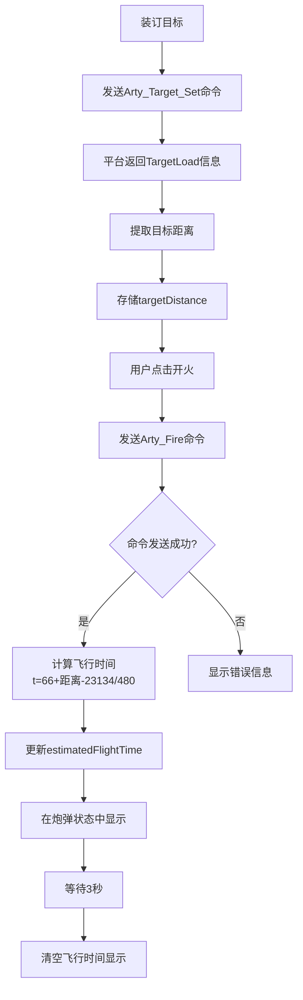
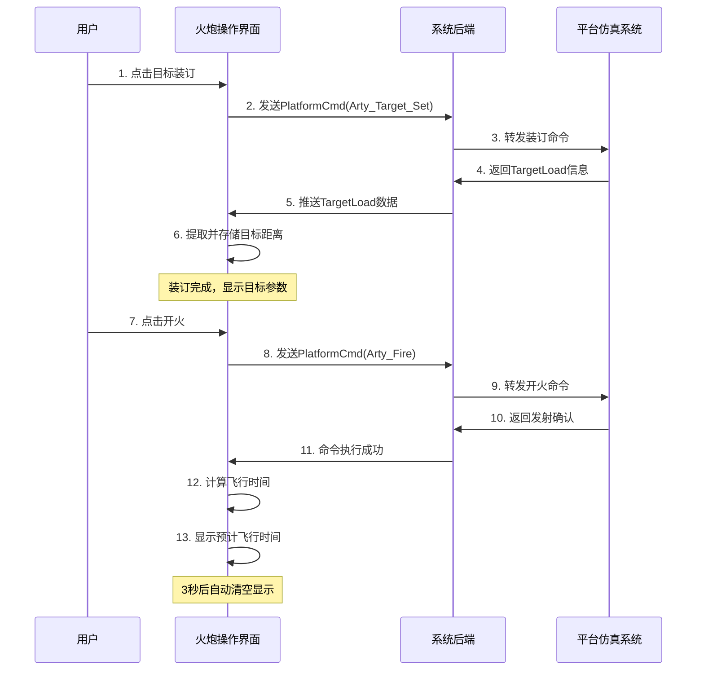
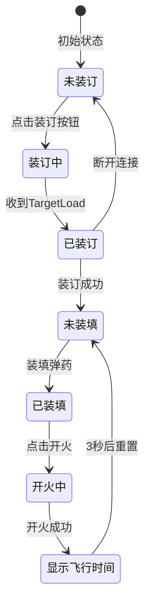
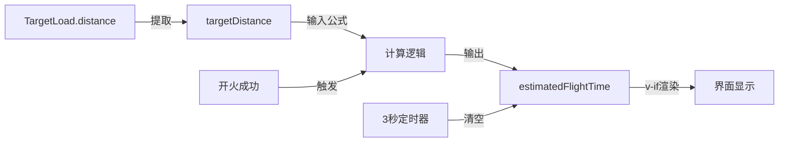
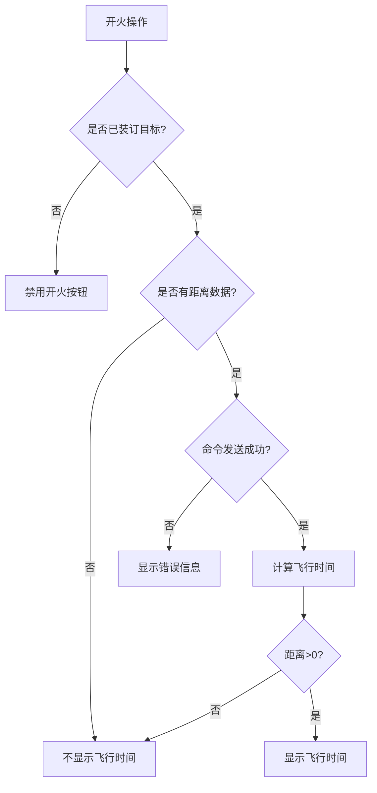

# 火炮预计飞行时间功能流程图

## 整体流程



## 数据流转



## 界面状态变化



## 关键变量关系



## 计算公式可视化

```
公式: t = 66 + (距离 - 23134) / 480

参数说明:
├─ t: 预计飞行时间（秒）
├─ 66: 基准飞行时间（秒）
├─ 23134: 基准距离（米）
├─ 480: 距离系数（米/秒）
└─ 距离: 实际目标距离（米）

计算示例:
┌──────────┬────────────────────────────┬──────────┐
│ 距离(m)  │ 计算过程                    │ 结果(秒) │
├──────────┼────────────────────────────┼──────────┤
│ 20000    │ 66 + (20000-23134)/480     │ 59       │
│ 23134    │ 66 + (23134-23134)/480     │ 66       │
│ 25000    │ 66 + (25000-23134)/480     │ 70       │
│ 28000    │ 66 + (28000-23134)/480     │ 76       │
│ 30000    │ 66 + (30000-23134)/480     │ 80       │
└──────────┴────────────────────────────┴──────────┘

特性:
• 距离每增加480m，飞行时间增加1秒
• 距离每减少480m，飞行时间减少1秒
• 基准距离23134m时，飞行时间为66秒
```

## 界面布局结构

```
┌────────────────────────────────────────────────┐
│         火炮操作页面                            │
├────────────────────────────────────────────────┤
│                                                │
│  ┌──────────┐  ┌──────────┐  ┌──────────┐    │
│  │ 左侧面板  │  │ 中间面板  │  │ 右侧面板  │    │
│  │          │  │          │  │          │    │
│  │ 任务控制  │  │ 气候环境  │  │ 任务目标  │    │
│  │ 弹药装填  │  │ 平台状态  │  │ 协同报文  │    │
│  │ 开火按钮  │  │ 装订目标  │  │          │    │
│  │          │  │          │  │          │    │
│  │          │  │ 炮弹状态  │  │          │    │
│  │          │  │ ┌──────┐ │  │          │    │
│  │          │  │ │位置   │ │  │          │    │
│  │          │  │ │姿态   │ │  │          │    │
│  │          │  │ │速度   │ │  │          │    │
│  │          │  │ │      │ │  │          │    │
│  │          │  │ │🕒飞行│ │  │          │    │
│  │          │  │ │时间:66秒│ │          │    │
│  │          │  │ └──────┘ │  │          │    │
│  └──────────┘  └──────────┘  └──────────┘    │
│                                                │
└────────────────────────────────────────────────┘

说明:
• 飞行时间显示在炮弹状态卡片底部
• 使用紫色渐变背景突出显示
• 仅在开火后且有距离数据时显示
• 3秒后自动消失
```

## 错误处理流程



## 性能优化点

1. **数据更新频率控制**

   - 仅在 TargetLoad 数据变化时更新距离
   - 避免每次状态更新都重新计算

2. **条件渲染优化**

   - 使用`v-if="estimatedFlightTime > 0"`避免无效渲染
   - 减少 DOM 操作开销

3. **定时器管理**

   - 使用 setTimeout 确保状态及时重置
   - 避免内存泄漏

4. **计算效率**
   - 使用 Math.round()一次性完成四舍五入
   - 公式简单，计算开销小

## 测试检查清单

- [x] 公式计算正确性验证
- [x] 边界值测试（距离为 0、负数、极大值）
- [x] 界面显示验证（样式、位置、动画）
- [x] 状态重置验证（3 秒后清空）
- [x] 错误处理验证（无距离数据、发送失败）
- [x] 多次开火验证（重复操作）
- [x] 断线重连验证（状态保持）
- [x] 性能测试（大量数据更新）

---

**创建日期**: 2025-10-13  
**文档版本**: v1.0
