# 3 仿真软件系统技术说明

## 3.1 系统综述与能力指标

### 3.1.1 系统概述

**opEnd**（无人机/火炮操作端）是一款基于 Electron 跨平台桌面架构的军事演练仿真系统，主要用于无人机和火炮等作战平台的协同操作训练和演练评估。系统采用现代化的前后端分离架构，支持多平台数据实时通信、协同指挥与精确打击模拟。

**系统定位**

- **应用领域**：军事演练、作战仿真、协同训练
- **核心用户**：无人机操作员、火炮指挥员、演练指挥部
- **部署环境**：Windows、macOS、Linux 跨平台桌面应用

**技术栈总览**

```
前端技术栈：
  ├── Vue 3.3.8 (渐进式前端框架)
  ├── Element Plus 2.9.7 (UI组件库)
  ├── Tailwind CSS 4.1.4 (CSS框架)
  └── TypeScript 5.2.2 (类型系统)

后端/主进程技术栈：
  ├── Electron 28.0.0 (跨平台桌面应用框架)
  ├── Node.js (运行环境)
  ├── Protobuf.js 7.5.3 (协议解析)
  ├── Dgram (UDP组播通信)
  └── Mammoth 1.11.0 (文档解析)

构建工具：
  ├── Vite 4.5.0 (前端构建工具)
  ├── Electron-builder 25.1.6 (打包工具)
  └── TypeScript Compiler (类型检查与编译)
```

### 3.1.2 核心能力指标

#### 性能指标

| 指标类型     | 指标名称         | 性能参数     | 说明                           |
| ------------ | ---------------- | ------------ | ------------------------------ |
| **通信性能** | 组播数据接收延迟 | < 100ms      | 从组播网络接收到 UI 显示的延迟 |
|              | 数据包解析速度   | > 1000 包/秒 | Protobuf 协议解析吞吐量        |
|              | 组播发送速度     | > 500 包/秒  | 平台指令发送频率               |
| **界面性能** | UI 响应时间      | < 50ms       | 用户操作到界面反馈的时间       |
|              | 地图渲染帧率     | ≥ 30 FPS     | 轨迹/航迹点实时渲染            |
|              | 数据刷新频率     | 1-3 秒/次    | 平台状态实时更新间隔           |
| **并发能力** | 同时接入平台数   | 100+         | 系统可同时监控的平台数量       |
|              | 航迹点容量       | 1000+/平台   | 单个平台可存储的航迹点数量     |
|              | 目标跟踪容量     | 50+/平台     | 单个平台可跟踪的目标数量       |
| **文档处理** | Word 文档解析    | < 2 秒       | 中等大小文档(< 5MB)解析时间    |
|              | Excel 文档解析   | < 1 秒       | 标准工作表解析时间             |

#### 功能能力指标

| 能力维度     | 能力项              | 说明                                         |
| ------------ | ------------------- | -------------------------------------------- |
| **组播通信** | UDP 组播监听        | 实时接收网络组播数据包                       |
|              | UDP 组播发送        | 发送平台指令与控制命令                       |
|              | 自定义组播配置      | 支持运行时修改组播地址/端口                  |
| **协议解析** | Protobuf 多协议解析 | 支持平台命令、平台状态、无人机飞行状态等协议 |
|              | 二进制数据解析      | 自动识别包类型并解析为结构化数据             |
|              | 协议版本兼容        | 向后兼容多版本协议定义                       |
| **平台操作** | 无人机操作          | 航线规划、速度设置、光电吊舱控制、激光照射   |
|              | 火炮操作            | 目标装订、打击参数设置、协同指挥             |
|              | 平台状态监控        | 实时位置、航向、速度、高度等参数监控         |
| **协同能力** | 跨平台协同          | 无人机与火炮之间的目标信息共享               |
|              | 航线同步            | 自动接收并转换 Nav 导航系统上传的航线        |
|              | 实时轨迹同步        | 连接时自动同步平台轨迹到组播网络             |
| **文档管理** | 多格式支持          | 支持 Word(.docx)、Excel(.xlsx)文档解析       |
|              | 文档状态管理        | 保持文档打开状态，避免重复选择               |
|              | 样式保留            | Word 文档 HTML 转换时保留原有格式            |

### 3.1.3 系统架构总览

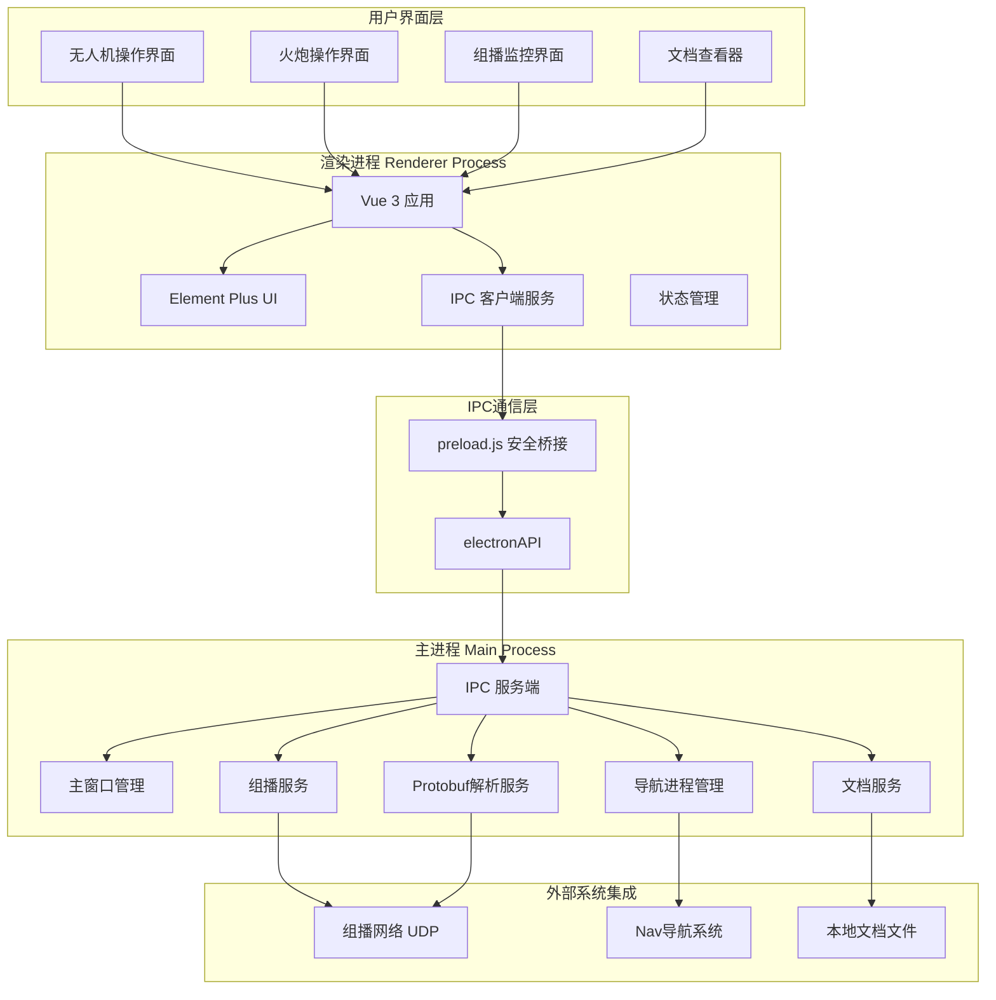
```mermaid
graph TB
    subgraph "用户界面层"
        A[无人机操作界面]
        B[火炮操作界面]
        C[组播监控界面]
        D[文档查看器]
    end

    subgraph "渲染进程 Renderer Process"
        E[Vue 3 应用]
        F[Element Plus UI]
        G[IPC 客户端服务]
        H[状态管理]
    end

    subgraph "IPC通信层"
        I[preload.js 安全桥接]
        J[electronAPI]
    end

    subgraph "主进程 Main Process"
        K[主窗口管理]
        L[IPC 服务端]
        M[组播服务]
        N[Protobuf解析服务]
        O[文档服务]
        P[导航进程管理]
    end

    subgraph "外部系统集成"
        Q[组播网络 UDP]
        R[Nav导航系统]
        S[本地文档文件]
    end

    A --> E
    B --> E
    C --> E
    D --> E
    E --> F
    E --> G
    G --> I
    I --> J
    J --> L
    L --> K
    L --> M
    L --> N
    L --> O
    L --> P
    M --> Q
    N --> Q
    P --> R
    O --> S
```

---

## 3.2 系统组成与功能

### 3.2.1 仿真软件系统组成

系统采用 Electron 多进程架构，主要由**主进程**（Main Process）和**渲染进程**（Renderer Process）两大部分组成，通过 IPC（进程间通信）机制进行安全的数据交互。

#### 3.2.1.1 主进程架构

主进程是系统的核心控制中心，拥有 Node.js 完整权限，负责系统资源管理、网络通信、数据解析等底层服务。

**主进程职责分工**

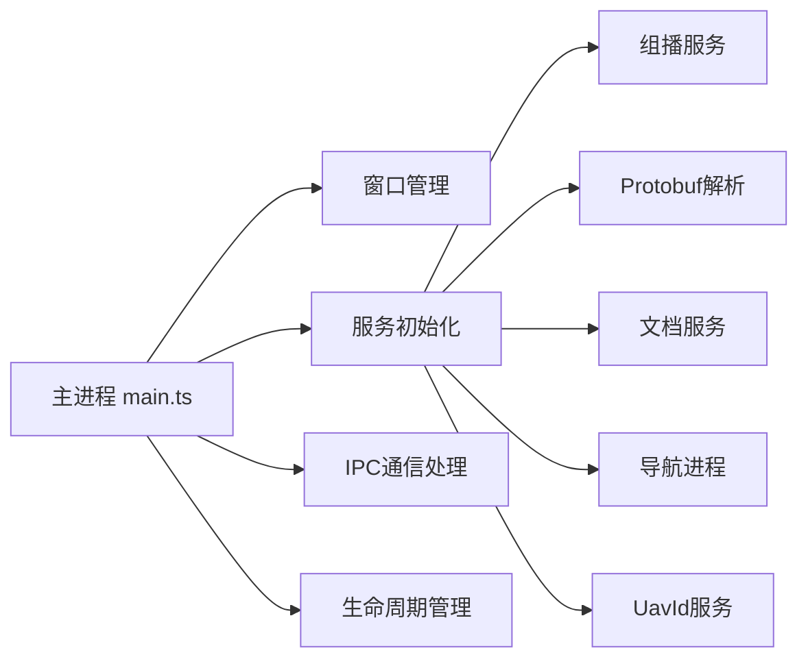
```mermaid
graph LR
    A[主进程 main.ts] --> B[窗口管理]
    A --> C[服务初始化]
    A --> D[IPC通信处理]
    A --> E[生命周期管理]

    C --> C1[组播服务]
    C --> C2[Protobuf解析]
    C --> C3[文档服务]
    C --> C4[导航进程]
    C --> C5[UavId服务]
```

**核心服务模块**

| 服务模块              | 文件路径                      | 核心功能          | 技术实现                |
| --------------------- | ----------------------------- | ----------------- | ----------------------- |
| **组播监听服务**      | `multicast.service.ts`        | 监听 UDP 组播数据 | `dgram.createSocket()`  |
| **组播发送服务**      | `multicast-sender.service.ts` | 发送平台指令      | UDP 组播发送 + 心跳机制 |
| **Protobuf 解析服务** | `protobuf-parser.service.ts`  | 二进制协议解析    | `protobufjs` 动态加载   |
| **文档服务**          | `document.service.ts`         | Word/Excel 解析   | `mammoth` + `xlsx`      |
| **文档状态服务**      | `document-state.service.ts`   | 文档缓存管理      | 内存状态管理            |
| **导航进程服务**      | `nav-process.service.ts`      | Nav 进程管理      | `child_process.spawn()` |
| **导航配置服务**      | `nav-config.service.ts`       | Nav 配置管理      | INI 配置文件读写        |
| **UavId 服务**        | `uav-id.service.ts`           | 无人机 ID 管理    | 单例模式 + 自动生成     |

**服务启动流程**

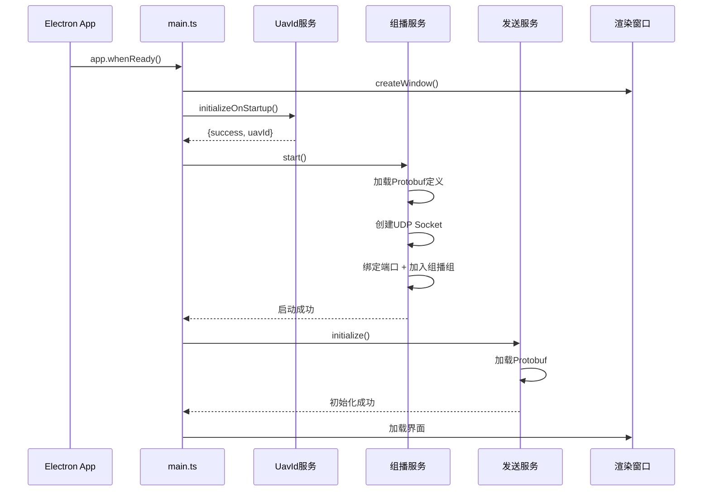
```mermaid
sequenceDiagram
    participant App as Electron App
    participant Main as main.ts
    participant UavId as UavId服务
    participant Multicast as 组播服务
    participant Sender as 发送服务
    participant Window as 渲染窗口

    App->>Main: app.whenReady()
    Main->>Window: createWindow()
    Main->>UavId: initializeOnStartup()
    UavId-->>Main: {success, uavId}
    Main->>Multicast: start()
    Multicast->>Multicast: 加载Protobuf定义
    Multicast->>Multicast: 创建UDP Socket
    Multicast->>Multicast: 绑定端口 + 加入组播组
    Multicast-->>Main: 启动成功
    Main->>Sender: initialize()
    Sender->>Sender: 加载Protobuf
    Sender-->>Main: 初始化成功
    Main->>Window: 加载界面
```

#### 3.2.1.2 渲染进程架构

渲染进程运行在 Chromium 沙箱环境中，负责用户界面展示和交互逻辑，使用 Vue 3 框架构建。

**渲染进程组件结构**

```
src/renderer/
├── views/                    # 页面组件
│   ├── pages/               # 主要页面
│   │   ├── StartPage.vue    # 启动页
│   │   ├── MainPage.vue     # 主页(组播监控)
│   │   ├── UavOperationPage.vue      # 无人机操作页
│   │   └── ArtilleryOperationPage.vue # 火炮操作页
│   └── components/          # 公共组件(如果有)
├── services/                # 前端服务层
│   └── document.service.ts  # 文档服务封装
├── typings/                 # 类型定义
│   ├── electron.d.ts        # Electron API类型
│   ├── env.d.ts             # 环境变量类型
│   └── auto-imports.d.ts    # 自动导入类型
├── assets/                  # 静态资源
│   └── css/
│       └── index.css        # 全局样式
├── App.vue                  # 根组件
├── main.ts                  # 入口文件
├── index.html               # HTML模板
└── tsconfig.json            # TypeScript配置
```

**页面组件功能对照**

| 页面组件                   | 路由路径     | 核心功能             | 数据来源        |
| -------------------------- | ------------ | -------------------- | --------------- |
| **StartPage**              | `/`          | 席位选择入口         | 本地状态        |
| **MainPage**               | `/main`      | 组播监控、数据包查看 | IPC 实时数据流  |
| **UavOperationPage**       | `/uav`       | 无人机操作、航线规划 | 组播 + 本地状态 |
| **ArtilleryOperationPage** | `/artillery` | 火炮操作、目标装订   | 组播 + 协同消息 |

#### 3.2.1.3 IPC 通信机制

Electron 使用**IPC**（Inter-Process Communication）实现主进程与渲染进程之间的安全通信。

**IPC 通信架构图**

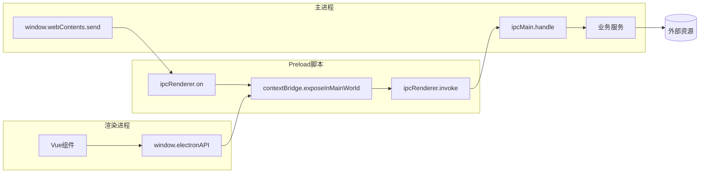
```mermaid
graph LR
    subgraph "渲染进程"
        A[Vue组件] --> B[window.electronAPI]
    end

    subgraph "Preload脚本"
        B --> C[contextBridge.exposeInMainWorld]
        C --> D[ipcRenderer.invoke]
        E[ipcRenderer.on] --> C
    end

    subgraph "主进程"
        D --> F[ipcMain.handle]
        G[window.webContents.send] --> E
        F --> H[业务服务]
    end

    H --> I[(外部资源)]
```

**IPC 频道定义**

系统定义了多个 IPC 频道用于不同功能模块的通信：

```typescript
// 组播服务频道
"multicast:start"; // 启动组播监听
"multicast:stop"; // 停止组播监听
"multicast:getStatus"; // 获取服务状态
"multicast:getConfig"; // 获取组播配置
"multicast:updateConfig"; // 更新组播配置
"multicast:sendPlatformCmd"; // 发送平台指令
"multicast:syncTrajectory"; // 同步轨迹
"multicast:startPlatformHeartbeat"; // 启动心跳
"multicast:stopPlatformHeartbeat"; // 停止心跳

// 文档服务频道
"document:readDocument"; // 读取文档
"document:getRecentDocument"; // 获取最近文档
"document:hideDocument"; // 隐藏文档
"document:getStats"; // 获取统计信息
"document:hasOpenedDocuments"; // 检查是否有已打开文档

// 图片服务频道
"images:getPlatformImagePath"; // 获取平台图片路径
"images:getPlatformImageData"; // 获取图片Base64数据

// 对话框服务频道
"dialog:showOpenDialog"; // 显示打开文件对话框
"show-save-dialog"; // 显示保存文件对话框
"export-file"; // 导出文件

// 事件推送频道(主进程 -> 渲染进程)
"multicast:packet"; // 推送组播数据包
"multicast:error"; // 推送错误消息
"route:converted"; // 推送航线转换成功
"route:uavIdMismatch"; // 推送UavId不匹配
```

**安全模型**

系统通过`preload.ts`实现安全的 API 暴露：

```typescript
// src/main/preload.ts (简化示例)
import { contextBridge, ipcRenderer } from "electron";

contextBridge.exposeInMainWorld("electronAPI", {
  // 组播服务
  multicast: {
    start: () => ipcRenderer.invoke("multicast:start"),
    stop: () => ipcRenderer.invoke("multicast:stop"),
    sendPlatformCmd: (data) =>
      ipcRenderer.invoke("multicast:sendPlatformCmd", data),
  },

  // 文档服务
  document: {
    readDocument: (filePath) =>
      ipcRenderer.invoke("document:readDocument", filePath),
    getRecentDocument: () => ipcRenderer.invoke("document:getRecentDocument"),
  },

  // 事件监听
  onMulticastPacket: (callback) => {
    ipcRenderer.on("multicast:packet", (_, data) => callback(data));
  },
});
```

渲染进程使用示例：

```typescript
// 渲染进程中调用
const result = await window.electronAPI.multicast.start();
if (result.success) {
  console.log("组播服务启动成功");
}

// 监听数据包
window.electronAPI.onMulticastPacket((packet) => {
  console.log("收到数据包:", packet);
});
```

---

### 3.2.2 仿真软件功能

系统主要包含**组播通信**、**平台操作**、**协同指挥**、**演练文档**四大核心功能模块。

#### 3.2.2.1 组播通信功能

**功能概述**

组播通信是系统的核心网络通信机制，用于接收和发送 UDP 组播数据包，实现多平台之间的实时数据共享。

**组播监听功能**

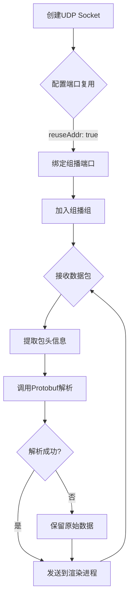
```mermaid
graph TD
    A[创建UDP Socket] --> B{配置端口复用}
    B -->|reuseAddr: true| C[绑定组播端口]
    C --> D[加入组播组]
    D --> E{接收数据包}
    E --> F[提取包头信息]
    F --> G[调用Protobuf解析]
    G --> H{解析成功?}
    H -->|是| I[发送到渲染进程]
    H -->|否| J[保留原始数据]
    J --> I
    I --> E
```

**核心代码逻辑**（`multicast.service.ts`）

```typescript
// 创建支持端口复用的Socket
this.socket = dgram.createSocket({
  type: "udp4",
  reuseAddr: true, // 关键：允许多个进程绑定同一端口
});

// 绑定端口
this.socket.bind(
  {
    port: this.multicastPort, // 10086
    address: this.interfaceAddress, // 0.0.0.0
    exclusive: false, // 允许端口复用
  },
  () => {
    // 加入组播组
    this.socket.addMembership(
      this.multicastAddress, // 239.255.43.21
      this.interfaceAddress
    );
  }
);

// 接收消息
this.socket.on("message", (msg, rinfo) => {
  const packet = {
    timestamp: Date.now(),
    source: `${rinfo.address}:${rinfo.port}`,
    data: msg,
    size: msg.length,
    parsedPacket: protobufParserService.parsePacket(msg),
  };
  this.emit("packet", packet);
});
```

**组播发送功能**

支持发送平台指令（PlatformCmd）和心跳数据，确保平台在线状态。

**发送流程图**

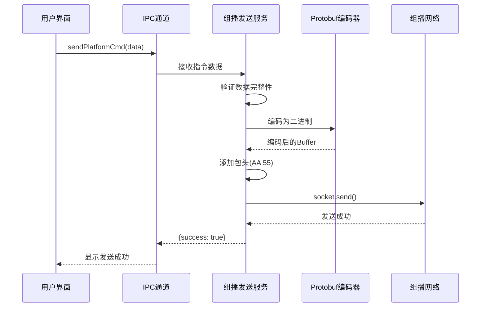
```mermaid
sequenceDiagram
    participant UI as 用户界面
    participant IPC as IPC通道
    participant Sender as 组播发送服务
    participant Protobuf as Protobuf编码器
    participant Network as 组播网络

    UI->>IPC: sendPlatformCmd(data)
    IPC->>Sender: 接收指令数据
    Sender->>Sender: 验证数据完整性
    Sender->>Protobuf: 编码为二进制
    Protobuf-->>Sender: 编码后的Buffer
    Sender->>Sender: 添加包头(AA 55)
    Sender->>Network: socket.send()
    Network-->>Sender: 发送成功
    Sender-->>IPC: {success: true}
    IPC-->>UI: 显示发送成功
```

**心跳机制**

系统支持自动发送平台心跳，保持平台在线状态：

```typescript
// 启动心跳（每3秒发送一次）
multicastSenderService.startPlatformHeartbeat('UAV01', 3000);

// 心跳数据自动包含平台基础信息
{
  platformName: 'UAV01',
  heartbeatTime: 1729000000,
  platformStatus: 'ONLINE'
}
```

**配置管理**

支持运行时动态修改组播参数：

```typescript
// 通过IPC更新配置
await window.electronAPI.multicast.updateConfig(
  "239.255.43.21", // 新组播地址
  10086, // 新端口
  "0.0.0.0" // 新接口地址
);
```

配置文件（`config.env`）：

```env
# 组播配置
MULTICAST_ADDRESS=239.255.43.21
MULTICAST_PORT=10086
INTERFACE_ADDRESS=0.0.0.0
MULTICAST_TTL=64

# 应用配置
NODE_ENV=development
LOG_LEVEL=debug
```

#### 3.2.2.2 平台操作功能

**无人机操作功能**

无人机操作界面提供完整的无人机任务控制能力。

**无人机操作界面布局图**

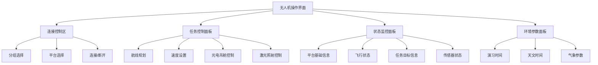
```mermaid
graph TB
    A[无人机操作界面] --> B[连接控制区]
    A --> C[任务控制面板]
    A --> D[状态监控面板]
    A --> E[环境参数面板]

    B --> B1[分组选择]
    B --> B2[平台选择]
    B --> B3[连接/断开]

    C --> C1[航线规划]
    C --> C2[速度设置]
    C --> C3[光电吊舱控制]
    C --> C4[激光照射控制]

    D --> D1[平台基础信息]
    D --> D2[飞行状态]
    D --> D3[任务目标信息]
    D --> D4[传感器状态]

    E --> E1[演习时间]
    E --> E2[天文时间]
    E --> E3[气象参数]
```

**核心操作功能列表**

| 功能模块     | 操作项        | 指令类型                      | 说明                          |
| ------------ | ------------- | ----------------------------- | ----------------------------- |
| **航线规划** | 启动 Nav 系统 | -                             | 调用外部 Nav 进程进行航线规划 |
|              | 接收航线上传  | PackageType: 0x20             | 自动接收并转换为 PlatformCmd  |
| **速度设置** | 设置飞行速度  | Command: Uav_Speed            | 设置航点速度(m/s)             |
| **光电吊舱** | 吊舱俯仰角    | Command: Uav_Sensor_Pitch     | 控制吊舱俯仰(-90° ~ +90°)     |
|              | 吊舱方位角    | Command: Uav_Sensor_Azimuth   | 控制吊舱方位(0° ~ 360°)       |
|              | 吊舱变倍      | Command: Uav_Sensor_Zoom      | 控制光学变倍(1x ~ 30x)        |
| **激光照射** | 开启照射      | Command: Uav_Laser_ON         | 开启激光照射并倒计时          |
|              | 关闭照射      | Command: Uav_Laser_OFF        | 关闭激光照射                  |
| **目标锁定** | 锁定目标      | Command: Uav_Lock_Target      | 发送目标锁定指令              |
| **协同指挥** | 发送协同消息  | Command: Coordination_Message | 向火炮发送目标信息            |

**航线规划流程**

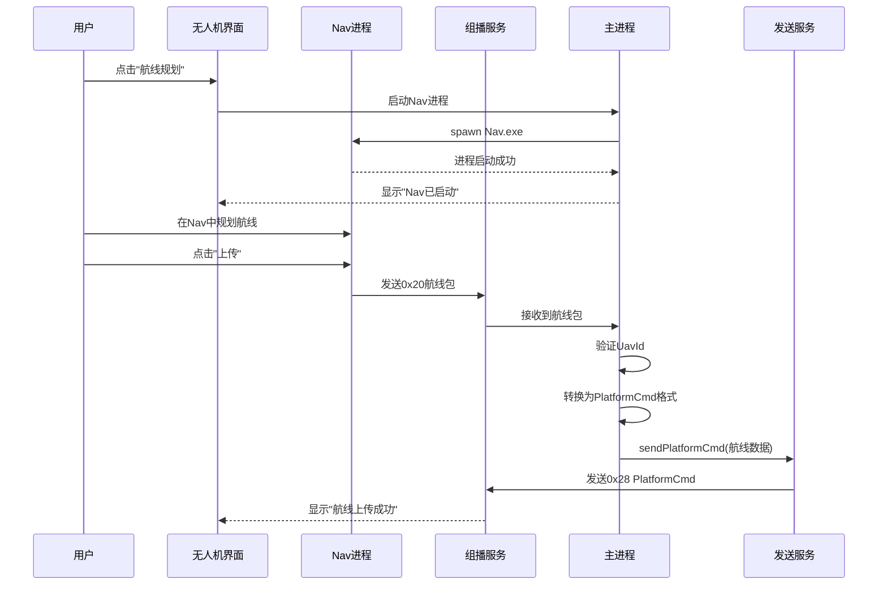
```mermaid
sequenceDiagram
    participant User as 用户
    participant UI as 无人机界面
    participant NavProcess as Nav进程
    participant Multicast as 组播服务
    participant Main as 主进程
    participant Sender as 发送服务

    User->>UI: 点击"航线规划"
    UI->>Main: 启动Nav进程
    Main->>NavProcess: spawn Nav.exe
    NavProcess-->>Main: 进程启动成功
    Main-->>UI: 显示"Nav已启动"

    User->>NavProcess: 在Nav中规划航线
    User->>NavProcess: 点击"上传"
    NavProcess->>Multicast: 发送0x20航线包
    Multicast->>Main: 接收到航线包
    Main->>Main: 验证UavId
    Main->>Main: 转换为PlatformCmd格式
    Main->>Sender: sendPlatformCmd(航线数据)
    Sender->>Multicast: 发送0x28 PlatformCmd
    Multicast-->>UI: 显示"航线上传成功"
```

**激光照射倒计时功能**

系统支持激光照射时长统计，用于评估目标照射时长：

```typescript
// 开启激光时开始计时
laserStartTime = Date.now();
laserDuration = 0;

// 每秒更新倒计时
setInterval(() => {
  if (isLaserOn) {
    laserDuration = Math.floor((Date.now() - laserStartTime) / 1000);
  }
}, 1000);

// 关闭激光时记录总时长
const totalDuration = laserDuration; // 秒
```

**火炮操作功能**

火炮操作界面提供目标装订、打击参数设置、协同指挥等功能。

**火炮操作界面布局图**

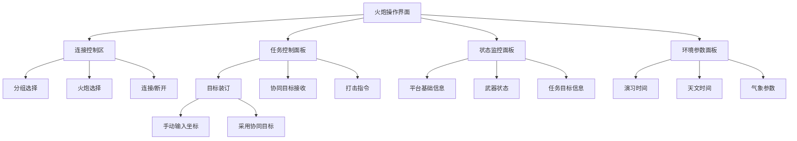
```mermaid
graph TB
    A[火炮操作界面] --> B[连接控制区]
    A --> C[任务控制面板]
    A --> D[状态监控面板]
    A --> E[环境参数面板]

    B --> B1[分组选择]
    B --> B2[火炮选择]
    B --> B3[连接/断开]

    C --> C1[目标装订]
    C --> C2[协同目标接收]
    C --> C3[打击指令]

    C1 --> C11[手动输入坐标]
    C1 --> C12[采用协同目标]

    D --> D1[平台基础信息]
    D --> D2[武器状态]
    D --> D3[任务目标信息]

    E --> E1[演习时间]
    E --> E2[天文时间]
    E --> E3[气象参数]
```

**火炮核心操作**

| 功能模块     | 操作项       | 指令类型                       | 说明                     |
| ------------ | ------------ | ------------------------------ | ------------------------ |
| **目标装订** | 手动装订     | Command: Set_Strike_Coordinate | 手动输入经纬度、高度     |
|              | 采用协同目标 | -                              | 采用无人机发送的协同目标 |
| **打击指令** | 发射         | Command: Artillery_Fire        | 发送打击指令             |
| **协同接收** | 接收协同消息 | Command: Coordination_Message  | 接收无人机发送的目标信息 |

**协同目标接收流程**

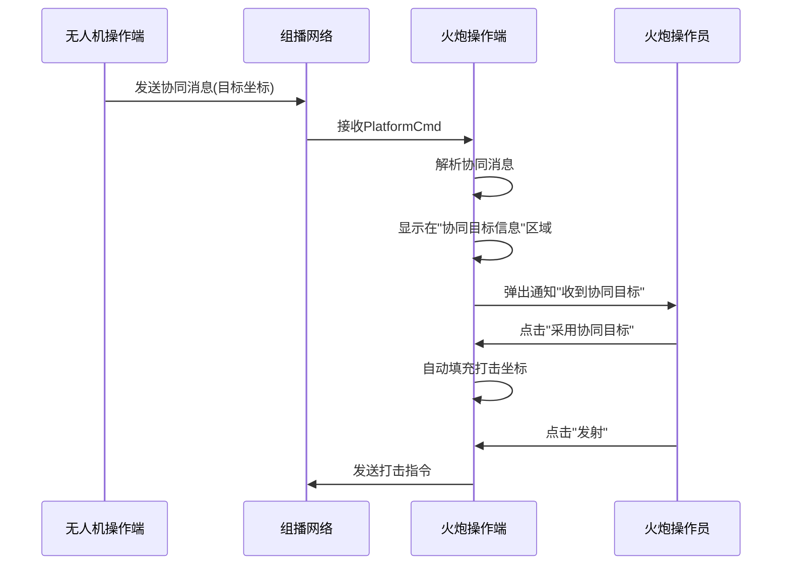
```mermaid
sequenceDiagram
    participant UAV as 无人机操作端
    participant Network as 组播网络
    participant Artillery as 火炮操作端
    participant User as 火炮操作员

    UAV->>Network: 发送协同消息(目标坐标)
    Network->>Artillery: 接收PlatformCmd
    Artillery->>Artillery: 解析协同消息
    Artillery->>Artillery: 显示在"协同目标信息"区域
    Artillery->>User: 弹出通知"收到协同目标"
    User->>Artillery: 点击"采用协同目标"
    Artillery->>Artillery: 自动填充打击坐标
    User->>Artillery: 点击"发射"
    Artillery->>Network: 发送打击指令
```

#### 3.2.2.3 文档管理功能

系统支持 Word 和 Excel 文档的解析与查看，用于显示演练方案、作战计划等文档。

**支持的文档格式**

| 文档类型       | 文件扩展名 | 解析库     | 输出格式        |
| -------------- | ---------- | ---------- | --------------- |
| Word 文档      | .docx      | mammoth.js | HTML (保留样式) |
| Excel 电子表格 | .xlsx      | xlsx.js    | JSON 数组       |

**文档解析流程**

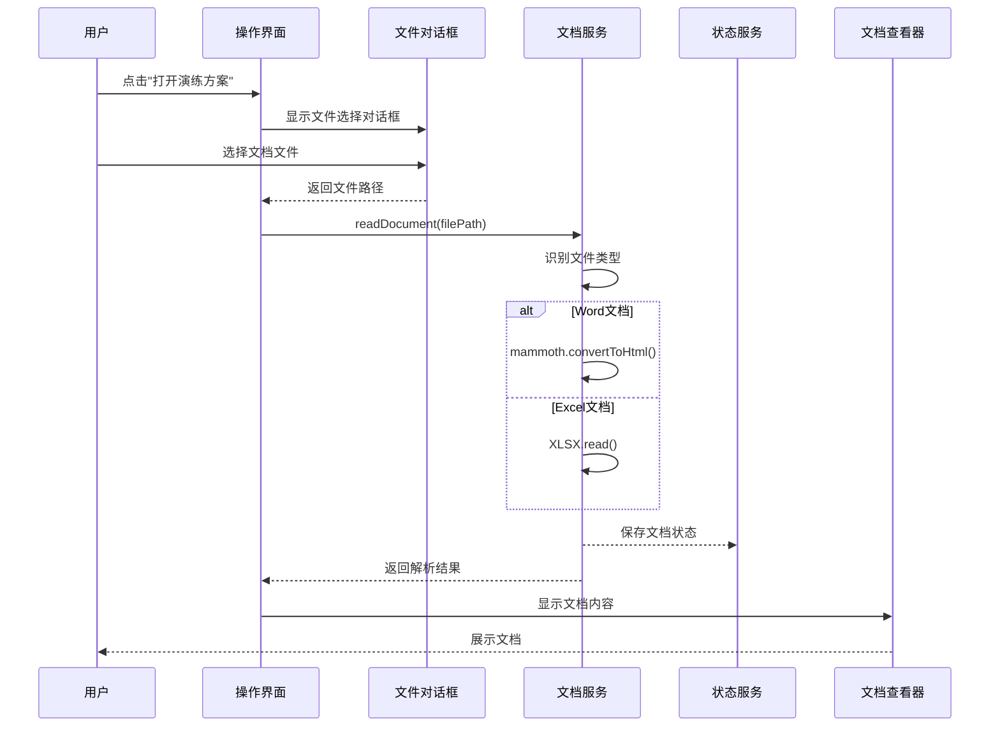
```mermaid
sequenceDiagram
    participant User as 用户
    participant UI as 操作界面
    participant Dialog as 文件对话框
    participant DocService as 文档服务
    participant StateService as 状态服务
    participant Viewer as 文档查看器

    User->>UI: 点击"打开演练方案"
    UI->>Dialog: 显示文件选择对话框
    User->>Dialog: 选择文档文件
    Dialog-->>UI: 返回文件路径
    UI->>DocService: readDocument(filePath)
    DocService->>DocService: 识别文件类型
    alt Word文档
        DocService->>DocService: mammoth.convertToHtml()
    else Excel文档
        DocService->>DocService: XLSX.read()
    end
    DocService-->>StateService: 保存文档状态
    DocService-->>UI: 返回解析结果
    UI->>Viewer: 显示文档内容
    Viewer-->>User: 展示文档
```

**文档状态管理**

系统实现了文档状态缓存机制，避免重复选择文档：

```typescript
// 打开文档时保存状态
DocumentStateService.saveDocumentState(
  filePath, // 文件路径
  fileName, // 文件名
  content, // 解析后的内容
  fileType // 文档类型
);

// 关闭文档时隐藏（不删除状态）
DocumentStateService.hideCurrentDocument();

// 再次打开时恢复状态
const recentDoc = DocumentStateService.showRecentDocument();
if (recentDoc) {
  displayDocument(recentDoc.content, recentDoc.type);
}
```

**Word 文档样式保留**

系统在解析 Word 文档时保留了格式样式：

```typescript
const result = await mammoth.convertToHtml(
  { buffer: fileBuffer },
  {
    styleMap: [
      "p[style-name='Heading 1'] => h1:fresh",
      "p[style-name='Heading 2'] => h2:fresh",
      "p[style-name='Title'] => h1.title:fresh",
      "r[style-name='Strong'] => strong",
      "r[style-name='Emphasis'] => em",
      "p[style-name='List Paragraph'] => li:fresh",
      "table => table.word-table:fresh",
    ],
    includeDefaultStyleMap: true,
  }
);
```

**Excel 数据解析**

Excel 文档解析为 JSON 数组格式，便于数据展示：

```typescript
const workbook = XLSX.read(fileBuffer, { type: "buffer" });
const sheets = [];

workbook.SheetNames.forEach((sheetName) => {
  const worksheet = workbook.Sheets[sheetName];
  const jsonData = XLSX.utils.sheet_to_json(worksheet, {
    header: 1,
    defval: "",
  });

  sheets.push({
    name: sheetName,
    data: jsonData,
  });
});
```

---

## 3.3 系统体系结构

### 3.3.1 架构设计原则

系统架构遵循以下设计原则：

1. **分层架构**：界面层、业务逻辑层、数据访问层分离
2. **进程隔离**：主进程与渲染进程职责分离，安全通信
3. **事件驱动**：基于 EventEmitter 的事件驱动架构
4. **模块化设计**：服务模块化，单一职责原则
5. **跨平台兼容**：统一的资源路径管理，支持多操作系统

### 3.3.2 Protobuf 协议解析架构

系统使用 Protobuf 作为网络数据交换格式，支持多种协议类型的解析。

**Protobuf 协议文件结构**

```
src/protobuf/
├── PlatformCmd.proto          # 平台指令协议
├── PlatformStatus.proto       # 平台状态协议
├── PublicStruct.proto         # 公共结构定义
├── UavFlyStatusStruct.proto   # 无人机飞行状态
├── UavNavMonitorStruct.proto  # 无人机导航监控
├── UavFlyMonitorStruct.proto  # 无人机飞行监控
└── UaviationSimulationStruct.proto # 航空仿真结构
```

**协议类型映射表**

| 包类型   | PackageType | Proto 文件                | 说明                             |
| -------- | ----------- | ------------------------- | -------------------------------- |
| 平台状态 | 0x29        | PlatformStatus.proto      | 平台基础状态、传感器、武器等信息 |
| 平台指令 | 0x28        | PlatformCmd.proto         | 无人机/火炮控制指令              |
| 航线上传 | 0x20        | UavNavMonitorStruct.proto | Nav 系统上传的航线数据           |
| 飞行状态 | 0x21        | UavFlyStatusStruct.proto  | 无人机实时飞行参数               |

**Protobuf 解析服务架构**

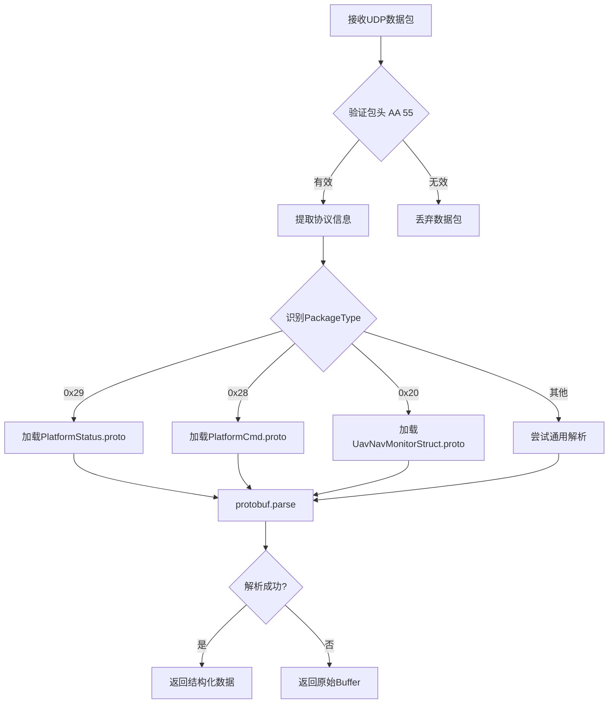
```mermaid
graph TB
    A[接收UDP数据包] --> B{验证包头 AA 55}
    B -->|有效| C[提取协议信息]
    B -->|无效| Z[丢弃数据包]

    C --> D{识别PackageType}
    D -->|0x29| E[加载PlatformStatus.proto]
    D -->|0x28| F[加载PlatformCmd.proto]
    D -->|0x20| G[加载UavNavMonitorStruct.proto]
    D -->|其他| H[尝试通用解析]

    E --> I[protobuf.parse]
    F --> I
    G --> I
    H --> I

    I --> J{解析成功?}
    J -->|是| K[返回结构化数据]
    J -->|否| L[返回原始Buffer]
```

**包格式定义**

所有网络数据包遵循统一的二进制格式：

```
偏移量   大小   字段名          说明
0x00     1      Header1        固定值 0xAA
0x01     1      Header2        固定值 0x55
0x02     1      ProtocolID     协议ID
0x03     1      PackageType    包类型
0x04     4      DataSize       数据长度(小端序)
0x08     N      ProtobufData   Protobuf编码的数据
```

**协议加载机制**

系统在启动时动态加载所有 Protobuf 定义文件：

```typescript
async loadProtobufDefinitions() {
  const protoPath = this.getProtobufPath();
  const protoFiles = [
    'PlatformStatus.proto',
    'PlatformCmd.proto',
    'PublicStruct.proto',
    'UavNavMonitorStruct.proto',
    'UavFlyStatusStruct.proto'
  ];

  for (const file of protoFiles) {
    const fullPath = join(protoPath, file);
    const root = await protobuf.load(fullPath);

    // 缓存已加载的消息类型
    this.loadedTypes.set(file, root);
  }
}
```

### 3.3.3 数据流架构

系统数据流分为**接收数据流**和**发送数据流**两个方向。

**接收数据流**

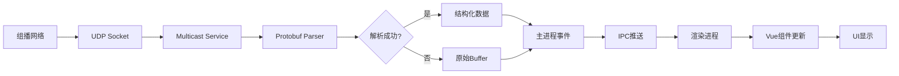
```mermaid
graph LR
    A[组播网络] --> B[UDP Socket]
    B --> C[Multicast Service]
    C --> D[Protobuf Parser]
    D --> E{解析成功?}
    E -->|是| F[结构化数据]
    E -->|否| G[原始Buffer]
    F --> H[主进程事件]
    G --> H
    H --> I[IPC推送]
    I --> J[渲染进程]
    J --> K[Vue组件更新]
    K --> L[UI显示]
```

**发送数据流**

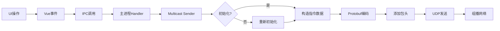
```mermaid
graph LR
    A[UI操作] --> B[Vue事件]
    B --> C[IPC调用]
    C --> D[主进程Handler]
    D --> E[Multicast Sender]
    E --> F{初始化?}
    F -->|否| G[重新初始化]
    F -->|是| H[构造指令数据]
    G --> H
    H --> I[Protobuf编码]
    I --> J[添加包头]
    J --> K[UDP发送]
    K --> L[组播网络]
```

**状态同步机制**

系统实现了平台状态的实时同步：

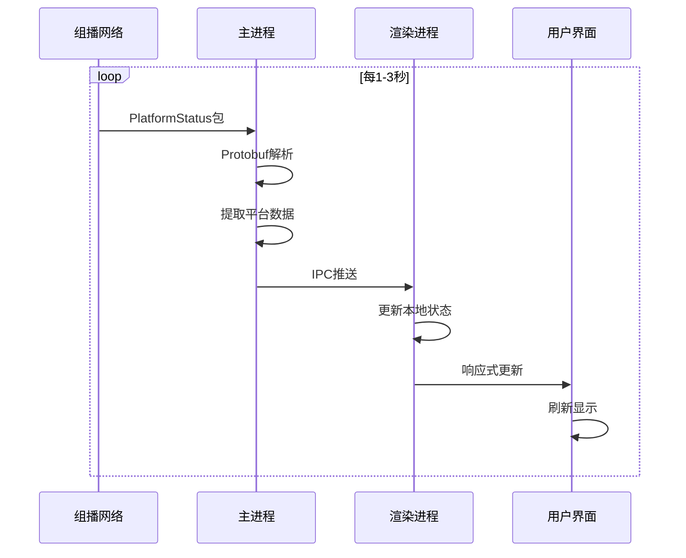
```mermaid
sequenceDiagram
    participant Network as 组播网络
    participant Main as 主进程
    participant Renderer as 渲染进程
    participant UI as 用户界面

    loop 每1-3秒
        Network->>Main: PlatformStatus包
        Main->>Main: Protobuf解析
        Main->>Main: 提取平台数据
        Main->>Renderer: IPC推送
        Renderer->>Renderer: 更新本地状态
        Renderer->>UI: 响应式更新
        UI->>UI: 刷新显示
    end
```

---

## 3.4 软件系统接口关系

### 3.4.1 内部接口

#### 3.4.1.1 IPC 接口规范

**请求-响应模式接口**

| 接口名称                      | 方向      | 参数                | 返回值                                                          | 说明         |
| ----------------------------- | --------- | ------------------- | --------------------------------------------------------------- | ------------ |
| `multicast:start`             | 渲染 → 主 | 无                  | `{success: boolean, error?: string}`                            | 启动组播监听 |
| `multicast:stop`              | 渲染 → 主 | 无                  | `{success: boolean, error?: string}`                            | 停止组播监听 |
| `multicast:getStatus`         | 渲染 → 主 | 无                  | `{isListening: boolean, address: string, port: number}`         | 获取服务状态 |
| `multicast:sendPlatformCmd`   | 渲染 → 主 | `PlatformCmdData`   | `{success: boolean, error?: string}`                            | 发送平台指令 |
| `document:readDocument`       | 渲染 → 主 | `string` (文件路径) | `{success: boolean, data?: any, type?: string, error?: string}` | 读取文档     |
| `images:getPlatformImageData` | 渲染 → 主 | `string` (平台类型) | `{success: boolean, data?: string, exists: boolean}`            | 获取平台图片 |

**事件推送模式接口**

| 事件名称                   | 方向      | 数据结构                            | 说明                   |
| -------------------------- | --------- | ----------------------------------- | ---------------------- |
| `multicast:packet`         | 主 → 渲染 | `MulticastPacket`                   | 推送接收到的组播数据包 |
| `multicast:error`          | 主 → 渲染 | `string`                            | 推送组播服务错误消息   |
| `route:converted`          | 主 → 渲染 | `{uavId, waypointCount, routeType}` | 推送航线转换成功事件   |
| `route:uavIdMismatch`      | 主 → 渲染 | `{systemUavId, routeUavId}`         | 推送 UavId 不匹配事件  |
| `route:noPlatformSelected` | 主 → 渲染 | `{uavId}`                           | 推送未选择平台事件     |

**数据类型定义**

```typescript
// PlatformCmd数据结构
interface PlatformCmdData {
  commandID: number; // 指令ID
  platformName: string; // 平台名称
  command: number; // 指令类型枚举
  navParam?: NavParam; // 航线参数
  sensorParam?: SensorParam; // 传感器参数
  laserParam?: LaserParam; // 激光参数
  strikeParam?: StrikeParam; // 打击参数
  coordParam?: CoordinationParam; // 协同参数
}

// 组播数据包结构
interface MulticastPacket {
  timestamp: number; // 时间戳
  source: string; // 源地址 "IP:PORT"
  data: Buffer; // 原始数据
  dataString: string; // UTF-8字符串
  size: number; // 数据大小
  parsedPacket?: ParsedPacket; // 解析后的数据
}

// 解析后的数据包
interface ParsedPacket {
  protocolID: number; // 协议ID
  packageType: number; // 包类型
  packageTypeName: string; // 包类型名称
  dataSize: number; // 数据大小
  parsedData: any; // 解析后的结构化数据
  source: string; // 源地址
  timestamp: number; // 时间戳
  size: number; // 总大小
}
```

#### 3.4.1.2 服务间接口

**组播服务与 Protobuf 解析服务**

```typescript
// 组播服务调用解析服务
class MulticastService {
  onMessage(msg: Buffer, rinfo: RemoteInfo) {
    // 调用Protobuf解析服务
    const parsed = protobufParserService.parsePacket(
      msg,
      `${rinfo.address}:${rinfo.port}`,
      Date.now()
    );

    this.emit("packet", {
      ...rawData,
      parsedPacket: parsed,
    });
  }
}
```

**文档服务与文档状态服务**

```typescript
// 文档服务调用状态服务
class DocumentService {
  static async readDocument(filePath: string) {
    const result = await this.parseDocument(filePath);

    if (result.success) {
      // 保存到状态服务
      DocumentStateService.saveDocumentState(
        filePath,
        fileName,
        result.data,
        result.type
      );
    }

    return result;
  }
}
```

### 3.4.2 外部接口

#### 3.4.2.1 组播网络接口

**组播参数**

| 参数名称 | 默认值        | 说明                        |
| -------- | ------------- | --------------------------- |
| 组播地址 | 239.255.43.21 | IPv4 组播地址(本地管理范围) |
| 组播端口 | 10086         | UDP 端口号                  |
| 接口地址 | 0.0.0.0       | 监听所有网络接口            |
| TTL      | 128           | 数据包生存时间(跳数)        |

**数据包格式**

所有通过组播发送和接收的数据包必须符合以下格式：

```
+--------+--------+----------+-------------+-----------+----------------+
| Header | Header | Protocol | Package     | Data Size | Protobuf Data  |
|  0xAA  |  0x55  |   ID     | Type        | (4 bytes) | (N bytes)      |
+--------+--------+----------+-------------+-----------+----------------+
  1 byte   1 byte   1 byte     1 byte       4 bytes      N bytes
```

**示例数据包（PlatformCmd）**

```
十六进制:
AA 55 01 28 3C 00 00 00 0A 06 55 41 56 30 31 10 ...

解析:
AA 55       - 包头
01          - 协议ID
28          - PackageType (PlatformCmd)
3C 00 00 00 - DataSize = 60字节 (小端序)
0A 06 ...   - Protobuf编码的数据
```

#### 3.4.2.2 Nav 导航系统接口

系统通过进程调用方式与 Nav 导航系统集成。

**进程启动接口**

```typescript
// 启动Nav进程
const navProcess = spawn("Nav.exe", [], {
  cwd: navWorkingDirectory,
  env: process.env,
});

// 监听进程输出
navProcess.stdout.on("data", (data) => {
  console.log(`Nav输出: ${data}`);
});

// 监听进程退出
navProcess.on("exit", (code) => {
  console.log(`Nav退出，代码: ${code}`);
});
```

**配置文件接口**

Nav 系统通过 INI 配置文件进行参数设置：

```ini
# Nav/data/config.ini
[UAV]
UavID=1001
UavName=UAV01
InitLongitude=116.3975
InitLatitude=39.9085
InitAltitude=1000.0
CruiseSpeed=10.0

[COMM]
MulticastAddress=239.255.43.21
MulticastPort=10086
```

**数据交换接口**

Nav 上传航线时发送 0x20 类型的组播包：

```protobuf
// UavNavMonitorStruct.proto
message UavNavMonitor {
  uint32 uavID = 1;               // 无人机ID
  uint32 routeType = 2;           // 航线类型
  repeated WayPoint wayPointList = 3;  // 航点列表
}

message WayPoint {
  Coord coord = 1;                // 坐标
  string labelName = 2;           // 标签名称
}

message Coord {
  double longitude = 1;           // 经度
  double latitude = 2;            // 纬度
  double altitude = 3;            // 高度
}
```

系统接收到该数据包后，自动转换为 PlatformCmd 格式并重新发送。

#### 3.4.2.3 文件系统接口

**支持的文件操作**

| 操作类型     | API                            | 说明                  |
| ------------ | ------------------------------ | --------------------- |
| 读取文档     | `fs.readFileSync(path)`        | 读取 Word/Excel 文件  |
| 读取图片     | `fs.readFileSync(imagePath)`   | 读取平台图片(jpg/png) |
| 写入导出文件 | `fs.writeFileSync(path, data)` | 导出 JSON 数据        |
| 检查文件存在 | `fs.existsSync(path)`          | 验证文件路径          |

**路径管理策略**

系统针对开发环境和打包环境实现了不同的路径策略：

```typescript
// 图片路径
if (app.isPackaged) {
  // 生产环境: resources/../images/
  imagePath = join(process.resourcesPath, "..", "images", imageName);
} else {
  // 开发环境: src/images/
  imagePath = join(__dirname, "..", "..", "src", "images", imageName);
}

// Protobuf路径
if (app.isPackaged) {
  // 生产环境: app.getAppPath()/main/src/protobuf/
  protoPath = join(app.getAppPath(), "main", "src", "protobuf");
} else {
  // 开发环境: src/protobuf/
  protoPath = join(__dirname, "..", "protobuf");
}
```

---

## 3.5 软件系统使用流程

### 3.5.1 系统启动流程

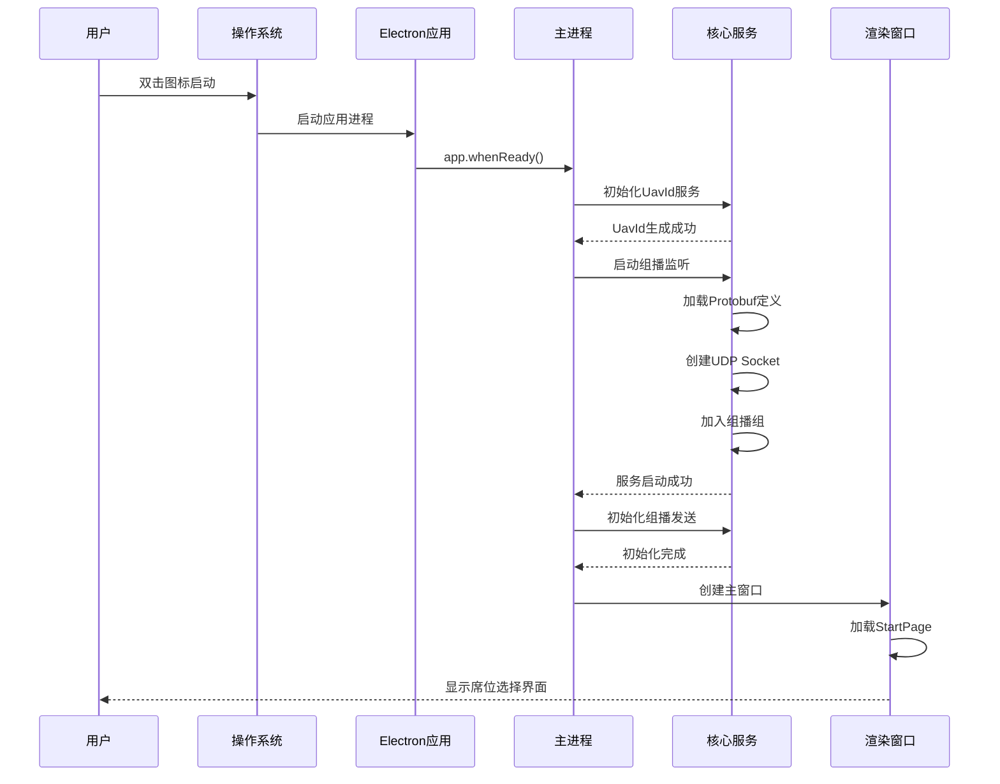
```mermaid
sequenceDiagram
    participant User as 用户
    participant OS as 操作系统
    participant App as Electron应用
    participant Main as 主进程
    participant Services as 核心服务
    participant Window as 渲染窗口

    User->>OS: 双击图标启动
    OS->>App: 启动应用进程
    App->>Main: app.whenReady()
    Main->>Services: 初始化UavId服务
    Services-->>Main: UavId生成成功
    Main->>Services: 启动组播监听
    Services->>Services: 加载Protobuf定义
    Services->>Services: 创建UDP Socket
    Services->>Services: 加入组播组
    Services-->>Main: 服务启动成功
    Main->>Services: 初始化组播发送
    Services-->>Main: 初始化完成
    Main->>Window: 创建主窗口
    Window->>Window: 加载StartPage
    Window-->>User: 显示席位选择界面
```

### 3.5.2 无人机操作流程

**完整操作流程图**

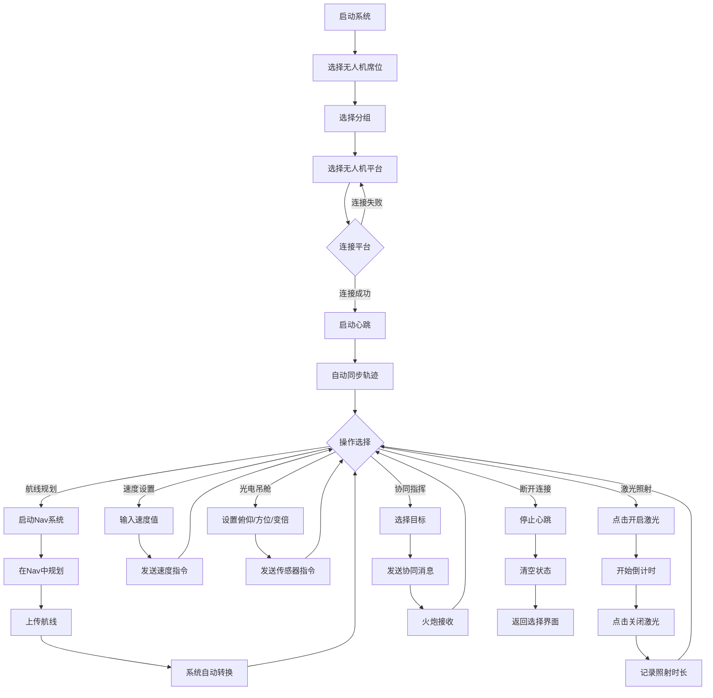
```mermaid
graph TB
    Start[启动系统] --> A[选择无人机席位]
    A --> B[选择分组]
    B --> C[选择无人机平台]
    C --> D{连接平台}
    D -->|连接失败| C
    D -->|连接成功| E[启动心跳]
    E --> F[自动同步轨迹]
    F --> G{操作选择}

    G -->|航线规划| H1[启动Nav系统]
    H1 --> H2[在Nav中规划]
    H2 --> H3[上传航线]
    H3 --> H4[系统自动转换]
    H4 --> G

    G -->|速度设置| I1[输入速度值]
    I1 --> I2[发送速度指令]
    I2 --> G

    G -->|光电吊舱| J1[设置俯仰/方位/变倍]
    J1 --> J2[发送传感器指令]
    J2 --> G

    G -->|激光照射| K1[点击开启激光]
    K1 --> K2[开始倒计时]
    K2 --> K3[点击关闭激光]
    K3 --> K4[记录照射时长]
    K4 --> G

    G -->|协同指挥| L1[选择目标]
    L1 --> L2[发送协同消息]
    L2 --> L3[火炮接收]
    L3 --> G

    G -->|断开连接| M[停止心跳]
    M --> N[清空状态]
    N --> End[返回选择界面]
```

**具体操作步骤**

1. **连接平台**

   - 步骤 1: 在分组下拉框选择"红方无人机"
   - 步骤 2: 在平台下拉框选择"UAV01"
   - 步骤 3: 点击"连接平台"按钮
   - 结果: 系统自动启动心跳，开始同步轨迹

2. **航线规划**

   - 步骤 1: 点击"航线规划"按钮
   - 步骤 2: 系统自动启动 Nav.exe 进程
   - 步骤 3: 在 Nav 界面中规划航线
   - 步骤 4: 在 Nav 中点击"上传"
   - 结果: 系统自动接收并转换为 PlatformCmd，发送到组播网络

3. **激光照射**

   - 步骤 1: 点击"开启激光"按钮
   - 步骤 2: 系统发送`Uav_Laser_ON`指令
   - 步骤 3: 界面开始倒计时显示照射时长
   - 步骤 4: 点击"关闭激光"按钮
   - 步骤 5: 系统发送`Uav_Laser_OFF`指令
   - 结果: 记录总照射时长，用于后续评估

4. **发送协同消息**
   - 步骤 1: 在目标信息区域查看当前锁定目标
   - 步骤 2: 点击"发送协同消息"按钮
   - 步骤 3: 系统构造协同消息(包含目标坐标)
   - 步骤 4: 通过组播发送给火炮平台
   - 结果: 火炮操作端接收并显示协同目标信息

### 3.5.3 火炮操作流程

**完整操作流程图**

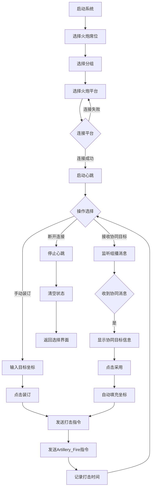
```mermaid
graph TB
    Start[启动系统] --> A[选择火炮席位]
    A --> B[选择分组]
    B --> C[选择火炮平台]
    C --> D{连接平台}
    D -->|连接失败| C
    D -->|连接成功| E[启动心跳]
    E --> F{操作选择}

    F -->|手动装订| G1[输入目标坐标]
    G1 --> G2[点击装订]
    G2 --> H[发送打击指令]

    F -->|接收协同目标| I1[监听组播消息]
    I1 --> I2{收到协同消息}
    I2 -->|是| I3[显示协同目标信息]
    I3 --> I4[点击采用]
    I4 --> I5[自动填充坐标]
    I5 --> H

    H --> J[发送Artillery_Fire指令]
    J --> K[记录打击时间]
    K --> F

    F -->|断开连接| L[停止心跳]
    L --> M[清空状态]
    M --> End[返回选择界面]
```

**具体操作步骤**

1. **手动目标装订**

   - 步骤 1: 在"目标装订"区域输入经度、纬度、高度
   - 步骤 2: 点击"装订"按钮
   - 步骤 3: 系统发送`Set_Strike_Coordinate`指令
   - 结果: 目标坐标设置完成

2. **采用协同目标**

   - 步骤 1: 无人机发送协同消息
   - 步骤 2: 火炮端接收并在"协同目标信息"区域显示
   - 步骤 3: 操作员点击"采用协同目标"
   - 步骤 4: 系统自动将协同目标坐标填充到装订表单
   - 结果: 可直接发送打击指令

3. **发射打击**
   - 步骤 1: 确认目标坐标已装订
   - 步骤 2: 点击"发射"按钮
   - 步骤 3: 系统发送`Artillery_Fire`指令
   - 结果: 打击指令发送成功，记录打击时间

### 3.5.4 组播监控流程

组播监控界面用于查看所有组播数据包的原始数据和解析结果。

**使用步骤**

1. 进入主页面(MainPage)
2. 系统自动显示实时接收的组播数据包
3. 可查看每个数据包的：
   - 时间戳
   - 源地址
   - 包类型
   - 数据大小
   - 解析后的结构化数据
4. 点击数据包可查看详细信息
5. 支持导出数据包到 JSON 文件

---

## 3.6 软件环境

### 3.6.1 开发环境

**操作系统要求**

| 操作系统 | 版本要求      | 说明                        |
| -------- | ------------- | --------------------------- |
| Windows  | Windows 10/11 | 推荐用于开发和测试          |
| macOS    | macOS 10.15+  | 支持 Intel 和 Apple Silicon |
| Linux    | Ubuntu 18.04+ | 需要安装开发依赖            |

**开发工具**

| 工具类型 | 工具名称 | 版本要求     | 用途         |
| -------- | -------- | ------------ | ------------ |
| IDE      | VS Code  | 最新版       | 代码编辑器   |
| Node.js  | Node.js  | 18.x 或 20.x | 运行环境     |
| 包管理器 | pnpm     | 8.x+         | 依赖管理     |
| 版本控制 | Git      | 2.x+         | 代码版本管理 |

**VS Code 推荐插件**

```
- Vue - Official (Vue 3 语法支持)
- TypeScript Vue Plugin (Volar)
- ESLint
- Prettier
- Tailwind CSS IntelliSense
```

### 3.6.2 运行时环境

**系统依赖**

| 依赖项   | 版本               | 说明         |
| -------- | ------------------ | ------------ |
| Node.js  | 内置于 Electron    | 无需单独安装 |
| Chromium | 内置于 Electron 28 | 渲染引擎     |

**网络要求**

| 网络参数 | 要求                | 说明                  |
| -------- | ------------------- | --------------------- |
| 组播支持 | 必须                | 网卡必须支持 UDP 组播 |
| 防火墙   | 允许 UDP 10086 端口 | 接收和发送组播数据    |
| 网络类型 | 局域网              | 建议使用有线网络      |

### 3.6.3 构建环境

**构建脚本**

```json
{
  "scripts": {
    "dev": "node scripts/dev-server.js",
    "build": "node scripts/build.js && electron-builder",
    "build:win": "node scripts/build.js && electron-builder --win",
    "build:mac": "node scripts/build.js && electron-builder --mac",
    "build:linux": "node scripts/build.js && electron-builder --linux"
  }
}
```

**开发服务器启动流程**


```mermaid
graph LR
    A[运行 npm run dev] --> B[dev-server.js]
    B --> C[启动Vite开发服务器]
    B --> D[监听主进程文件]
    C --> E[渲染进程热更新]
    D --> F[主进程自动重启]
    E --> G[浏览器自动刷新]
    F --> H[Electron窗口重新加载]
```

**生产构建流程**

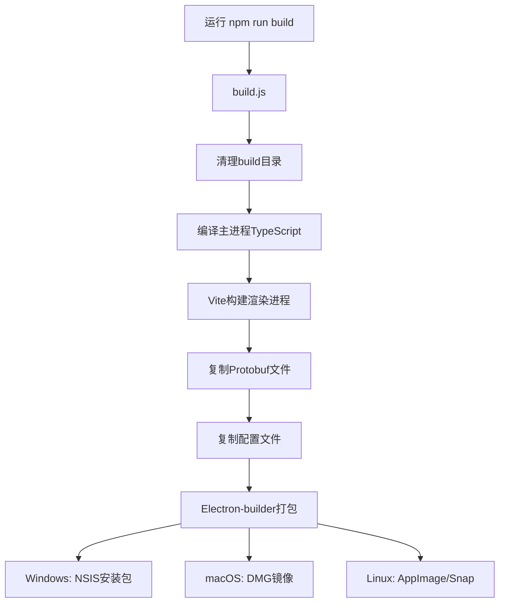
```mermaid
graph TB
    A[运行 npm run build] --> B[build.js]
    B --> C[清理build目录]
    C --> D[编译主进程TypeScript]
    D --> E[Vite构建渲染进程]
    E --> F[复制Protobuf文件]
    F --> G[复制配置文件]
    G --> H[Electron-builder打包]
    H --> I1[Windows: NSIS安装包]
    H --> I2[macOS: DMG镜像]
    H --> I3[Linux: AppImage/Snap]
```

**构建配置**（`electron-builder.json`）

```json
{
  "appId": "com.electron.opend",
  "productName": "opEnd",
  "directories": {
    "output": "dist"
  },
  "files": [
    { "from": "build/main", "to": "main" },
    { "from": "build/renderer", "to": "renderer" },
    { "from": "src/protobuf", "to": "main/src/protobuf" },
    { "from": "build/config.env", "to": "config.env" },
    { "from": "images", "to": "../images" }
  ],
  "win": {
    "target": "nsis",
    "icon": "images/icon.ico"
  },
  "mac": {
    "target": "dmg",
    "icon": "images/icon.png"
  },
  "linux": {
    "target": ["AppImage", "snap"],
    "icon": "images/icon.png"
  }
}
```

### 3.6.4 部署环境

**安装包分发**

| 平台    | 安装包格式    | 大小估算 | 安装路径                |
| ------- | ------------- | -------- | ----------------------- |
| Windows | NSIS (.exe)   | ~150MB   | C:\Program Files\opEnd  |
| macOS   | DMG           | ~160MB   | /Applications/opEnd.app |
| Linux   | AppImage/Snap | ~170MB   | /opt/opEnd              |

**首次运行配置**

1. 安装应用
2. 首次启动时，系统自动：
   - 生成唯一的 UavId
   - 加载默认组播配置
   - 初始化 Protobuf 协议
3. 用户配置（可选）：
   - 修改组播地址/端口
   - 配置 Nav 系统路径

**系统资源要求**

| 资源类型 | 最低要求       | 推荐配置     |
| -------- | -------------- | ------------ |
| CPU      | 双核 2.0GHz    | 四核 2.5GHz+ |
| 内存     | 4GB            | 8GB+         |
| 硬盘     | 500MB 可用空间 | 1GB+         |
| 显卡     | 集成显卡       | 独立显卡     |
| 分辨率   | 1280x720       | 1920x1080+   |

### 3.6.5 配置文件管理

**环境配置文件**（`config.env`）

```env
# 组播网络配置
MULTICAST_ADDRESS=239.255.43.21
MULTICAST_PORT=10086
INTERFACE_ADDRESS=0.0.0.0
MULTICAST_TTL=128

# 应用配置
NODE_ENV=production
LOG_LEVEL=info

# Nav系统配置(可选)
NAV_WORKING_DIRECTORY=./Nav
```

**TypeScript 配置**

主进程配置（`src/main/tsconfig.json`）：

```json
{
  "compilerOptions": {
    "target": "ES2020",
    "module": "commonjs",
    "lib": ["ES2020"],
    "outDir": "../../build/main",
    "rootDir": "./",
    "esModuleInterop": true,
    "skipLibCheck": true,
    "strict": true,
    "resolveJsonModule": true
  },
  "include": ["**/*.ts"],
  "exclude": ["node_modules"]
}
```

渲染进程配置（`src/renderer/tsconfig.json`）：

```json
{
  "compilerOptions": {
    "target": "ES2020",
    "module": "ESNext",
    "lib": ["ES2020", "DOM"],
    "jsx": "preserve",
    "moduleResolution": "bundler",
    "esModuleInterop": true,
    "skipLibCheck": true,
    "strict": true
  },
  "include": ["**/*.ts", "**/*.vue"],
  "exclude": ["node_modules"]
}
```

---

## 附录

### A. 常用指令类型枚举

```typescript
enum CommandType {
  // 无人机指令
  Uav_Nav = 6, // 航线导航
  Uav_Speed = 10, // 速度设置
  Uav_Sensor_Pitch = 11, // 吊舱俯仰
  Uav_Sensor_Azimuth = 12, // 吊舱方位
  Uav_Sensor_Zoom = 13, // 吊舱变倍
  Uav_Laser_ON = 14, // 激光开启
  Uav_Laser_OFF = 15, // 激光关闭
  Uav_Lock_Target = 16, // 目标锁定

  // 火炮指令
  Set_Strike_Coordinate = 20, // 装订打击坐标
  Artillery_Fire = 21, // 发射

  // 协同指令
  Coordination_Message = 30, // 协同消息
}
```

### B. 平台类型枚举

```typescript
enum PlatformType {
  UAV = 1, // 无人机
  COMMAND_POST = 2, // 指挥所
  ROCKET_LAUNCHER = 3, // 火箭炮
  ARTILLERY = 4, // 火炮
}
```

### C. 故障排查指南

**常见问题**

| 问题              | 可能原因       | 解决方案                   |
| ----------------- | -------------- | -------------------------- |
| 组播监听失败      | 端口被占用     | 修改组播端口或关闭占用进程 |
| 无法接收数据包    | 防火墙阻止     | 允许 UDP 10086 端口        |
| Protobuf 解析失败 | 协议文件缺失   | 确认 src/protobuf 目录完整 |
| Nav 启动失败      | Nav 路径错误   | 检查 Nav 工作目录配置      |
| 文档打开失败      | 文件格式不支持 | 仅支持.docx 和.xlsx 格式   |

**日志查看**

- 开发环境：控制台直接输出
- 生产环境：查看应用数据目录的日志文件

---

## 版本历史

| 版本  | 日期       | 修改内容               |
| ----- | ---------- | ---------------------- |
| 1.0.0 | 2025-10-15 | 初始版本，完整技术文档 |

---

**文档结束**
