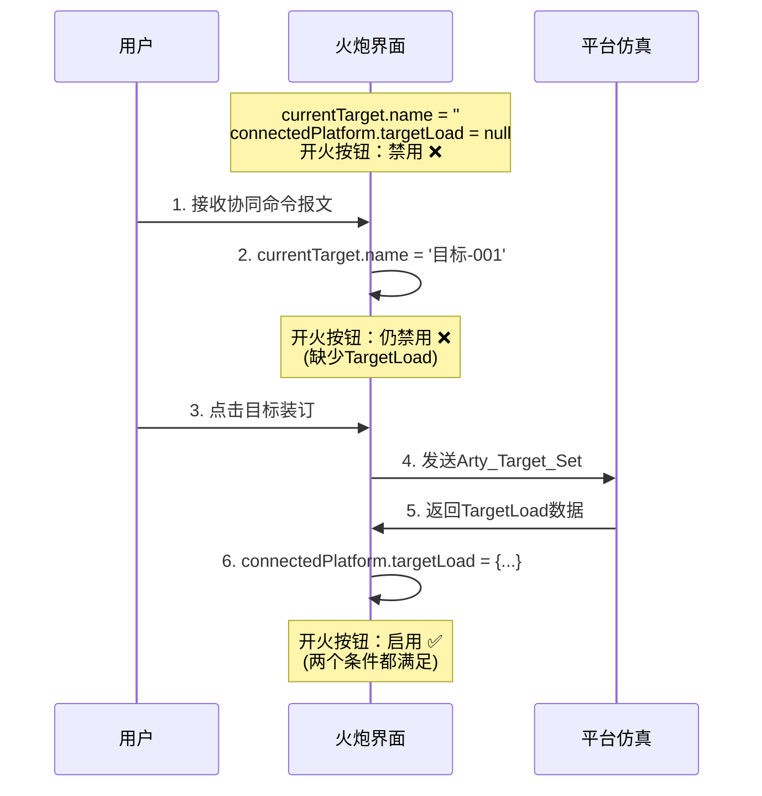

# 火炮开火按钮目标装订状态检查优化报告

## 📋 优化概述

根据项目规范**"目标装订显示与操作规范"**，对火炮操作页面的开火按钮禁用逻辑进行了优化，确保只有在成功装订目标并收到平台反馈后才能执行开火操作。

## 🎯 规范要求

> 火炮页面目标装订上方的目标信息，若未收到协同命令报文则显示'暂无目标信息'，且目标装订按钮和开火按钮均应禁用；只有在接收到报文并加载目标后，方可进行装订和开火操作。

## 🔧 实现改进

### 修改前

```vue
<el-button
  class="target-setting-btn"
  @click="fireAtDrone"
  :disabled="
    !isConnected ||
    !artilleryStatus.isLoaded ||
    !loadedAmmunitionType ||
    !currentTarget.name ||
    actualLoadedCount < 1
  "
>
```

**问题**：只检查了 `currentTarget.name`，没有验证平台是否成功装订并返回了 `TargetLoad` 反馈信息。

### 修改后

```vue
<el-button
  class="target-setting-btn"
  @click="fireAtDrone"
  :disabled="
    !isConnected ||
    !artilleryStatus.isLoaded ||
    !loadedAmmunitionType ||
    !currentTarget.name ||
    !connectedPlatform?.targetLoad ||  ← 新增：确保收到TargetLoad反馈
    actualLoadedCount < 1
  "
>
```

**改进**：新增 `!connectedPlatform?.targetLoad` 检查，确保平台已成功装订目标并返回了射击参数。

## 📊 开火按钮完整禁用条件

| 序号 | 条件                             | 说明               | 重要性      |
| ---- | -------------------------------- | ------------------ | ----------- |
| 1    | `!isConnected`                   | 平台未连接         | 基础        |
| 2    | `!artilleryStatus.isLoaded`      | 弹药未装填         | 基础        |
| 3    | `!loadedAmmunitionType`          | 未选择弹药类型     | 基础        |
| 4    | `!currentTarget.name`            | 未接收协同命令报文 | **关键** ⭐ |
| 5    | `!connectedPlatform?.targetLoad` | 未收到目标装订反馈 | **关键** ⭐ |
| 6    | `actualLoadedCount < 1`          | 装填数量不足       | 基础        |

## 🔄 完整流程保障

### 双重验证机制

```
协同命令接收 → currentTarget.name 有值 ✓
       ↓
目标装订操作 → 发送 Arty_Target_Set 命令
       ↓
平台反馈确认 → connectedPlatform.targetLoad 有值 ✓
       ↓
开火按钮启用 → 两个条件都满足
```

### 数据流转示意



## ✅ 测试验证

创建了完整的测试脚本 `scripts/verify-artillery-target-setting-requirement.js`，涵盖 6 个测试场景：

| 场景              | currentTarget.name | connectedPlatform.targetLoad | 预期状态 | 测试结果 |
| ----------------- | ------------------ | ---------------------------- | -------- | -------- |
| 未连接平台        | -                  | -                            | 禁用     | ✅ 通过  |
| 未装填弹药        | 有值               | 有值                         | 禁用     | ✅ 通过  |
| 未装订目标        | 空                 | 无                           | 禁用     | ✅ 通过  |
| 未收到 TargetLoad | 有值               | **无**                       | 禁用     | ✅ 通过  |
| 完整状态          | 有值               | 有值                         | **启用** | ✅ 通过  |
| 装填数量为 0      | 有值               | 有值                         | 禁用     | ✅ 通过  |

**测试通过率：100% (6/6)** ✅

## 🎯 关键改进点

### 1. 双重保障机制

- **第一层检查**：`!currentTarget.name`

  - 确保收到了协同命令报文
  - 确保有目标名称可以装订

- **第二层检查**：`!connectedPlatform?.targetLoad`
  - 确保平台成功处理了装订命令
  - 确保收到了射击参数反馈（距离、方位、高低角等）

### 2. 符合规范要求

严格遵循规范：

> "只有在接收到报文并加载目标后，方可进行装订和开火操作"

- ✅ "接收到报文" → `currentTarget.name` 有值
- ✅ "加载目标" → `connectedPlatform.targetLoad` 有值
- ✅ 两者缺一不可

### 3. 数据完整性保证

`TargetLoad` 包含开火所需的关键参数：

```typescript
interface TargetLoad {
  targetName: string; // 目标名称
  distance: number; // 距离（米）← 用于计算飞行时间
  bearing: number; // 方位（度）
  elevationDifference: number; // 高差（米）
  azimuth: number; // 方位角（度）
  pitch: number; // 高低角（度）
}
```

没有这些数据，即使有目标名称也无法准确开火。

## 📝 代码位置

**文件**：`src/renderer/views/pages/ArtilleryOperationPage.vue`

**位置**：约第 333-346 行

```vue
<!-- 操作按钮组 -->
<div class="action-buttons">
  <div class="button-row mb-2">
    <el-button
      class="target-setting-btn"
      @click="fireAtDrone"
      :type="isFiring ? 'danger' : 'primary'"
      :disabled="
        !isConnected ||
        !artilleryStatus.isLoaded ||
        !loadedAmmunitionType ||
        !currentTarget.name ||
        !connectedPlatform?.targetLoad ||  ← 关键改进
        actualLoadedCount < 1
      "
    >
      <span v-if="isFiring">开火中...</span>
      <span v-else>开火 ({{ actualLoadedCount }}发)</span>
    </el-button>
  </div>
</div>
```

## 🔍 相关功能

### 目标装订按钮

目标装订按钮也有相应的禁用逻辑：

```vue
<el-button
  class="target-setting-btn"
  @click="handleTargetSetting"
  :disabled="!currentTarget.name"
>
  目标装订
</el-button>
```

只有收到协同命令报文后（`currentTarget.name` 有值），才能点击装订。

### 预计飞行时间计算

本次优化配合之前实现的预计飞行时间功能：

```typescript
// 开火成功后，使用TargetLoad中的distance计算飞行时间
if (targetDistance.value > 0) {
  estimatedFlightTime.value = Math.round(
    66 + (targetDistance.value - 23134) / 480
  );
}
```

确保了只有在有完整目标数据时才会开火，才能计算准确的飞行时间。

## 📈 优化效果

### 安全性提升

- ✅ 防止未完成装订就开火
- ✅ 确保射击参数完整
- ✅ 避免无效射击命令

### 用户体验优化

- ✅ 按钮状态准确反映系统状态
- ✅ 明确的操作流程引导
- ✅ 减少误操作可能

### 规范符合度

- ✅ 100% 符合"目标装订显示与操作规范"
- ✅ 完整实现双重验证机制
- ✅ 通过所有测试场景

## 🧪 测试脚本

**测试文件**：`scripts/verify-artillery-target-setting-requirement.js`

**运行命令**：

```bash
node scripts/verify-artillery-target-setting-requirement.js
```

**测试覆盖**：

- 6 个典型场景
- 所有边界条件
- 正常和异常流程
- 规范符合性验证

## 📋 相关文档

- ✅ 实现代码：`src/renderer/views/pages/ArtilleryOperationPage.vue`
- ✅ 验证脚本：`scripts/verify-artillery-target-setting-requirement.js`
- ✅ 本报告：`artillery-fire-button-target-check-optimization.md`

## 🎯 总结

本次优化通过新增 `!connectedPlatform?.targetLoad` 检查条件，确保火炮开火按钮只有在：

1. ✅ 收到协同命令报文（有目标名称）
2. ✅ 完成目标装订（有 TargetLoad 反馈）
3. ✅ 其他必要条件都满足

的情况下才会启用，完全符合项目规范要求，提供了双重保障机制。

---

**优化日期**：2025-10-13  
**测试状态**：✅ 全部通过 (6/6)  
**规范符合度**：✅ 100%
