# 仿真系统应用功能架构与流程说明

## 文档概述

本文档从**应用功能层面**详细阐述仿真系统的整体架构、核心流程和交互设计，包含：

- 系统功能架构图
- 核心业务流程图
- 用户交互流程图
- 数据流转架构图
- 协同作战流程图

---

## 一、系统功能架构

### 1.1 总体功能架构图

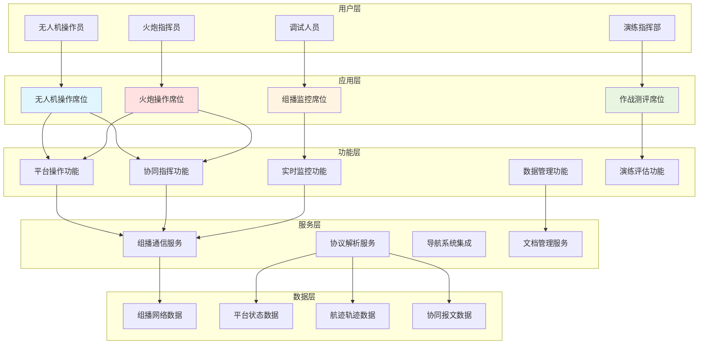

**架构说明**：

系统采用**五层架构**设计：

1. **用户层**：不同角色的操作员，包括无人机操作员、火炮指挥员、调试人员和演练指挥部
2. **应用层**：四种操作席位界面，提供专业化的操作环境
3. **功能层**：核心业务功能模块，实现平台操作、协同指挥、监控、数据管理和评估
4. **服务层**：底层技术服务，包括组播通信、协议解析、导航集成和文档管理
5. **数据层**：各类数据存储和流转，支持实时和历史数据管理

### 1.2 功能模块详细说明

#### 1.2.1 无人机操作席位功能

| 功能模块         | 核心功能             | 说明                                         |
| ---------------- | -------------------- | -------------------------------------------- |
| **平台连接管理** | 连接/断开平台        | 建立与仿真平台的通信连接，发送心跳包维持连接 |
| **航线规划**     | 航迹点编辑、航线上传 | 在地图上规划飞行航线，支持多点编辑和航线上传 |
| **飞行控制**     | 速度设置、高度设置   | 实时调整无人机飞行参数，控制飞行姿态         |
| **光电吊舱控制** | 传感器开关、转向控制 | 控制机载光电设备的开关和朝向                 |
| **激光照射**     | 激光开关、照射参数   | 控制激光照射设备，设置激光编码和照射时长     |
| **目标探测**     | 目标发现、锁定跟踪   | 发现并锁定敌方目标，生成目标信息             |
| **协同打击**     | 发送打击协同指令     | 向火炮平台发送目标坐标和打击参数             |
| **状态监控**     | 实时状态显示         | 显示平台位置、速度、高度、航向等实时数据     |
| **轨迹回放**     | 历史轨迹查看         | 查看平台历史飞行轨迹                         |

#### 1.2.2 火炮操作席位功能

| 功能模块         | 核心功能           | 说明                               |
| ---------------- | ------------------ | ---------------------------------- |
| **平台连接管理** | 连接/断开平台      | 建立与火炮仿真平台的通信连接       |
| **目标装订**     | 目标坐标设置       | 手动输入或自动接收目标坐标信息     |
| **火力参数设置** | 武器选择、发射参数 | 选择弹药类型，设置发射参数         |
| **协同接收**     | 接收打击协同指令   | 接收无人机发送的目标信息和打击参数 |
| **发射协同**     | 发送发射协同指令   | 向无人机通报发射信息和弹着时间     |
| **火力打击**     | 执行打击命令       | 向目标发射炮弹                     |
| **状态监控**     | 弹药状态、平台状态 | 显示弹药余量、平台位置等信息       |
| **协同报文管理** | 收发报文记录       | 记录和显示所有协同通信报文         |

#### 1.2.3 组播监控席位功能

| 功能模块     | 核心功能       | 说明                                 |
| ------------ | -------------- | ------------------------------------ |
| **组播配置** | 地址/端口配置  | 配置组播监听地址和端口               |
| **实时监听** | 数据包接收     | 实时接收网络中的所有组播数据包       |
| **协议解析** | 数据包解析显示 | 解析并显示各类协议数据包内容         |
| **数据汇聚** | 分类汇聚显示   | 将数据包按类型分类汇聚显示           |
| **数据导出** | 批量复制/导出  | 支持数据包批量复制和导出             |
| **状态统计** | 统计信息展示   | 显示数据包数量、类型、时长等统计信息 |

#### 1.2.4 作战测评席位功能

| 功能模块         | 核心功能         | 说明                                   |
| ---------------- | ---------------- | -------------------------------------- |
| **演练信息管理** | 演练基本信息录入 | 记录演练名称、时间、参演单位等基础信息 |
| **专家评分**     | 多维度评分       | 从战术运用、协同配合等维度进行评分     |
| **自动统计**     | 数据自动计算     | 自动计算总分、平均分等统计数据         |
| **数据导出**     | 评估报告导出     | 导出评估数据为 Excel 或 Word 文档      |
| **历史记录**     | 评估记录查询     | 查询和对比历史演练评估数据             |

---

## 二、核心业务流程

### 2.1 系统启动流程

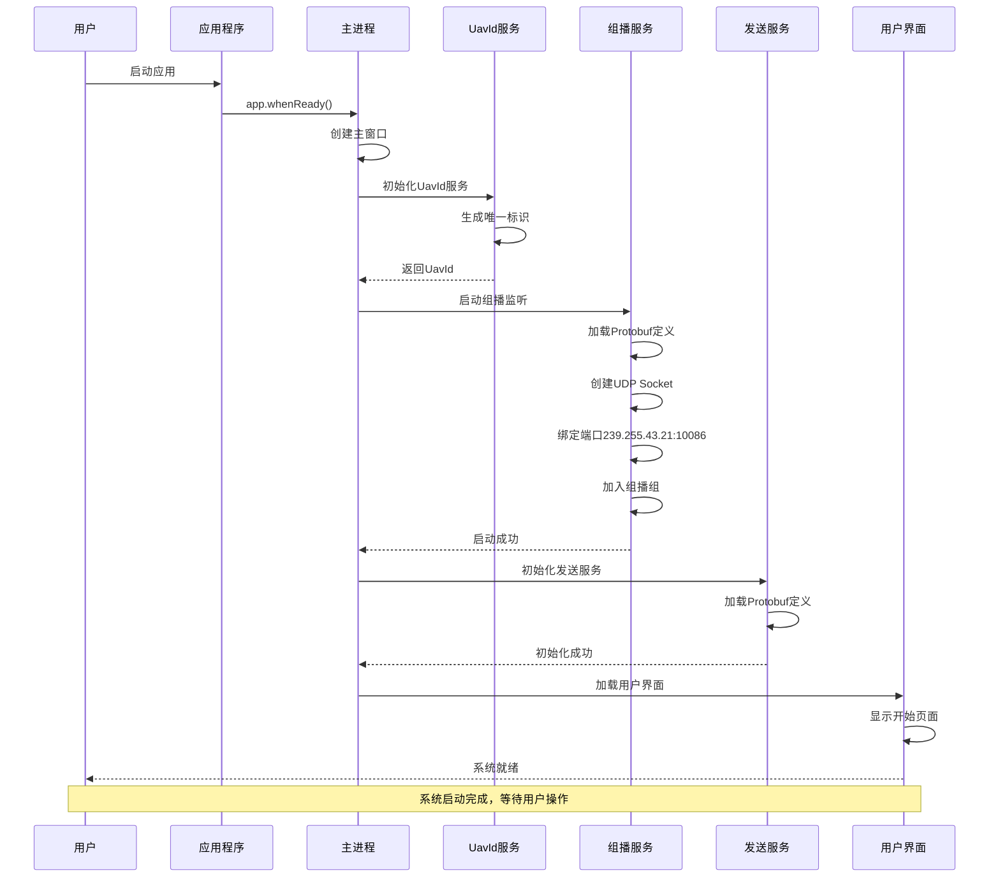

**流程说明**：

1. **应用启动**：用户双击应用图标，Electron 应用启动
2. **主进程初始化**：创建主窗口，初始化核心服务
3. **UavId 生成**：为当前终端生成唯一标识符（用于平台识别）
4. **组播服务启动**：
   - 加载 Protobuf 协议定义文件
   - 创建 UDP Socket
   - 绑定到组播地址 239.255.43.21:10086
   - 加入组播组，开始监听网络数据
5. **发送服务初始化**：加载协议定义，准备发送能力
6. **界面加载**：渲染用户界面，显示开始页面

### 2.2 平台连接流程

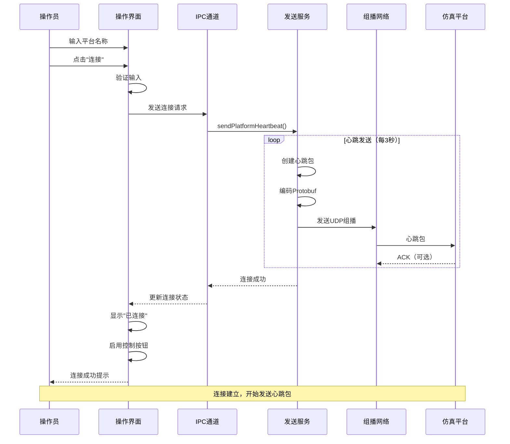

**流程说明**：

1. **用户输入**：输入平台名称（如 UAV_001、ARTY_001）
2. **验证检查**：检查平台名称格式是否正确
3. **发送心跳**：通过 IPC 调用发送服务发送心跳包
4. **周期维持**：每 3 秒发送一次心跳包，维持连接
5. **状态更新**：界面显示连接状态，启用操作按钮

### 2.3 无人机航线规划流程

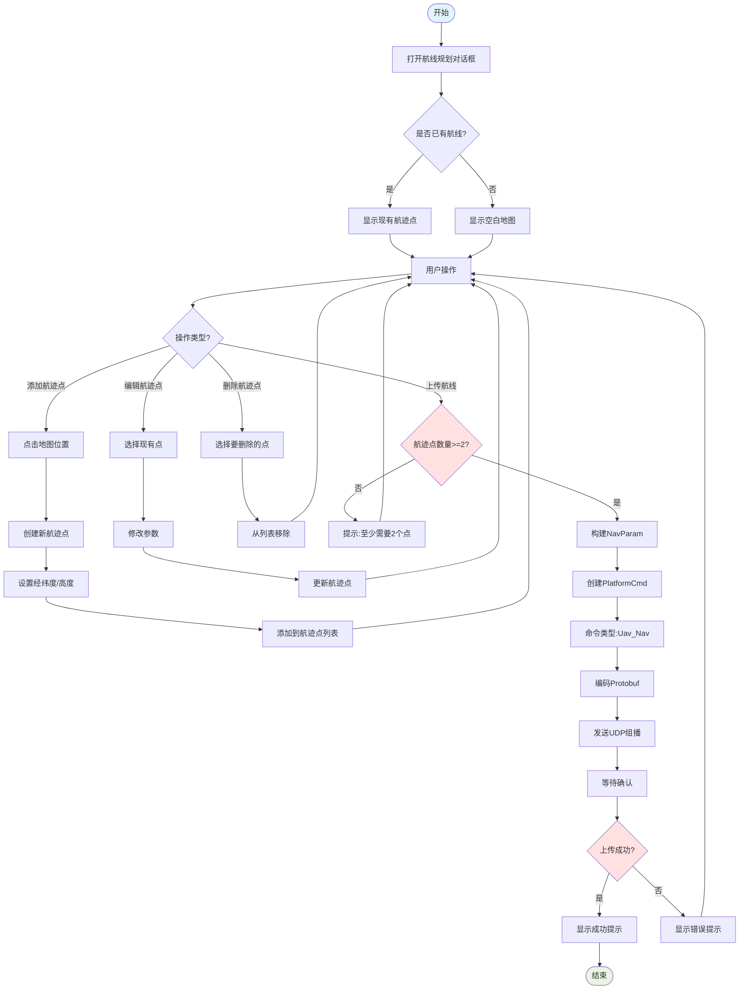

**流程说明**：

1. **打开规划器**：点击"航线规划"按钮，打开地图编辑器
2. **显示现有航线**：如果有现有航线，在地图上显示
3. **添加航迹点**：点击地图位置，输入经纬度和高度
4. **编辑航迹点**：选择现有点，修改其参数
5. **删除航迹点**：移除不需要的航迹点
6. **上传验证**：检查至少有 2 个航迹点
7. **构建命令**：将航迹点打包为 NavParam
8. **发送上传**：通过组播网络发送航线数据

---

## 三、协同打击完整流程

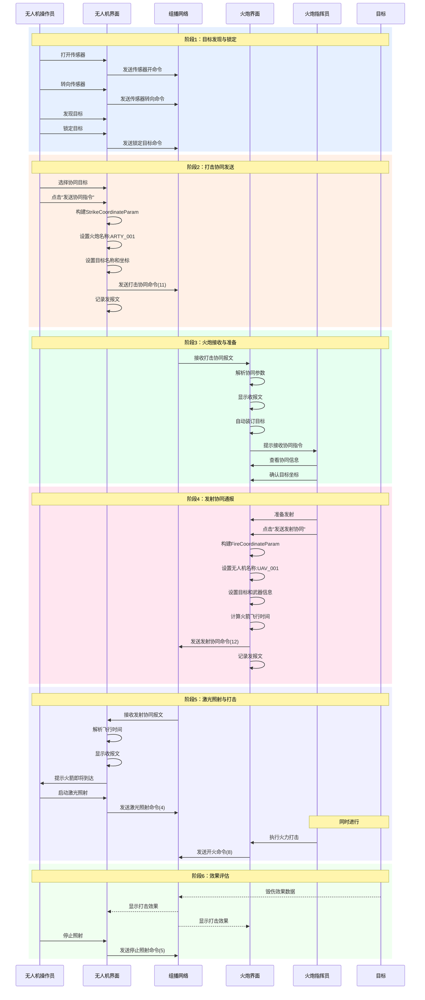

**协同流程说明**：

**阶段 1：目标发现与锁定**

- 无人机操作员打开机载传感器
- 转动传感器搜索目标
- 发现并锁定目标，生成目标信息

**阶段 2：打击协同发送**

- 无人机选择要协同的火炮平台
- 构建打击协同参数（目标名称、坐标）
- 发送打击协同命令（命令 11）到组播网络

**阶段 3：火炮接收与准备**

- 火炮界面自动接收打击协同报文
- 解析并显示目标信息
- 自动完成目标装订
- 火炮指挥员确认目标信息

**阶段 4：发射协同通报**

- 火炮准备发射，选择武器
- 计算火箭飞行时间
- 向无人机发送发射协同命令（命令 12）
- 通报预计弹着时间

**阶段 5：激光照射与打击**

- 无人机接收发射协同，准备照射
- 根据飞行时间启动激光照射
- 火炮同时执行火力打击
- 激光引导火箭精确打击目标

**阶段 6：效果评估**

- 观察打击效果
- 停止激光照射
- 记录作战数据

---

## 四、用户交互流程

### 4.1 无人机操作交互状态图

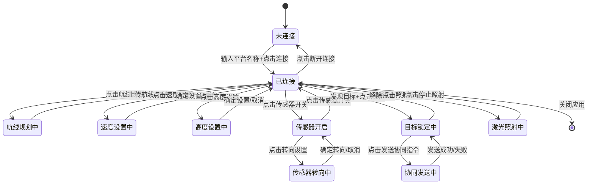

**交互说明**：

1. **初始状态**：系统启动后处于"未连接"状态
2. **连接平台**：输入平台名称后点击连接，进入"已连接"状态
3. **功能操作**：在已连接状态下可执行各种操作
4. **状态切换**：各操作之间可自由切换
5. **断开连接**：点击断开后返回未连接状态

### 4.2 火炮操作交互状态图

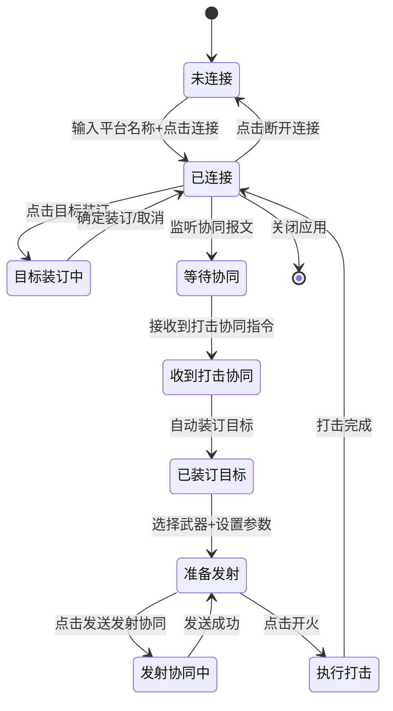

**交互说明**：

1. **连接平台**：建立与火炮仿真平台的连接
2. **等待协同**：保持监听状态，等待无人机协同指令
3. **接收协同**：自动接收并解析打击协同报文
4. **自动装订**：根据协同参数自动完成目标装订
5. **发射准备**：选择武器类型，设置发射参数
6. **协同通报**：向无人机发送发射协同指令
7. **执行打击**：发送开火命令

### 4.3 组播监控交互流程

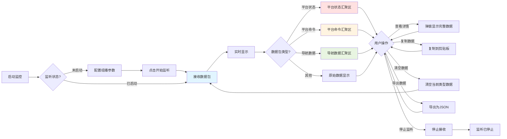

**交互说明**：

1. **配置参数**：设置组播地址、端口、网卡接口
2. **开始监听**：启动 UDP 组播接收
3. **数据分类**：自动识别并分类显示数据包
4. **实时更新**：数据包实时显示在对应汇聚区
5. **查看详情**：点击详情查看完整数据
6. **数据管理**：支持复制、导出、清空操作

---

## 五、系统技术架构

### 5.1 Electron 多进程架构

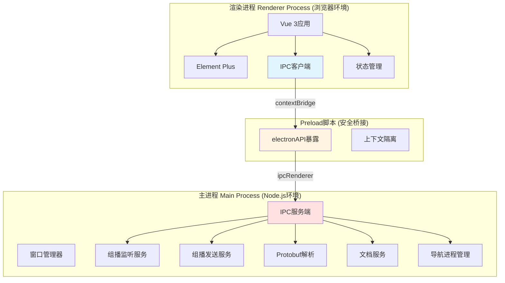

**架构说明**：

1. **主进程**：拥有完整 Node.js 权限，负责系统资源管理
2. **渲染进程**：运行在浏览器环境，负责界面渲染
3. **Preload 脚本**：安全桥接层，通过 contextBridge 暴露有限 API
4. **IPC 通信**：主进程和渲染进程通过 IPC 机制通信

### 5.2 数据流转架构

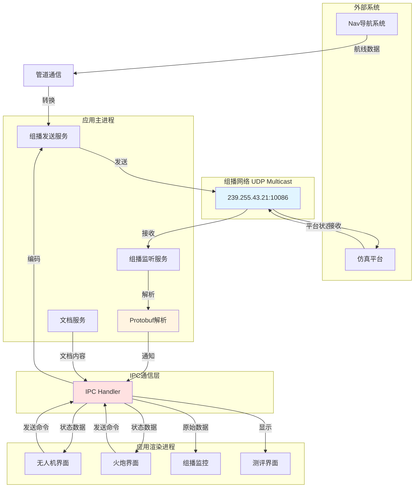

**数据流说明**：

1. **外部系统输入**：Nav 导航系统通过管道通信发送航线数据
2. **组播接收**：从组播网络接收仿真平台状态数据
3. **协议解析**：Protobuf 解析服务解码二进制数据
4. **IPC 分发**：通过 IPC 将数据分发到各个界面
5. **命令发送**：界面操作通过 IPC 编码后发送到组播网络

---

## 六、网络部署架构

### 6.1 网络拓扑图

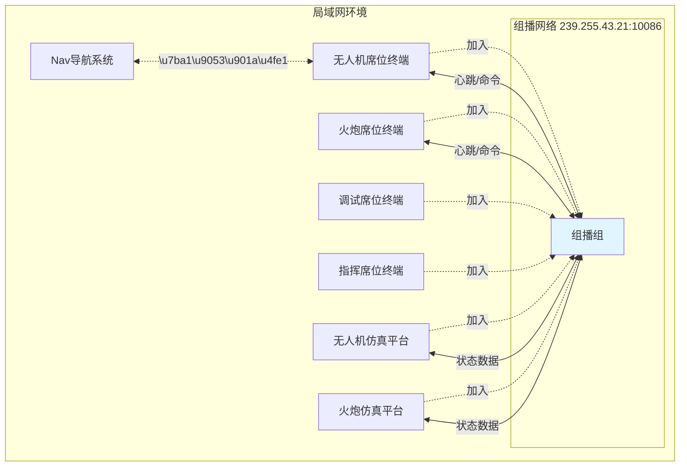

**部署说明**：

1. **组播网络**：所有终端和仿真平台加入同一组播组（239.255.43.21:10086）
2. **无人机席位**：操作无人机，可与 Nav 导航系统集成
3. **火炮席位**：操作火炮，接收协同指令
4. **调试席位**：监控所有组播通信
5. **指挥席位**：查看演练评估数据
6. **仿真平台**：模拟真实装备，发送状态数据

---

## 七、核心协议说明

### 7.1 支持的协议类型

| 包类型 | 协议名称          | 说明       | 发送方   | 接收方     |
| ------ | ----------------- | ---------- | -------- | ---------- |
| 0x01   | UavStatus         | 无人机状态 | 仿真平台 | 所有终端   |
| 0x20   | RouteUpload       | 航线上传   | Nav 系统 | 无人机终端 |
| 0x29   | Platforms         | 平台列表   | 仿真平台 | 所有终端   |
| 0x2A   | PlatformCmd       | 平台命令   | 操作终端 | 仿真平台   |
| 0x2B   | PlatformStatus    | 平台状态   | 仿真平台 | 所有终端   |
| 0x2C   | PlatformHeartbeat | 平台心跳   | 操作终端 | 仿真平台   |

### 7.2 平台命令枚举

| 命令编号 | 命令名称              | 说明       | 适用平台 |
| -------- | --------------------- | ---------- | -------- |
| 0        | Command_inValid       | 错误命令   | 所有     |
| 1        | Uav_Sensor_On         | 传感器开   | 无人机   |
| 2        | Uav_Sensor_Off        | 传感器关   | 无人机   |
| 3        | Uav_Sensor_Turn       | 传感器转向 | 无人机   |
| 4        | Uav_LazerPod_Lasing   | 激光照射   | 无人机   |
| 5        | Uav_LazerPod_Cease    | 停止照射   | 无人机   |
| 6        | Uav_Nav               | 航线规划   | 无人机   |
| 7        | Arty_Target_Set       | 目标装订   | 火炮     |
| 8        | Arty_Fire             | 火炮发射   | 火炮     |
| 9        | Uav_Set_Speed         | 设置速度   | 无人机   |
| 10       | Uav_Lock_Target       | 锁定目标   | 无人机   |
| 11       | Uav_Strike_Coordinate | 打击协同   | 无人机   |
| 12       | Arty_Fire_Coordinate  | 发射协同   | 火炮     |
| 13       | Uav_Set_Altitude      | 设置高度   | 无人机   |

---

## 八、系统特点总结

### 8.1 核心特点

1. **多平台协同**：支持无人机、火炮等多种作战平台协同作战
2. **实时通信**：基于 UDP 组播的低延迟实时通信（<100ms）
3. **跨平台部署**：Electron 框架支持 Windows/macOS/Linux
4. **模块化设计**：清晰的功能模块划分，易于维护扩展
5. **安全隔离**：主进程和渲染进程隔离，IPC 安全通信

### 8.2 技术亮点

1. **Protobuf 协议**：高效的二进制序列化，节省带宽
2. **组播通信**：一对多通信，适合军事演练场景
3. **Vue 3 架构**：现代化前端框架，响应式数据流
4. **心跳机制**：可靠的连接维持方案（每 3 秒一次）
5. **动态协议加载**：运行时加载 Protobuf 定义，灵活扩展

### 8.3 适用场景

- ✅ 军事演练仿真训练
- ✅ 多平台协同作战演练
- ✅ 作战效果评估
- ✅ 指挥员战术培训
- ✅ 装备操作培训

---

**文档版本**：v1.0  
**创建日期**：2025-10-15  
**适用系统**：opEnd 仿真系统  
**维护部门**：系统开发组
